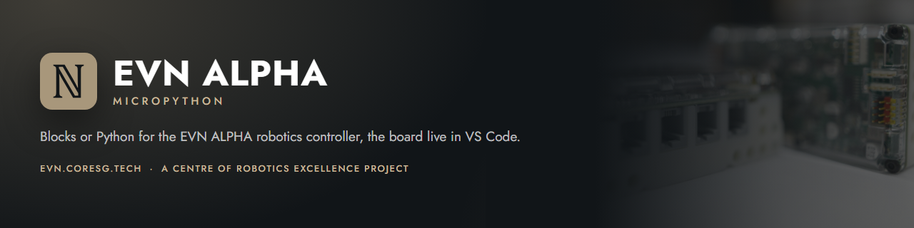

### MicroPython for the EVN ALPHA robotics controller, and the VS Code extension that runs your programs on it

**[evn.coresg.tech](https://evn.coresg.tech)** &nbsp;&middot;&nbsp;
[Getting started](https://evn.coresg.tech/#/getting-started) &nbsp;&middot;&nbsp;
[API reference](https://evn.coresg.tech/#/api/) &nbsp;&middot;&nbsp;
[Blocks reference](https://evn.coresg.tech/#/blocks/) &nbsp;&middot;&nbsp;
[Downloads](https://evn.coresg.tech/#/downloads) &nbsp;&middot;&nbsp;
[Changelog](https://evn.coresg.tech/#/changelog)

---

This repository is the published side of **EVN ALPHA MicroPython**: the documentation site served at
[evn.coresg.tech](https://evn.coresg.tech), the Markdown the site renders, the example programs, the
MicroPython firmware and the packaged VS Code extension. It is generated from the extension source, so
nothing here is edited by hand.

The **EVN ALPHA** is a LEGO&reg; Technic&trade;-compatible robotics controller from the
[Centre of Robotics Excellence](https://edu.coresg.tech/): an RP2040 with four EV3/NXT motor ports,
four servo ports, sixteen I2C and two UART ports, and 18650 cells charged over USB-C. This project gives
it MicroPython, a block editor, autocomplete, and a live view of the board inside VS Code. It is in
**early access** — user testing, with the motor layer, the board services and fifteen standard
peripherals bench-validated.

## Quick start

1. **Install the extension.** Download
   [`evn-alpha-micropython-0.2.34.vsix`](https://evn.coresg.tech/vsix/evn-alpha-micropython-0.2.34.vsix),
   then in VS Code (1.106 or newer): *Extensions* view → the `...` menu → **Install from VSIX…** → pick the file.
2. **Set the board up.** Run **EVN: Install mpremote** once, then **EVN: Flash MicroPython firmware** with
   the board plugged in. The firmware travels inside the extension; a board in UF2 (BOOTSEL) mode is
   recognised and flashed without a COM port.
3. **Run something.** Open the **EVN ALPHA** tab in the activity bar, open `01_first_moves` under
   *Examples*, plug a motor into port 1, and press **Ctrl+F5**.

The written guide is [Getting started](https://evn.coresg.tech/#/getting-started); the extension also has
a five-step walkthrough (**EVN: Getting started walkthrough**).

## Downloads

| | Version | Download | Notes |
| :--- | :--- | :--- | :--- |
| **VS Code extension** | 0.2.34 | [`.vsix`](https://evn.coresg.tech/vsix/evn-alpha-micropython-0.2.34.vsix) | [Changelog](https://evn.coresg.tech/#/changelog) |
| **MicroPython firmware** | 0.2.34 | [`.uf2`](https://evn.coresg.tech/firmware/EVN_ALPHA_MicroPython.uf2) | [BUILD.txt](firmware/BUILD.txt) |

The extension carries the firmware and flashes it for you, so the UF2 is only needed without it: hold
**BOOTSEL** while plugging the board in and copy the file onto the drive that appears.
[`latest.json`](latest.json) is the manifest the extension's update check reads.

## What is in this repository

| Path | What it is |
| :--- | :--- |
| [`docs/`](docs/) | The Markdown the site renders: `GETTING_STARTED.md`, `API.md`, `BLOCKS.md`, `CHANGELOG.md`. |
| [`examples/`](examples/) | The bundled example programs — eight in Python, eight for the block editor. |
| [`firmware/`](firmware/) | `EVN_ALPHA_MicroPython.uf2` and `BUILD.txt`, the build record of that firmware. |
| [`vsix/`](vsix/) | The packaged VS Code extension, served straight from Pages (no GitHub release needed). |
| [`latest.json`](latest.json) | Extension and firmware versions with their download URLs; read by **EVN: Check for extension and firmware updates**. |
| `index.html` + [`assets/`](assets/) | The documentation site: one page, no build step, rendering the Markdown in the browser. Jost is self-hosted in `assets/fonts/`. |
| `ide/` | The EVN IDE in the browser: the same editor and blocks over Web Serial, for a Chromium browser. |

## Documentation

- **[Getting started](https://evn.coresg.tech/#/getting-started)** — what you need, flashing, the first program, the sidebar, Bluetooth.
- **[API reference](https://evn.coresg.tech/#/api/)** — every class and function of the `evn` module, with units and defaults.
- **[Blocks reference](https://evn.coresg.tech/#/blocks/)** — every block and the MicroPython it generates.
- **[Changelog](https://evn.coresg.tech/#/changelog)** — what changed in each release.

In VS Code, **Ctrl+F1** on a word in a Python file opens this site at the matching API section.

## Part of EVN

| Repository | What it is |
| :--- | :--- |
| [EVN-arduino](https://github.com/EVNdevs/EVN-arduino) | The Arduino IDE library for the RP2040 in EVN ALPHA. |
| [EVN-robot-builds](https://github.com/EVNdevs/EVN-robot-builds) | Robot builds, with stud.io build instructions and Arduino code. |
| [EVN-PlatformIO-example](https://github.com/EVNdevs/EVN-PlatformIO-example) | An example PlatformIO project for EVN ALPHA. |
| [evndevs.github.io](https://github.com/EVNdevs/evndevs.github.io) | This repository: the MicroPython documentation site and downloads. |

The controller itself, with what is in the box: **[coresg.tech/evn](https://coresg.tech/evn)**.

## Credits

**EVN is a joint project of [Kenneth Chow](https://www.linkedin.com/in/kc-robotics/) and [Heng Teng Yi](https://www.linkedin.com/in/heng-teng-yi/)**, mentor and mentee, in
Singapore: Kenneth Chow as the Strategic Lead, Heng Teng Yi as the Technical Lead. Kenneth founded the
[Centre of Robotics Excellence](https://edu.coresg.tech/) in 2014; the EVN ALPHA was first developed there
at the end of 2018. Teng Yi came to it with four years of international competitive robotics behind him,
including wins in five RoboCup sub-leagues, and he wrote and maintains the
[EVN Arduino library](https://github.com/EVNdevs/EVN-arduino) ([GitHub](https://github.com/HTY2003),
[documentation](https://evn.readthedocs.io)).

LEGO&reg; MINDSTORMS&reg; was discontinued in 2022. The material for learning with it thinned out, and
serious robotics hardware stayed expensive. EVN is meant to be an affordable, open platform &mdash; the
natural evolution of LEGO MINDSTORMS, and a basecamp for students who want to get serious about robotics.

The board exists because of its backers. The Kickstarter campaign
[**EVN: The Natural Evolution of the LEGO&reg; MINDSTORMS&reg; System**](https://www.kickstarter.com/projects/thenaturalevolution/evn-the-natural-evolution-of-the-lego-mindstorms-system) ran from 22 December 2023 to
20 February 2024 and was funded by **71 backers** pledging **S$13,053** against a S$8,888 goal. Without
them EVN would not exist.

---

  A <a href="https://edu.coresg.tech/">Centre of Robotics Excellence</a> project &nbsp;&middot;&nbsp; Singapore 
  MIT licensed. LEGO&reg;, Technic&trade; and MINDSTORMS&reg; are trademarks of the LEGO Group,
  which does not sponsor, authorise or endorse this project.

