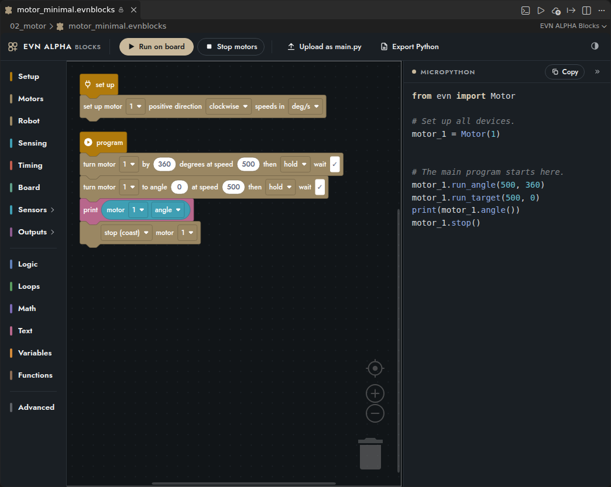

# EVN ALPHA Blocks (early access)

A block editor for the EVN ALPHA, built on [Blockly](https://github.com/RaspberryPiFoundation/blockly) (the block library maintained by the Raspberry Pi Foundation, the same engine behind Scratch-style editors). Blocks are turned into a MicroPython program for the `evn` module and run on the board through the same path as a hand-written `.py` file. The generated Python is always visible next to the blocks, so a program can be read, copied and, with *Export Python*, continued as text.

## Using it

- **EVN: New blocks program** (command palette, or right-click a folder in the Explorer) creates a `.evnblocks` file and opens it in the block editor. The *Examples* tree (and **EVN: New project**, which copies it into `examples/`) has one folder per object — the board, the motor, the robot, every sensor and output — each with a `…_minimal.evnblocks` (the few blocks you need) and a `…_complete.evnblocks` (every block of that object), next to the same programs in Python. Four folders are Python only: Pose, UART, I2C and Files.
- A program has two parts, as in Pybricks (see *Set up, then program* below): the set-up blocks go under **set up**, the program under **program**. Drag blocks from the toolbox on the left. The **Python** pane on the right shows the generated program as you build it; **Copy** puts it on the clipboard.
- **Run on board** (or **Ctrl+F5**) saves the file, writes the program to `<name>.evnblocks.py` next to it and runs it in the *EVN ALPHA* terminal. **Stop motors** (Ctrl+Shift+F5) interrupts it and coasts every motor.
- **Upload as main.py** puts the program on the board, where a press of the user button starts it after every power-on; **Export Python** saves it as a `.py` file you can edit as text.
- A `.evnblocks` file is JSON (the Blockly workspace); it can be committed, diffed and shared. `<name>.evnblocks.py` is rewritten at every run: edit the blocks, not that file.

The editor uses the CORE colour scheme (white or dark, tan accent) and follows the VS Code colour theme; the scheme button at the right of the toolbar forces light or dark.

Settings: `evn.blocks.renderer` (look of the blocks: `zelos` rounded/Scratch-like, `geras` or `thrasos` classic Blockly), `evn.blocks.showCode` (the Python pane) and `evn.blocks.theme` (`auto`, `light`, `dark`).

## Set up, then program

Every blocks program has the two yellow start blocks Pybricks users know. They can't be deleted, and a file has one of each:

- **set up**: the *set up …* blocks go under it, one for each motor, the robot, and each sensor or output the program uses, with its port. They are all in the **Setup** category (and in each device's own category). Only set-up blocks (and comments) snap under **set up**, and set-up blocks snap nowhere else: a set-up is done once, before the program starts, so one inside a loop or an `if` would look conditional without being so. In the Python they become the lines under `# Set up all devices.`
- **program**: the blocks under it run from top to bottom after the set-up, starting at `# The main program starts here.` Its **play button** runs the program on the board, exactly like *Run on board* (with no board it asks for the port, as that button does). The button is white while a board is connected and outlined when none is.
- A stack attached to neither block is **greyed out and does not run**, as a block left loose in Pybricks does not. Drag it back under **program** and it runs again. Function definitions (*Functions*) stand on their own as before, and a loose **comment** stays as it is. Disabling **set up** or **program** (right-click) switches off everything under it.
- The **comment** block (`# …`, in *Setup* and *Advanced*) goes anywhere, in either part, and becomes a `#` line in the Python.

A file made before these two blocks existed opens with its set-up blocks stacked under **set up** and its stacks chained under **program** in the order they used to run (top to bottom, then left to right), so it generates the same program; the first edit saves it in the new format (`"version": 2`). What cannot be placed that way is left loose and named in the status line: a stack that ran after a *forever* ended by a *break* (nothing can follow *forever*), and a value block standing on its own. A file that breaks the rules (edited as text, or merged) opens whole: blocks in the wrong part are taken out as a stack of their own, beside the one they were in, and the blocks after them close up; a second **set up** / **program** is removed and its blocks come loose. The status line says what moved. A file that cannot be opened completely (a block this version does not know) is shown read-only and is never saved, run, uploaded or exported. Open a version-2 file only with this version of the extension or a later one: an earlier one cannot read it (its editor shows an error, and if you edit anyway it saves only what it could read). A file from a later version opens read-only here, and nothing is saved from it.

### Coming from Pybricks

What works the same: the **set up** / **program** start blocks and the play button on **program**; the Setup palette; the Python opening with the set-up lines (stopwatch included) under `# Set up all devices.`; `wait`, **wait until** and **wait forever**; speeds in °/s, distances in mm; motor moves ending in *hold*, *brake* or *coast* with a *wait* option; the robot's straight, turn, arc and stop; the live, read-only Python beside the blocks, with *Copy* and *Export Python*.

What is different on the EVN ALPHA:

- **Ports are numbers**, the ones printed on the board: motors 1 to 4, I2C devices 1 to 16. In Python, `Port.A` .. `Port.D` also name motor ports 1 to 4.
- **Each block names its port**, not a device you named in the set-up (Pybricks: `left_motor`). The Python names each object after its port: `motor_1`, `color_sensor_3`.
- **A device without a set-up block still works**, with the default options, where Pybricks marks such a block with a warning. The set-up block is where the options live (direction, speed unit, LED count, servo profile).
- **No multitasking yet**: there is no *multitask* block and only one **program** block, since the `evn` module has no `async` motor calls for them to run on.
- The Python imports from `evn` (`from evn import Motor, …`), not from `pybricks.*`.

## The blocks and the Python they generate

Motors are `motor_1` .. `motor_4`, one object per port, created once at the top of the program (`motor_1 = Motor(1)`). The **set up motor** block sets the constructor options for a port; without it a port uses clockwise as positive and speeds in deg/s. Ports are the numbers printed on the board, 1 to 4; angles are degrees, speeds deg/s (or % of full speed after *set up motor*), times ms.

### Motors

| Block | Python |
| :--- | :--- |
| set up motor *1* positive direction *counterclockwise* speeds in *% of full speed* | `motor_1 = Motor(1, positive_direction=Direction.COUNTERCLOCKWISE, speed_unit=SpeedUnit.PERCENT)` |
| turn motor *1* by *360* degrees at speed *500* then *hold* wait ☑ | `motor_1.run_angle(500, 360)` |
| turn motor *1* to angle *0* at speed *500* then *coast* wait ☐ | `motor_1.run_target(500, 0, then=Stop.COAST, wait=False)` |
| run motor *1* for *1000* ms at speed *500* then *hold* wait ☑ | `motor_1.run_time(500, 1000)` |
| run motor *1* at speed *300* | `motor_1.run(300)` |
| stop (coast) / brake / hold motor *1* | `motor_1.stop()` / `.brake()` / `.hold()` |
| run motor *1* at speed *200* until stalled then *coast* duty limit *50* % | `motor_1.run_until_stalled(200, duty_limit=50)` |
| wait until motor *1* is done | `while not motor_1.done():` `wait(10)` |
| set motor *1* angle to *0* | `motor_1.reset_angle()` (a non-zero value: `reset_angle(value)`) |
| stop all motors | `stop_all()` |

`then` is *hold* (default), *coast*, *brake*, *keep running* (`Stop.NONE`) or *coast (smart)* (`Stop.COAST_SMART`); it is only written when it differs from the default. `wait` unticked adds `wait=False` (the move continues while the program goes on: use it to move two motors together, then **wait until motor is done**).

### Robot (a drive base: two wheel motors driven together)

| Block | Python |
| :--- | :--- |
| set up robot: left motor *4* right motor *3* wheel diameter *62.4* mm wheels *170* mm apart | `drive_base = DriveBase(motor_4, motor_3, wheel_diameter=62.4, axle_track=170)` (after the two motors' lines; a mirrored motor gets its direction from its own **set up motor** block) |
| drive straight *300* mm then *hold* wait ☑ | `drive_base.straight(300)` |
| turn robot *90* degrees then *hold* wait ☑ | `drive_base.turn(90)` (positive = right, clockwise seen from above) |
| drive an arc of radius *150* mm through *90* *degrees* then *hold* wait ☑ | `drive_base.arc(150, angle=90)`; with *mm*: `drive_base.arc(150, distance=200)`, the length along the arc (a negative radius curves left, a negative amount drives backwards) |
| drive at *200* mm/s turning *0* deg/s | `drive_base.drive(200, 0)` |
| stop the robot *coast* / *brake* | `drive_base.stop()` / `drive_base.brake()` |
| set robot speed *300* mm/s turn rate *150* deg/s | `drive_base.settings(straight_speed=300, turn_rate=150)` |
| set robot acceleration *750* mm/s² turn acceleration *750* deg/s² | `drive_base.settings(straight_acceleration=750, turn_acceleration=750)` |
| reset robot distance and angle | `drive_base.reset()` |
| robot *follows* its gyro: IMU on port *3* | `imu_3 = IMU(3)` at the top and `imu=3` on the **set up robot** line after it (`drive_base = DriveBase(motor_4, motor_3, wheel_diameter=62.4, axle_track=170, imu=3)`: the base builds its own `Pose` from its ports, geometry and motor directions), then `drive_base.use_gyro(True)` where the block sits; no separate `Pose` line |
| robot *stops following* its gyro: IMU on port *3* | `drive_base.use_gyro(False)` (the robot drives on its wheels alone again) |

One robot per program. Without a **set up robot** block the robot is left motor 1, right motor 2, 56 mm wheels 112 mm apart. `then` here is *hold*, *coast*, *brake* or *coast (smart)* (a drive base has no *keep running*: use **drive at**). Both wheels run on one time base, so a straight is straight and an arc is an arc; the distance between the wheels is measured between the tyres' contact patches — check it with one *turn robot 360 degrees* against a mark on the floor.

**Robot follows its gyro** makes the robot itself, not just its wheels, drive the path: the wheel encoders and an EVN IMU fixed to the chassis track where the robot really is (`evn.Pose`), and every straight, turn and arc is corrected as it goes, so scrub on a turn, a dragged cable and the gyro's drift no longer add up over minutes (on the floor, 40 moves ended about a centimetre from the mark with no visible heading error; the pose's own closure was 3 mm / 0.24 degrees). Put it before the first move and keep the robot still while the program starts: it waits, up to 30 s, for the IMU to settle (an `OSError` if the robot was moving). A robot pushed sideways is the one thing the pose cannot see. The `drive_base_gyro` example is the `drive_base` one with this block.

### Sensing (values)

| Block | Python |
| :--- | :--- |
| motor *1* angle / speed / load (mNm) / full speed (deg/s) | `motor_1.angle()` / `.speed()` / `.load()` / `.full_speed()` |
| motor *1* is done / is stalled | `motor_1.done()` / `motor_1.stalled()` |
| robot distance (mm) / angle (deg) | `drive_base.distance()` / `drive_base.angle()` |
| robot is done / is stalled | `drive_base.done()` / `drive_base.stalled()` |
| button pressed? | `button.pressed()` |
| battery voltage (mV) | `battery.voltage()` |
| stopwatch time (ms) | `stopwatch.time()` (a `StopWatch` created at the top of the program) |

### Timing

| Block | Python |
| :--- | :--- |
| wait *1000* ms | `wait(1000)` |
| forever … | `while True:` … |
| wait until *…* | `while not …: wait(10)` |
| wait forever | `while True: wait(1000)` (nothing can follow it) |
| *reset* / *pause* / *resume* stopwatch | `stopwatch.reset()` / `stopwatch.pause()` / `stopwatch.resume()` |
| wait for a button press | `while not button.pressed(): wait(10)` then `while button.pressed(): wait(10)` (the press also coasts every motor: a start trigger, not something to do mid-move) |

### Board

| Block | Python |
| :--- | :--- |
| turn LED on / off / toggle | `led.on()` / `led.off()` / `led.toggle()` |
| set LED to *true* | `led.set(True)` (plug in a comparison or a sensor block) |
| print *hello* | `print('hello')` (Blockly's standard print block; join text and values with the Text blocks) |

### Data log

The board records while the program runs (`evn.DataLog`): each reading at the rate its source makes new ones, kept in the board's memory, and written to a CSV file on the board by **save data log** once the motors have stopped. One data log per program, `data_log`, created at the top from **set up data log** (without one: `DataLog()`, the file `/data/log_<date>_<time>.csv`).

| Block | Python |
| :--- | :--- |
| set up data log named *run1* columns *x, y* | `data_log = DataLog('x', 'y', name='run1')` at the top (the columns are what **add row** records; left empty, no columns - or one called `value` when the program adds rows) |
| data log: record motor *1* *angle* *0* times a second | `data_log.add(motor_1, 'angle')` (0 = every new reading: up to 1000 a second for a motor, about 460 with an IMU on the bus; *speed* deg/s, *load* mNm, *stalled*) |
| data log: record *IMU* on port *1* *heading* *50* times a second | `data_log.add(imu_1, 'heading', 50)` (the reading is the sensor's method name: `heading`, `tilt`, `acceleration` ...; *battery* `voltage` / `cells` and *button* `pressed` ignore the port; a rate above the sensor's own gives the sensor's) |
| *start* / *stop* data log | `data_log.start()` / `data_log.stop()` (put the **record** blocks before *start*) |
| data log: add row *a* *b* *c* | `data_log.log(a, b)`: one value per column of **set up data log** (an empty slot is `None`, an empty cell; a slot beyond the columns is ignored); starts the log if it was never started; after *stop* it is an error (`RuntimeError`) |
| save data log | `data_log.save()` (after *stop data log* and with the motors stopped: the board refuses to write its flash while a motor drives, `OSError` 16; a stop just issued is fine). A data log not yet saved (recording or stopped) is saved by itself when main.py ends, the editor's Run finishes, the board soft-reboots or a with block ends, once the motors coast |

When a reading's share of the memory is full the board keeps every second sample and halves its rate, so the recording never stops by itself; a run of identical readings is kept as two rows, its first and its last (the rows of **add row** are all kept). `examples/22_data_log/` has a minimal and a complete program; the extension's own data logger (the graph button on the *Board* view) records the same way without a program.

### Sensors (the EVN Standard Peripherals you read)

Every peripheral works like a motor: one object per port, created once at the top of the program with the port in its name (`color_sensor_1 = ColorSensor(1)`). Each block carries its own port, so the **set up …** block is only there to say which ports a program uses — and, for the RGB LEDs, the servo and the display, to carry the option that has nowhere else to go. Ports are the numbers printed on the board: **I2C 1 to 16**, servos 1 to 4, serial 1 to 2. Each device has its own sub-category under *Sensors* or *Outputs*.

| Block | Python |
| :--- | :--- |
| set up colour sensor on port *1* | `color_sensor_1 = ColorSensor(1)` |
| colour sensor *1* sees *white* | `color_sensor_1.color() == Color.WHITE` (the six colours `color()` picks from: red, yellow, green, blue, white, nothing) |
| colour sensor *1* colour | `color_sensor_1.color()` |
| colour sensor *1* light level (%) | `color_sensor_1.ambient()` — the brightness it sees in % of its full scale, not calibrated: compare with values measured on your own surface |
| colour sensor *1* only reports red ☐ yellow ☐ green ☐ blue ☑ white ☑ nothing ☑ | `color_sensor_1.detectable_colors((Color.BLUE, Color.WHITE, Color.NONE))` (Pybricks' block: *colour* then only chooses from these) |
| colour sensor *1* hue / saturation / brightness | `color_sensor_1.hsv().h` / `.hsv().s` / `.hsv().v` |
| colour sensor *1* red / green / blue | `color_sensor_1.rgb()[0]` / `[1]` / `[2]` |
| set up distance sensor on port *1* | `distance_sensor_1 = DistanceSensor(1)` |
| distance sensor *1* distance (mm) | `distance_sensor_1.distance()` (`None` when nothing is in range) |
| set distance sensor *1* to *long range* | `distance_sensor_1.profile('long_range')` (*normal* `'default'`, *fast* `'high_speed'`, *accurate* `'high_accuracy'`) |
| set up gesture sensor on port *1* | `gesture_sensor_1 = GestureSensor(1)` |
| gesture sensor *1* gesture | `gesture_sensor_1.gesture()` (`'up'`, `'down'`, `'left'`, `'right'` or `None`) |
| gesture sensor *1* wait up to *5000* ms for a gesture | `gesture_sensor_1.read_gesture(5000)` |
| gesture sensor *1* proximity | `gesture_sensor_1.proximity()` |
| gesture sensor *1* colour | `gesture_sensor_1.color()` |
| set up weather sensor on port *1* | `env_sensor_1 = EnvSensor(1)` |
| weather sensor *1* temperature (C) / humidity (%) / air pressure (Pa) | `env_sensor_1.temperature()` / `.humidity()` / `.pressure()` |
| set up compass on port *1* | `compass_1 = Compass(1)` |
| compass *1* heading | `compass_1.heading()` |
| set compass *1* heading to *0* | `compass_1.north()`; another angle: `compass_1.north(90)` (the way it points now becomes that heading) |
| start calibrating compass *1* spinning flat ☑ | `compass_1.calibrate(True)` (unticked: `calibrate()`, tumble the sensor by hand) |
| finish calibrating compass *1* | `compass_1.calibrate_stop()` (stores the calibration on the board for the port; raises when the sensor did not turn far enough: wait for the coverage first) |
| compass *1* calibration coverage (%) | `round(compass_1.calibrate_progress()[1] * 100)` (while calibrating; *wait until* it reaches 100 for a planar calibration or about 75 for a full one — the Board view finishes a full one at 75 — then finish) |
| cancel calibrating compass *1* | `compass_1.calibrate_cancel()` (the calibration it had before stays) |
| set up touch pads on port *1* | `touch_1 = TouchArray(1)` |
| touch pads *1* any touched | `touch_1.pressed()` |
| touch pads *1* pad *0* touched | `touch_1.read(0)` (pads 0 to 11) |
| set up IMU on port *1* calibrate at start ☐ | `imu_1 = IMU(1)` (uses the calibration stored for the port); ticked: `IMU(1, calibrate=True)`, a new one measured when the program starts (still and level, about 2 s) |
| IMU *1* heading / pitch / roll | `imu_1.heading()` / `imu_1.tilt()[0]` / `imu_1.tilt()[1]` |
| IMU *1* has *the top* facing up | `imu_1.up() == Side.TOP` (`BOTTOM`, `FRONT`, `BACK`, `LEFT`, `RIGHT`) |
| IMU *1* *is still* / *is ready (gyro settled)* | `imu_1.stationary()` / `imu_1.ready()` |
| set IMU *1* heading to *0* | `imu_1.reset_heading()`; another angle: `imu_1.reset_heading(45)` |
| calibrate IMU *1* *(still and level)* / *first pose of two* / *second pose* | `imu_1.calibrate()` / `imu_1.calibrate(pose=1)` / `imu_1.calibrate(pose=2)` (stored on the board for the port; two poses on a surface that is not level: half a turn in between) |
| set up ADC on port *1* | `adc_1 = ADC(1)` followed by `adc_1.inputs((0, 1, 2, 3))` — the driver scans AIN0 only by default, and the voltage block would raise `ValueError` for any other input |
| ADC *1* voltage of input *0* | `adc_1.voltage(0)` (input 0 to 3, all four scanned by the setup block; volts; never more than 3.3 V on a pin) |

The calibration blocks here (compass, IMU) and under *Advanced* (motor) store the same calibration as the Board view's pulse buttons; [Calibrating your robot](CALIBRATION.md) says when and how to calibrate each part.

### Outputs (displays, lights, servos, Bluetooth)

| Block | Python |
| :--- | :--- |
| set up display on port *1* mirror the console ☐ | `display_1 = Display(1)` (ticked, it also writes `display_1.mirror(True)`: every `print()` appears on the display too) |
| display *1* print *hello* | `display_1.print('hello')` |
| display *1* show *hello* at column *0* row *0* | `display_1.text(0, 0, 'hello')` (16 columns, 8 rows) |
| clear display *1* | `display_1.clear()` |
| set up LED matrix on port *1* | `matrix_1 = MatrixLED(1)` |
| LED matrix *1* show *heart* | `matrix_1.icon(Icon.HEART)` (happy, sad, yes, no, the four arrows and triangles, square, circle, clockwise, counterclockwise, pause, all on, all off) |
| LED matrix *1* show number *7* | `matrix_1.number(7)` (-99 to 99). A computed value is rounded: `matrix_1.number(int(round(distance_sensor_2.distance() / 10)))` - the same for every block whose number must be whole (matrix pixel and brightness, 7-segment and RGB brightness, RGB LED number, display column / row, servo pulse, touch pad, ADC input, gesture timeout) |
| LED matrix *1* show text *hi* | `matrix_1.text('hi')` (one letter at a time; the program waits) |
| LED matrix *1* show letter *A* | `matrix_1.char((str('A') + ' ')[:1])` (one character, shown until something else is; the added blank means an empty text shows a blank instead of raising `ValueError`) |
| LED matrix *1* pixel row *0* column *0* *on* | `matrix_1.pixel(0, 0, True)` (row from the top, column from the left, 0 to 7) |
| LED matrix *1* brightness *8* | `matrix_1.brightness(8)` (1 to 16) |
| clear LED matrix *1* | `matrix_1.clear()` |
| set up 7-segment display on port *1* | `seven_segment_1 = SevenSegmentLED(1)` |
| 7-segment *1* show number *1234* | `seven_segment_1.number(1234)` |
| 7-segment *1* show text *HELP* | `seven_segment_1.text('HELP')` (up to 4 characters: digits, the letters A B C D E F G H J L N O P R T U Y, `-`, `_` and space; any other letter raises `ValueError`, seven segments cannot draw it) |
| 7-segment *1* colon *on* | `seven_segment_1.colon(True)` |
| 7-segment *1* brightness *8* | `seven_segment_1.brightness(8)` |
| clear 7-segment *1* | `seven_segment_1.clear()` |
| colour *red* | `Color.RED` (orange, yellow, green, cyan, blue, violet, magenta, brown, white, gray, black, *off* `Color.NONE`) |
| colour red *255* green *120* blue *0* | `(255, 120, 0)` |
| set up RGB LEDs on servo port *1* with *8* LEDs | `rgb_1 = RGBLED(1, 8)` (1 to 64 LEDs — the firmware's limit; a servo port, which cannot drive a servo while this is open) |
| RGB LEDs *1* set all to *colour red* | `rgb_1.fill(Color.RED)` |
| RGB LEDs *1* set LED *0* to *colour green* | `rgb_1.set(0, Color.GREEN)` (LED 0 is the one at the plug) |
| RGB LEDs *1* brightness *64* | `rgb_1.brightness(64)` (0 to 255) |
| turn RGB LEDs *1* off | `rgb_1.off()` |
| set up servo on port *1* type *Geekservo 270 degrees* | `servo_1 = Servo(1)` (*generic 180 degrees*: `Servo(1, 'generic')`, *Geekservo 360 degrees*: `Servo(1, 'geekservo_360')`, *Geekservo continuous*: `Servo(1, 'geekservo_cr')`) |
| move servo *1* to *90* degrees | `servo_1.angle(90)` (not for a continuous servo) |
| sweep servo *1* to *180* degrees at *60* deg/s wait ☑ | `servo_1.move(180, 60)` (unticked: `, wait=False`) |
| servo *1* has finished its sweep | `servo_1.done()` |
| run servo *1* at *50* % | `servo_1.duty(50)` (a continuous servo, -100 to 100; 0 stops it) |
| set servo *1* pulse to *1500* us | `servo_1.pulse(1500)` |
| stop servo *1* | `servo_1.stop()` |
| set up Bluetooth on serial port *2* | `bluetooth_2 = Bluetooth(2)` |
| Bluetooth *2* send *hello* | `bluetooth_2.write((str('hello') + '\n').encode())` |
| Bluetooth *2* has something to read | `bluetooth_2.any() > 0` |
| Bluetooth *2* received line (wait up to *5000* ms) | `(bluetooth_2.readline(5000) or b'').decode()` — waits up to that long for a line, gives it without its newline (empty text on timeout) and leaves whatever arrived behind it in the receive buffer, where `read()` can still find it |

The colour input of the RGB LED blocks takes either colour block: **colour *red*** (an `evn` `Color`) or **colour red / green / blue** (an `(r, g, b)` tuple, 0 to 255 each). Blockly's own colour-picker field is not part of Blockly 13 core, so there is no swatch picker.

### Extended (the EVN Extended Peripherals)

Devices the firmware drives natively that EVN does not stock ([API reference](API_EXTENDED.md#evn-extended-peripherals)): the HiTechnic NXT colour sensor and compass (through an NXT cable adapter; the firmware runs their port at 100 kHz) the DFRobot HuskyLens camera (set its Protocol Type to I2C), the ST VL53L1X distance sensor (up to 4 m) and the ams-OSRAM TCS3430 XYZ colour sensor. They work like the sensors above: one object per port, named after it, a sub-category each.

| Block | Python |
| :--- | :--- |
| set up HiTechnic colour sensor on port *1* | `ht_color_1 = HiTechnicColorSensor(1)` |
| calibrate HiTechnic colour sensor *1* *black (nothing in front)* / *white (a white sheet)* | `ht_color_1.calibrate_black()` / `ht_color_1.calibrate_white()`: black then white at the start of the program, at the distance the colours will be read |
| HiTechnic colour sensor *1* sees *white* | `ht_color_1.color() == Color.WHITE` |
| HiTechnic colour sensor *1* colour | `ht_color_1.color()` |
| HiTechnic colour sensor *1* colour number / reflection (%) | `ht_color_1.color_number()` (0 black ... 17 white, the sensor's own chart) / `ht_color_1.reflection()` |
| HiTechnic colour sensor *1* red / green / blue | `ht_color_1.rgb()[0]` / `[1]` / `[2]` |
| HiTechnic colour sensor *1* hue / saturation / brightness | `ht_color_1.hsv().h` / `.hsv().s` / `.hsv().v` |
| set up HiTechnic compass on port *1* | `ht_compass_1 = HiTechnicCompass(1)` |
| HiTechnic compass *1* heading | `ht_compass_1.heading()` (0 to 359, whole degrees) |
| set HiTechnic compass *1* heading to *0* | `ht_compass_1.north()`; another value `ht_compass_1.north(90)` |
| set up HuskyLens on port *1* | `huskylens_1 = HuskyLens(1)` |
| set HuskyLens *1* to *object tracking* | `huskylens_1.algorithm(HuskyLens.OBJECT_TRACKING)` (face recognition, object tracking, object recognition, line tracking, colour recognition, tag recognition, object classification) |
| HuskyLens *1* objects seen | `huskylens_1.count()` |
| HuskyLens *1* first block x / y / width / height / ID | `(huskylens_1.blocks() or [(-1, -1, -1, -1, -1)])[0][0]` (`[1]` … `[4]`): -1 when the camera sees no block |
| HuskyLens *1* learn what it sees as ID *1* | `huskylens_1.learn(1)` |
| set up VL53L1X distance sensor on port *1* | `vl53l1x_1 = VL53L1X(1)` (long mode, 33 ms per reading) |
| VL53L1X *1* distance (mm) | `vl53l1x_1.distance() or -1`: -1 when the reading is not valid |
| set VL53L1X *1* to *long* / *short* range | `vl53l1x_1.distance_mode('long')` (up to ~4 m in the dark) / `vl53l1x_1.distance_mode('short')` (up to ~1.3 m, better in daylight) |
| set up TCS3430 colour sensor on port *1* | `tcs3430_1 = TCS3430(1)` (2.78 ms at 64x, for a target close in front) |
| calibrate TCS3430 *1* *black (nothing in front)* / *white (a white sheet)* | `tcs3430_1.calibrate_black()` / `tcs3430_1.calibrate_white()`: take black then white at the start of the program, at the distance the colours will be read (without them the module's warm LED makes white read yellow) |
| TCS3430 *1* sees *white* | `tcs3430_1.color() == Color.WHITE` |
| TCS3430 *1* colour | `tcs3430_1.color()` |
| TCS3430 *1* X / Y (brightness) / Z / infrared | `tcs3430_1.xyz()[0]` / `[1]` / `[2]` / `tcs3430_1.ir()` (raw counts) |
| TCS3430 *1* hue / saturation / brightness | `tcs3430_1.hsv().h` / `.hsv().s` / `.hsv().v` |
| set TCS3430 *1* gain to *64x* | `tcs3430_1.gain(64)` (1x, 4x, 16x, 64x, 128x) |

### Advanced

| Block | Python |
| :--- | :--- |
| calibrate motor *1* wait ☑ | `motor_1.calibrate()` (about 11 s, shaft free to turn, up to about a turn and a half each way; stored on the board for that port); unticked: `motor_1.calibrate(wait=False)`, which starts it and goes on while the ports are measured one after another in the background — a ticked one on the same port waits for that run while it is still going (after it has finished it starts a new one, so wait with *motor … is calibrated* instead) |
| motor *1* is calibrated | `evn.calibration(1)['calibrated']` |
| set motor *1* *speed* / *acceleration* / *torque* limit to *500* | `motor_1.control.limits(speed=500)` (one limit, the other two kept; the defaults are the motor's tested maximum). Files from before carry *limit motor … speed … acceleration … torque …*, which still works: `control.limits(...)` with each input that is filled in |
| set motor *1* duty to *50* % | `motor_1.dc(50)` |
| track motor *1* to angle *0* | `motor_1.track_target(0)` |
| use *ADRC* / *PID* control for motor *1* | `motor_1.control.law('adrc')` |
| # *…* (comment) | `# …` (also in *Setup*; goes anywhere, does nothing on the board) |
| Python *…* (statement) | the line as written |
| Python *…* (value) | the expression as written |

The two **Python** blocks are the escape hatch. `motor_1` .. `motor_4`, `drive_base`, `data_log` and every peripheral object (`color_sensor_1`, `display_3`, `rgb_2`, …) are available: a Python block that mentions one has it created at the top of the program like a block would. A Python block always imports the core names (`Motor`, `Port`, `Stop`, `Direction`, `SpeedUnit`, `wait`, `StopWatch`, `battery`, `button`, `led`, `stop_all`) and adds a bare `import evn`, plus any other name from the module it spells out (`ColorSensor`, `Color`, `Icon`, `Side`, `DriveBase`, `Pose`, `DataLog`, `UART`, `I2C`, `Flash`, `core1_status`, …), so the import line stays readable and nothing in the module is out of reach. A device named inside a string or a `#` comment is *not* opened, and a port outside the device's range is ignored. The robot's pose is `drive_base.pose` when a **robot follows its gyro** block is in the program (the base builds it from `imu=`; a Python block does not create one, and there is no separate `pose` variable).

### What has no block

Each device has the few calls a program usually needs; everything else in the API reference is a **Python** block away, with the object already created:

- **Motors**: `gears`, `reset_angle=False` and `model=` in the constructor, `speed_unit()` / `full_speed(x)` after it, `control.pid()` / `evn()` / `target_tolerances()` / `stall_tolerances()`, `settings(max_voltage=…)`, `model`, `close()`; the module's `evn.configure_motor()` / `motor_config()` / `clear_calibration()` (the Board view's gear and right-click menu do these).
- **Robot**: `curve()` (the older Pybricks sign convention of `arc()`), `state()`, `reset(distance, angle)`, `follower()`, `pose_error()`, `then=Stop.COAST_SMART` chains, `close()`.
- **Every peripheral**: `close()`, `age()`, `read()` (the "wait for a new reading" form of each getter), `raw()`, and the tuning calls — colour sensor `gain()`, `integration_time()`, `ranges()` / `normalized()` (a calibrated white and black), `color_match()`, `thresholds()`, `lux()`, `color_temperature()`; distance sensor `timing_budget()`, `signal_rate_limit()`; gesture sensor `engines()`, `gain()`, `led()`, `gesture_config()`; weather sensor `oversampling()`, `filter()`, `standby()`, `forced()`; compass `field()`, `field_strength()`, `heading_confidence()`, `axes()`, `calibration()` (installing a calibration by hand), `calibrate_directions()` (the Board view draws it), `stored_calibration()`, `clear_calibration()`; touch pads `touched()`, `events()`, `data()`, `thresholds()`, `electrodes()`, `autoconfig()`; IMU `euler()`, `quaternion()`, `acceleration()`, `linear_acceleration()`, `gravity()`, `angular_velocity()`, `temperature()`, `tap()`, `screen_orientation()`, `calibration()`, `cancel_calibration()`, `clear_calibration()`, `calibrate_gyro()`, `settings()`, `ranges()`, `filter()`, `sample_rate()`, `axes()`, `dmp()`; ADC `raw()`, `inputs()`, `range()`, `data_rate()`, `continuous()`.
- **Displays**: the OLED's drawing calls (`pixel`, `line`, `rect`, `draw_circle`, `draw_text`, `splash`, `contrast`, `flip`, `invert`, `scroll`), the matrix's `bitmap()` / `animate()` / `orientation()` / `blink()` / `hline()` / `vline()` / `rect()`, the 7-segment's `digit()`, `char()`, `point()`, `segments()`.
- **RGB LEDs**: `range()`, `on()` with a list, `blink()`, `animate()`, `hsv()`, `get()`, `invert()`, `count()`.
- **Servo**: `set_range()`, `enable()` / `disable()`, and the constructor's `reverse=` / `range=` / `min_us=` / `max_us=`.
- **Board**: `battery.cells()` / `present()` / `age()`.
- **Data log**: `info()`, `running()`, `quantities()`, `close()`, `save(path)` with a path of your own, more than three columns in one row, and the constructor's `timestamp=` / `extension=` / `append=` / `size=` / `autosave=` / `on_full=`.
- **Extended peripherals**: HiTechnic colour sensor `version()`, `firmware()`, `color_match()`, `detectable_colors()`, `black_reference()` / `white_reference()`, `ambient()`, `raw()`, `mains()`; HiTechnic compass `calibrate()` / `calibrate_stop()` / `calibrating()` (the sensor's own calibration), `firmware()`; HuskyLens `blocks(id)` / `arrows()` as whole lists, `learned()`, `frame()`, `forget()`, `algorithm()` as a getter; VL53L1X `status()`, `raw()`, `timing_budget()`, `distance_mode()` as a getter; TCS3430 `color_match()`, `detectable_colors()` (teach it colours from its own `hsv()`), `black_reference()` / `white_reference()`, `xyz()` as a tuple, `raw()`, `xy()`, `saturated()`, `integration_time()`, `gain()` as a getter; `age()` and `close()` of every one.
- **Bluetooth**: `read()`, `read_all()`, `clear()`, `wait_until()`, `repl()`, `command()`, `address()`, `configured()`, `set_baudrate()`, and the constructor's `name=` / `baud=` / `mode=` (a block always uses the defaults).
- **The rest of the module**: `Pose` (the pose estimator: position and heading from the encoders, an IMU and a compass; with the robot's gyro block the drive base builds one, `drive_base.pose`), `I2C`, `UART`, `Flash`, `evn.calibration()` / `imu_calibration()` / `compass_calibration()` (the stored records as dicts), `clock()`, `reset()`, `reset_cause()`, `bootloader()`, `autostart()`, `core1_status()`, `evn.version`.

### Logic, Loops, Math, Text, Variables, Functions

Blockly's standard blocks, generating standard Python (`if`, `while`, `for count in range(…)`, arithmetic, `str(…)` joins, variables, `def`). MicroPython runs all of it; `math_number` values are ints when whole.

## Safety

The same rules as for Python programs apply: **Ctrl+C** in the terminal and **Stop motors** interrupt a running program and coast every motor; the board's **user button** coasts every motor (the program keeps running; holding it 2 s reboots the board); connecting a tool to the board also coasts the motors. A **forever** loop only ends one of those ways. Keep wheels off the ground for the first run of any program.
