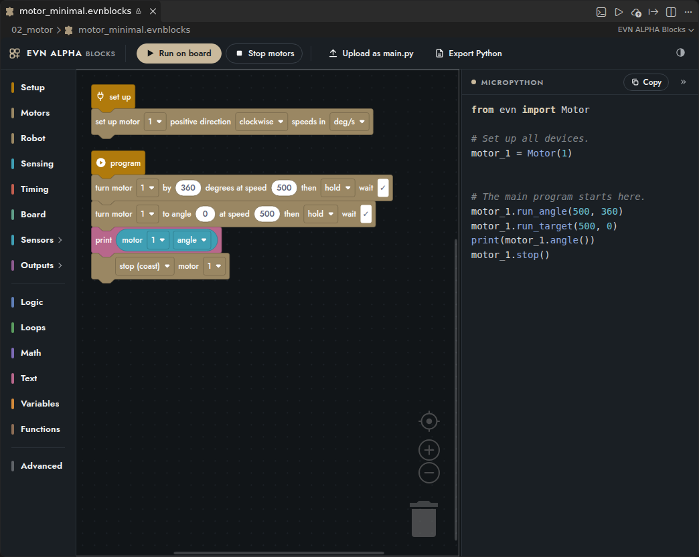

# EVN ALPHA Blocks (early access)

A block editor for the EVN ALPHA, built on [Blockly](https://github.com/RaspberryPiFoundation/blockly) (the block library maintained by the Raspberry Pi Foundation, the same engine behind Scratch-style editors). Blocks are turned into a MicroPython program for the `evn` module and run on the board through the same path as a hand-written `.py` file. The generated Python is always visible next to the blocks, so a program can be read, copied and, with *Export Python*, continued as text.

## Using it

- **EVN: New blocks program** (command palette, or right-click a folder in the Explorer) creates a `.evnblocks` file and opens it in the block editor. The *Examples* tree (and **EVN: New project**, which copies it into `examples/`) has one folder per object — the board, the motor, the robot, the pose, every sensor and output, the serial and I2C ports, files and the data log — each with a `…_minimal.evnblocks` (the few blocks you need) and a `…_complete.evnblocks` (every block of that object), next to the same programs in Python.
- A program has two parts, as in Pybricks (see *Set up, then program* below): the set-up blocks go under **set up**, the program under **program**. Drag blocks from the toolbox on the left. The **Python** pane on the right shows the generated program as you build it; **Copy** puts it on the clipboard.
- **Run on board** (or **Ctrl+F5**) saves the file, writes the program to `<name>.evnblocks.py` next to it and runs it in the *EVN ALPHA* terminal. **Stop motors** (Ctrl+Shift+F5) interrupts it and coasts every motor.
- **Upload as main.py** puts the program on the board, where a press of the user button starts it after every power-on; **Export Python** saves it as a `.py` file you can edit as text.
- A `.evnblocks` file is JSON (the Blockly workspace); it can be committed, diffed and shared. `<name>.evnblocks.py` is rewritten at every run: edit the blocks, not that file. For the same reason *My projects* hides it, and a Python program of yours cannot be created, renamed or saved under a name ending in `.evnblocks` (the name box refuses it).



The editor uses the CORE colour scheme (white or dark, tan accent) and follows the VS Code colour theme; the scheme button at the right of the toolbar forces light or dark.

Settings: `evn.blocks.renderer` (look of the blocks: `zelos` rounded/Scratch-like, `geras` or `thrasos` classic Blockly), `evn.blocks.showCode` (the Python pane) and `evn.blocks.theme` (`auto`, `light`, `dark`).

## Set up, then program

Every blocks program has the two yellow start blocks Pybricks users know. They can't be deleted, and a file has one of each:

- **set up**: the *set up …* blocks go under it, one for each motor, the robot, and each sensor or output the program uses, with its port. They are all in the **Setup** category (and in each device's own category). Only set-up blocks (and comments) snap under **set up**, and set-up blocks snap nowhere else: a set-up is done once, before the program starts, so one inside a loop or an `if` would look conditional without being so. In the Python they become the lines under `# Set up all devices.`
- **program**: the blocks under it run from top to bottom after the set-up, starting at `# The main program starts here.` Its **play button** runs the program on the board, exactly like *Run on board* (with no board it asks for the port, as that button does). The button is white while a board is connected and outlined when none is.
- A stack attached to neither block is **greyed out and does not run**, as a block left loose in Pybricks does not. Drag it back under **program** and it runs again. Function definitions (*Functions*) stand on their own as before, and a loose **comment** stays as it is. Disabling **set up** or **program** (right-click) switches off everything under it.
- The **comment** block (`# …`, in *Setup* and *Advanced*) goes anywhere, in either part, and becomes a `#` line in the Python.

A file made before these two blocks existed opens with its set-up blocks stacked under **set up** and its stacks chained under **program** in the order they used to run (top to bottom, then left to right), so it generates the same program; the first edit saves it in the new format (`"version": 2`). What cannot be placed that way is left loose and named in the status line: a stack that ran after a *forever* ended by a *break* (nothing can follow *forever*), and a value block standing on its own. A file that breaks the rules (edited as text, or merged) opens whole: blocks in the wrong part are taken out as a stack of their own, beside the one they were in, and the blocks after them close up; a second **set up** / **program** is removed and its blocks come loose. The status line says what moved. A file that cannot be opened completely (a block this version does not know) is shown read-only and is never saved, run, uploaded or exported. Open a version-2 file only with this version of the extension or a later one: an earlier one cannot read it (its editor shows an error, and if you edit anyway it saves only what it could read). A file from a later version opens read-only here, and nothing is saved from it.

### Coming from Pybricks

What works the same: the **set up** / **program** start blocks and the play button on **program**; the Setup palette; the Python opening with the set-up lines (stopwatch included) under `# Set up all devices.`; `wait`, **wait until** and **wait forever**; speeds in °/s, distances in mm; motor moves ending in *hold*, *brake* or *coast* with a *wait* option; the robot's straight, turn, arc and stop; the live, read-only Python beside the blocks, with *Copy* and *Export Python*.

What is different on the EVN ALPHA:

- **Ports are numbers**, the ones printed on the board: motors 1 to 4, I2C devices 1 to 16. In Python, `Port.A` .. `Port.D` also name motor ports 1 to 4.
- **Each block names its port**, not a device you named in the set-up (Pybricks: `left_motor`). The Python names each object after its port: `motor_1`, `color_sensor_3`.
- **A device without a set-up block still works**, with the default options, where Pybricks marks such a block with a warning. The set-up block is where the options live (direction, speed unit, LED count, servo profile).
- **No multitasking yet**: there is no *multitask* block and only one **program** block, since the `evn` module has no `async` motor calls for them to run on.
- The Python imports from `evn` (`from evn import Motor, …`), not from `pybricks.*`.

## The blocks and the Python they generate

Motors are `motor_1` .. `motor_4`, one object per port, created once at the top of the program (`motor_1 = Motor(1)`). The **set up motor** block sets the constructor options for a port; without it a port uses clockwise as positive and speeds in deg/s. Ports are the numbers printed on the board, 1 to 4; angles are degrees, speeds deg/s (or % of full speed after *set up motor*), times ms.

### Motors

| Block | Python |
| :--- | :--- |
| set up motor *1* positive direction *counterclockwise* speeds in *% of full speed* | `motor_1 = Motor(1, positive_direction=Direction.COUNTERCLOCKWISE, speed_unit=SpeedUnit.PERCENT)` |
| turn motor *1* by *360* degrees at speed *500* then *hold* wait ☑ | `motor_1.run_angle(500, 360)` |
| turn motor *1* to angle *0* at speed *500* then *coast* wait ☐ | `motor_1.run_target(500, 0, then=Stop.COAST, wait=False)` |
| run motor *1* for *1000* ms at speed *500* then *hold* wait ☑ | `motor_1.run_time(500, 1000)` |
| run motor *1* at speed *300* | `motor_1.run(300)` |
| stop (coast) / brake / hold motor *1* | `motor_1.stop()` / `.brake()` / `.hold()` |
| run motor *1* at speed *200* until stalled then *coast* duty limit *50* % | `motor_1.run_until_stalled(200, duty_limit=50)` |
| wait until motor *1* is done | `while not motor_1.done():` `wait(10)` |
| set motor *1* angle to *0* | `motor_1.reset_angle()` (a non-zero value: `reset_angle(value)`) |
| stop all motors | `stop_all()` |

`then` is *hold* (default), *coast*, *brake*, *keep running* (`Stop.NONE`) or *coast (smart)* (`Stop.COAST_SMART`); it is only written when it differs from the default. `wait` unticked adds `wait=False` (the move continues while the program goes on: use it to move two motors together, then **wait until motor is done**).

### Robot (a drive base: two wheel motors driven together)

| Block | Python |
| :--- | :--- |
| set up robot: left motor *4* right motor *3* wheel diameter *62.4* mm wheels *170* mm apart | `drive_base = DriveBase(motor_4, motor_3, wheel_diameter=62.4, axle_track=170)` (after the two motors' lines; a mirrored motor gets its direction from its own **set up motor** block) |
| drive straight *300* mm then *hold* wait ☑ | `drive_base.straight(300)` |
| turn robot *90* degrees then *hold* wait ☑ | `drive_base.turn(90)` (positive = right, clockwise seen from above) |
| drive an arc of radius *150* mm through *90* *degrees* then *hold* wait ☑ | `drive_base.arc(150, angle=90)`; with *mm*: `drive_base.arc(150, distance=200)`, the length along the arc (a negative radius curves left, a negative amount drives backwards) |
| drive at *200* mm/s turning *0* deg/s | `drive_base.drive(200, 0)` |
| stop the robot *coast* / *brake* | `drive_base.stop()` / `drive_base.brake()` |
| set robot speed *300* mm/s turn rate *150* deg/s | `drive_base.settings(straight_speed=300, turn_rate=150)` |
| set robot acceleration *750* mm/s² turn acceleration *750* deg/s² | `drive_base.settings(straight_acceleration=750, turn_acceleration=750)` |
| reset robot distance and angle | `drive_base.reset()` |
| robot *follows* its gyro: IMU on port *3* | `imu_3 = IMU(3)` at the top and `imu=3` on the **set up robot** line after it (`drive_base = DriveBase(motor_4, motor_3, wheel_diameter=62.4, axle_track=170, imu=3)`: the base builds its own `Pose` from its ports, geometry and motor directions), then `drive_base.use_gyro(True)` where the block sits; no separate `Pose` line. With a [Pose block](#pose-where-the-robot-is) in the program the IMU goes on the pose's line instead (`pose = Pose(..., imu=3)`) and the robot adopts that pose (`pose=pose`) |
| robot *stops following* its gyro: IMU on port *3* | `drive_base.use_gyro(False)` (the robot drives on its wheels alone again) |

One robot per program. Without a **set up robot** block the robot is left motor 1, right motor 2, 56 mm wheels 112 mm apart. `then` here is *hold*, *coast*, *brake* or *coast (smart)* (a drive base has no *keep running*: use **drive at**). Both wheels run on one time base, so a straight is straight and an arc is an arc (if one wheel is held back, both wait for it); the distance between the wheels is measured between the tyres' contact patches — check it with one *turn robot 360 degrees* against a mark on the floor.

**Robot follows its gyro** makes the robot itself, not just its wheels, drive the path: the wheel encoders and an EVN IMU fixed to the chassis track where the robot really is (`evn.Pose`), and every straight, turn and arc is corrected as it goes, so scrub on a turn, a dragged cable and the gyro's drift no longer add up over minutes (on the floor, 40 moves ended about a centimetre from the mark with no visible heading error; the pose's own closure was 3 mm / 0.24 degrees). Put it before the first move and keep the robot still while the program starts: it waits, up to 35 s, for the IMU to settle (an `OSError` if the robot was moving). A robot pushed sideways is the one thing the pose cannot see. The `drive_base_gyro` example is the `drive_base` one with this block.

### Pose (where the robot is)

Where the robot is on the floor (`evn.Pose`, [API reference](API_ROBOT.md#pose--where-the-robot-is)): its position and heading from the wheel encoders, the IMU of **robot follows its gyro** when the program has one, and the compass of **set up pose**. One pose per program, `pose`, created at the top from the **set up robot** geometry (or the default robot) and the direction of each wheel's **set up motor**; the robot adopts it, so the pose the blocks read is the one the robot follows. It keeps counting while the robot drives, turns or is pushed by hand. The robot starts at x 0, y 0, heading 0: forward is +y, its right +x, headings clockwise in degrees; with a compass the heading starts from north (x East, y North).

| Block | Python |
| :--- | :--- |
| set up pose: use the compass on port *14* | `compass_14 = Compass(14)` at the top and `compass=14` on the pose's line. The compass needs a calibration made on the robot, and a place away from the motors |
| pose *x (mm)* / *y (mm)* / *heading (degrees)* / *speed (mm/s)* / *turn rate (deg/s)* | `pose.position()[0]` / `pose.position()[1]` / `pose.heading()` (0 to 360) / `pose.velocity()[0]` / `pose.velocity()[1]` |
| pose uncertainty of *x (mm)* / *y (mm)* / *heading (degrees)* | `pose.covariance()[0]` / `[1]` / `[2]`: one standard deviation, the pose's own idea of how far off it may be |
| pose is using the *wheels* / *IMU* / *compass* | `'compass' in pose.sources()`: true while that source counts. The compass drops out while its field is not the Earth's (a motor's magnets, a steel table) and comes back by itself |
| set pose to x *0* y *0* heading *0* | `pose.reset()`; other values `pose.reset(100, 0, 90)`. A re-framing: nothing moves. `pose.reset(0, 0, pose.heading())` moves only the origin and keeps the heading the pose has; what a heading of your own does while a compass counts is under `reset` in the [API reference](API_ROBOT.md#setting-it-up) |

With a pose block in the program the set-up lines become

```python
pose = Pose(4, 3, wheel_diameter=62.4, axle_track=170, reverse_left=True, imu=3, compass=14)
drive_base = DriveBase(motor_4, motor_3, wheel_diameter=62.4, axle_track=170, pose=pose)
```

(after `imu_3 = IMU(3)` and `compass_14 = Compass(14)`): the pose takes the ports, the wheel and the track of **set up robot**, `reverse_left=True` for a motor set up counterclockwise, the IMU of **robot follows its gyro** (a *stops following* block alone adds none) and the compass of **set up pose**, and the board checks that the robot's and the pose's ports, directions, wheel and track agree. Without a pose block nothing changes: the robot builds its own pose from `imu=`. A program without **set up robot** gets the default robot's pose, `Pose(1, 2, wheel_diameter=56, axle_track=112)`, and no robot line. `examples/04_pose/` has a minimal program (a robot pushed by hand) and a complete one (30 cm out and back with the gyro and a compass).

### Sensing (values)

| Block | Python |
| :--- | :--- |
| motor *1* angle / speed / load (mNm) / full speed (deg/s) | `motor_1.angle()` / `.speed()` / `.load()` / `.full_speed()` |
| motor *1* is done / is stalled | `motor_1.done()` / `motor_1.stalled()` |
| robot distance (mm) / angle (deg) | `drive_base.distance()` / `drive_base.angle()` |
| robot is done / is stalled | `drive_base.done()` / `drive_base.stalled()` |
| button pressed? | `button.pressed()` |
| battery voltage (mV) | `battery.voltage()` |
| battery low? (below *6600* mV) | `battery.low(6600)`: true once the pack, over about the last second, is below the level (or a cell below half of it), until the pack is 150 mV above it again and the weaker cell at half of that; the cell usually decides first, so it can read true while the voltage is still slightly above the level. Any number fits (a computed level is rounded to the nearest mV). 6600 leaves about 30 minutes of driving before the pack switches the board off at about 6.1 V |
| stopwatch time (ms) | `stopwatch.time()` (a `StopWatch` created at the top of the program) |

### Timing

| Block | Python |
| :--- | :--- |
| wait *1000* ms | `wait(1000)` |
| forever … | `while True:` … |
| wait until *…* | `while not …: wait(10)` |
| wait forever | `while True: wait(1000)` (nothing can follow it) |
| *reset* / *pause* / *resume* stopwatch | `stopwatch.reset()` / `stopwatch.pause()` / `stopwatch.resume()` |
| wait for a button press | `while not button.pressed(): wait(10)` then `while button.pressed(): wait(10)` (the press also coasts every motor: a start trigger, not something to do mid-move) |

### Board

| Block | Python |
| :--- | :--- |
| turn LED on / off / toggle | `led.on()` / `led.off()` / `led.toggle()` |
| set LED to *true* | `led.set(True)` (plug in a comparison or a sensor block) |
| print *hello* | `print('hello')` (Blockly's standard print block; join text and values with the Text blocks) |

### Data log

The board records while the program runs (`evn.DataLog`): each reading at the rate its source makes new ones, kept in the board's memory, and written to a CSV file on the board by **save data log** once the motors have stopped. One data log per program, `data_log`, created at the top from **set up data log** (without one: `DataLog()`, the file `/data/log_<date>_<time>.csv`).

| Block | Python |
| :--- | :--- |
| set up data log named *run1* columns *x, y* | `data_log = DataLog('x', 'y', name='run1')` at the top (the columns are what **add row** records; left empty, no columns - or one called `value` when the program adds rows) |
| data log: record motor *1* *angle* *0* times a second | `data_log.add(motor_1, 'angle')` (0 = every new reading: up to 1000 a second for a motor, about 460 with an IMU on the bus; *speed* deg/s, *load* mNm, *stalled*) |
| data log: record *IMU* on port *1* *heading* *50* times a second | `data_log.add(imu_1, 'heading', 50)` (the reading is the sensor's method name: `heading`, `tilt`, `acceleration` ...; *battery* `voltage` / `cells` and *button* `pressed` ignore the port; a rate above the sensor's own gives the sensor's). The sources include the Extended *HiTechnic colour sensor* (`data_log.add(ht_color_8, 'rgb')`: `rgb`, `color`, `color_number`, `hsv`, `reflection` and, on a V2, `color_index`, `normalized_rgb`, taken while the program keeps its light on; `ambient`, `ambient_raw` while it keeps it off) and *HiTechnic compass* (`data_log.add(ht_compass_5, 'heading')`) |
| *start* / *stop* data log | `data_log.start()` / `data_log.stop()` (put the **record** blocks before *start*) |
| data log: add row *a* *b* *c* | `data_log.log(a, b)`: one value per column of **set up data log** (an empty slot is `None`, an empty cell; a slot beyond the columns is ignored); starts the log if it was never started; after *stop* it is an error (`RuntimeError`) |
| save data log | `data_log.save()` (after *stop data log* and with the motors stopped: the board refuses to write its flash while a motor drives, `OSError` 16; a stop just issued is fine). A data log not yet saved (recording or stopped) is saved by itself when main.py ends, the editor's Run finishes, the board soft-reboots or a with block ends, once the motors coast |

When a reading's share of the memory is full the board keeps every second sample and halves its rate, so the recording never stops by itself; a run of identical readings is kept as two rows, its first and its last (the rows of **add row** are all kept). `examples/22_data_log/` has a minimal and a complete program; the extension's own data logger (the graph button on the *Board* view) records the same way without a program.

### Files (on the board)

Files live in the board's 11 MB flash file system and stay after a power cycle ([Programs, files and main.py](API_SYSTEM.md#programs-files-and-mainpy)); a plain name is a file in `/` (the data logs are in the folder `data`). The blocks use `open()` and `os` as in MicroPython, and three small functions that the program gets at its top when a block needs them: `read_file`, `file_exists` and `delete_file`.

| Block | Python |
| :--- | :--- |
| file *notes.txt* *add* the line *hello* | `with open('notes.txt', 'a') as file:` `file.write('hello\n')` (the file is made when there is none; a number or a joined text is written as `str(...) + '\n'`) |
| file *notes.txt* *replace everything with* the line *hello* | the same with `'w'`: afterwards the file holds only that line |
| text of file *notes.txt* | `read_file('notes.txt')`: the whole file as text; empty text when there is no such file (any other error is raised). For small text files: the whole file goes into memory at once, so a big one (a data log in `data/`) stops the program with `MemoryError`, and a file that is not UTF-8 text with `UnicodeError`. Read a big file a line at a time in a Python block (`for line in open('data/run.csv'):`) |
| file *notes.txt* exists | `file_exists('notes.txt')`: `os.stat()` of the name succeeds (a file or a folder) |
| delete file *notes.txt* | `delete_file('notes.txt')`: `os.remove()`, and nothing when there is no such file |
| files on the board | `os.listdir()`: the names in `/`; print it |

**The flash is not written while a motor drives**: a write or a delete then raises `OSError` 16 (EBUSY), because a flash write would stop the 1 kHz motor loop. Keep the values in variables during a move and write them after it (a holding, braked or coasting motor does not block a write), or record with the data log, which saves once the motors coast. `examples/21_files/` has a minimal and a complete program.

### Sensors (the EVN Standard Peripherals you read)

Every peripheral works like a motor: one object per port, created once at the top of the program with the port in its name (`color_sensor_1 = ColorSensor(1)`). Each block carries its own port, so the **set up …** block is only there to say which ports a program uses — and, for the RGB LEDs, the servo, the display and the serial port's speed, to carry the option that has nowhere else to go. Ports are the numbers printed on the board: **I2C 1 to 16**, servos 1 to 4, serial 1 to 2. Each device has its own sub-category under *Sensors* or *Outputs*.

| Block | Python |
| :--- | :--- |
| set up colour sensor on port *1* | `color_sensor_1 = ColorSensor(1)` |
| calibrate colour sensor *1* *black (nothing in front)* / *white (a white sheet)* | `color_sensor_1.calibrate_black()` / `color_sensor_1.calibrate_white()`: black, then white, once, at the height the colours will be read; the board keeps it for the port, so later programs start calibrated |
| colour sensor *1* sees *white* | `color_sensor_1.color() == Color.WHITE` (the six colours `color()` picks from: red, yellow, green, blue, white, nothing) |
| colour sensor *1* colour | `color_sensor_1.color()` |
| colour sensor *1* light level (%) | `color_sensor_1.ambient()` — the brightness it sees in % of its full scale, not calibrated: compare with values measured on your own surface |
| colour sensor *1* only reports red ☐ yellow ☐ green ☐ blue ☑ white ☑ nothing ☑ | `color_sensor_1.detectable_colors((Color.BLUE, Color.WHITE, Color.NONE))` (Pybricks' block: *colour* then only chooses from these) |
| colour sensor *1* hue / saturation / brightness | `color_sensor_1.hsv().h` / `.hsv().s` / `.hsv().v` (through the port's colour calibration when it has one: a calibrated white reads saturation 0, brightness 100) |
| colour sensor *1* red / green / blue | `color_sensor_1.rgb()[0]` / `[1]` / `[2]` |
| set up distance sensor on port *1* | `distance_sensor_1 = DistanceSensor(1)` |
| distance sensor *1* distance (mm) | `distance_sensor_1.distance()` (`None` when nothing is in range) |
| set distance sensor *1* to *long range* | `distance_sensor_1.profile('long_range')` (*normal* `'default'`, *fast* `'high_speed'`, *accurate* `'high_accuracy'`) |
| set up gesture sensor on port *1* | `gesture_sensor_1 = GestureSensor(1)` |
| gesture sensor *1* gesture | `gesture_sensor_1.gesture()` (`'up'`, `'down'`, `'left'`, `'right'` or `None`) |
| gesture sensor *1* wait up to *5000* ms for a gesture | `gesture_sensor_1.read_gesture(5000)` |
| gesture sensor *1* proximity | `gesture_sensor_1.proximity()` |
| gesture sensor *1* colour | `gesture_sensor_1.color()` |
| calibrate gesture sensor *1* colour *black (sensor covered)* / *white (a white sheet)* | `gesture_sensor_1.calibrate_black()` / `gesture_sensor_1.calibrate_white()`: the colour calibration, stored for the port like the colour sensor's. Turn the gesture engine off first (gesture mode freezes the colour); the sensor's LED is infrared, so black = the sensor covered completely, white = a white sheet in the room light |
| set up weather sensor on port *1* | `env_sensor_1 = EnvSensor(1)` |
| weather sensor *1* temperature (C) / humidity (%) / air pressure (Pa) | `env_sensor_1.temperature()` / `.humidity()` / `.pressure()` |
| set up compass on port *1* | `compass_1 = Compass(1)` |
| compass *1* heading | `compass_1.heading()` |
| set compass *1* heading to *0* | `compass_1.north()`; another angle: `compass_1.north(90)` (the way it points now becomes that heading) |
| start calibrating compass *1* spinning flat ☑ | `compass_1.calibrate(True)` (unticked: `calibrate()`, tumble the sensor by hand) |
| finish calibrating compass *1* | `compass_1.calibrate_stop()` (stores the calibration on the board for the port; raises when the sensor did not turn far enough: wait for the coverage first) |
| compass *1* calibration coverage (%) | `round(compass_1.calibrate_progress()[1] * 100)` (while calibrating; *wait until* it reaches 100 for a planar calibration or about 75 for a full one — the Board view finishes a full one at 75 — then finish) |
| cancel calibrating compass *1* | `compass_1.calibrate_cancel()` (the calibration it had before stays) |
| set up touch pads on port *1* | `touch_1 = TouchArray(1)` |
| touch pads *1* any touched | `touch_1.pressed()` |
| touch pads *1* pad *0* touched | `touch_1.read(0)` (pads 0 to 11) |
| set up IMU on port *1* calibrate at start ☐ | `imu_1 = IMU(1)` (uses the calibration stored for the port); ticked: `IMU(1, calibrate=True)`, a new one measured when the program starts (still and level, about 2 s) |
| IMU *1* heading / pitch / roll | `imu_1.heading()` / `imu_1.tilt()[0]` / `imu_1.tilt()[1]` |
| IMU *1* has *the top* facing up | `imu_1.up() == Side.TOP` (`BOTTOM`, `FRONT`, `BACK`, `LEFT`, `RIGHT`) |
| IMU *1* *is still* / *is ready (gyro settled)* / *has calibrated its gyro (steadiest heading)* | `imu_1.stationary()` / `imu_1.ready()` / `imu_1.heading_confidence() == 1` (the IMU's DMP has measured its gyro itself, 8 to 25 s still, so the heading no longer creeps; `ready()` comes about a second after the robot is still with a stored calibration) |
| set IMU *1* heading to *0* | `imu_1.reset_heading()`; another angle: `imu_1.reset_heading(45)` |
| calibrate IMU *1* *(still and level)* / *first pose of two* / *second pose* | `imu_1.calibrate()` / `imu_1.calibrate(pose=1)` / `imu_1.calibrate(pose=2)` (stored on the board for the port; two poses on a surface that is not level: half a turn in between) |
| set up ADC on port *1* | `adc_1 = ADC(1)` followed by `adc_1.inputs((0, 1, 2, 3))` — the driver scans AIN0 only by default, and the voltage block would raise `ValueError` for any other input |
| ADC *1* voltage of input *0* | `adc_1.voltage(0)` (input 0 to 3, all four scanned by the setup block; volts; never more than 3.3 V on a pin) |

The calibration blocks here (compass, IMU) and under *Advanced* (motor) store the same calibration as the Board view's pulse buttons; [Calibrating your robot](CALIBRATION.md) says when and how to calibrate each part.

### Outputs (displays, lights, servos, Bluetooth)

| Block | Python |
| :--- | :--- |
| set up display on port *1* mirror the console ☐ | `display_1 = Display(1)` (ticked, it also writes `display_1.mirror(True)`: every `print()` appears on the display too) |
| display *1* print *hello* | `display_1.print('hello')` |
| display *1* show *hello* at column *0* row *0* | `display_1.text(0, 0, 'hello')` (16 columns, 8 rows) |
| clear display *1* | `display_1.clear()` |
| set up LED matrix on port *1* | `matrix_1 = MatrixLED(1)` |
| LED matrix *1* show *heart* | `matrix_1.icon(Icon.HEART)` (happy, sad, yes, no, the four arrows and triangles, square, circle, clockwise, counterclockwise, pause, all on, all off) |
| LED matrix *1* show number *7* | `matrix_1.number(7)` (-99 to 99). A computed value is rounded: `matrix_1.number(int(round(distance_sensor_2.distance() / 10)))` - the same for every block whose number must be whole (matrix pixel and brightness, 7-segment and RGB brightness, RGB LED number, display column / row, servo pulse, touch pad, ADC input, gesture timeout) |
| LED matrix *1* show text *hi* | `matrix_1.text('hi')` (one letter at a time; the program waits) |
| LED matrix *1* show letter *A* | `matrix_1.char((str('A') + ' ')[:1])` (one character, shown until something else is; the added blank means an empty text shows a blank instead of raising `ValueError`) |
| LED matrix *1* pixel row *0* column *0* *on* | `matrix_1.pixel(0, 0, True)` (row from the top, column from the left, 0 to 7) |
| LED matrix *1* brightness *8* | `matrix_1.brightness(8)` (1 to 16) |
| clear LED matrix *1* | `matrix_1.clear()` |
| set up 7-segment display on port *1* | `seven_segment_1 = SevenSegmentLED(1)` |
| 7-segment *1* show number *1234* | `seven_segment_1.number(1234)` |
| 7-segment *1* show text *HELP* | `seven_segment_1.text('HELP')` (up to 4 characters: digits, the letters A B C D E F G H J L N O P R T U Y, `-`, `_` and space; any other letter raises `ValueError`, seven segments cannot draw it) |
| 7-segment *1* colon *on* | `seven_segment_1.colon(True)` |
| 7-segment *1* brightness *8* | `seven_segment_1.brightness(8)` |
| clear 7-segment *1* | `seven_segment_1.clear()` |
| colour *red* | `Color.RED` (orange, yellow, green, cyan, blue, violet, magenta, brown, white, gray, black, *off* `Color.NONE`) |
| colour red *255* green *120* blue *0* | `(255, 120, 0)` |
| set up RGB LEDs on servo port *1* with *8* LEDs | `rgb_1 = RGBLED(1, 8)` (1 to 64 LEDs — the firmware's limit; a servo port, which cannot drive a servo while this is open) |
| RGB LEDs *1* set all to *colour red* | `rgb_1.fill(Color.RED)` |
| RGB LEDs *1* set LED *0* to *colour green* | `rgb_1.set(0, Color.GREEN)` (LED 0 is the one at the plug) |
| RGB LEDs *1* brightness *64* | `rgb_1.brightness(64)` (0 to 255) |
| turn RGB LEDs *1* off | `rgb_1.off()` |
| set up servo on port *1* type *Geekservo 270 degrees* | `servo_1 = Servo(1)` (*generic 180 degrees*: `Servo(1, 'generic')`, *Geekservo 360 degrees*: `Servo(1, 'geekservo_360')`, *Geekservo continuous*: `Servo(1, 'geekservo_cr')`) |
| move servo *1* to *90* degrees | `servo_1.angle(90)` (not for a continuous servo) |
| sweep servo *1* to *180* degrees at *60* deg/s wait ☑ | `servo_1.move(180, 60)` (unticked: `, wait=False`) |
| servo *1* has finished its sweep | `servo_1.done()` |
| run servo *1* at *50* % | `servo_1.duty(50)` (a continuous servo, -100 to 100; 0 stops it) |
| set servo *1* pulse to *1500* us | `servo_1.pulse(1500)` |
| stop servo *1* | `servo_1.stop()` |
| set up Bluetooth on serial port *2* | `bluetooth_2 = Bluetooth(2)` |
| Bluetooth *2* send *hello* | `bluetooth_2.write((str('hello') + '\n').encode())` |
| Bluetooth *2* has something to read | `bluetooth_2.any() > 0` |
| Bluetooth *2* received line (wait up to *5000* ms) | `bytes_to_text(bluetooth_2.readline(5000) or b'')` — waits up to that long for a line, gives it without its newline (empty text on timeout) and leaves whatever arrived behind it in the receive buffer, where `read()` can still find it. `bytes_to_text` (defined at the top) decodes UTF-8 and gives bytes that are not UTF-8 as one character each, so a peer at the wrong speed shows garbled text instead of stopping the program with `UnicodeError` |

The colour input of the RGB LED blocks takes either colour block: **colour *red*** (an `evn` `Color`) or **colour red / green / blue** (an `(r, g, b)` tuple, 0 to 255 each). Blockly's own colour-picker field is not part of Blockly 13 core, so there is no swatch picker.

### Serial and I2C (the raw ports)

**UART**: a serial header, Serial 1 or Serial 2, as a plain serial port ([API reference](API_SYSTEM.md#uart--raw-serial-port)), for a USB-serial adapter, another controller or a GPS. One object per port, `uart_1`, created at the top from **set up UART** (without one, at 115200 baud). A port the Bluetooth blocks use cannot be a UART as well: with Bluetooth blocks and UART blocks on the same port the program would stop at the start (`OSError: serial port N is used by a Bluetooth object`, or `... by a UART object`), so the editor puts a warning on each of those blocks. The blocks use only the calls MicroPython's `machine.UART` has (`UART(id, baudrate)`, `write`, `read(n)`, `any`), so they run the same on an `evn.UART` that follows `machine.UART`: the line, the text and the throw-away blocks share one helper defined at the top, `uart_receive(uart, line_wait=None)`, which reads a line a byte at a time (`read(1)`) against a `StopWatch` (no `readline(timeout=)`, which `machine.UART` does not have) and decodes it like `bytes_to_text` above. Every read gives a count (`read(uart.any())` for the text): a bare `read()` on `machine.UART` keeps reading while the other side keeps sending. A Python block that constructs `uart_1` itself (`uart_1 = UART(1, 9600)`, as programs did before these blocks) is left to do so while no UART or Bluetooth block uses that port: a Python block that only mentions `uart_1` then does not make the top of the program construct it a second time. A UART block on the port does construct it at the top, and the Python block's own `UART(1, 9600)` would then stop the program with `OSError` ("serial port 1 is already open"): the editor warns on that Python block. Replace its line with a **set up UART** block at its speed.

| Block | Python |
| :--- | :--- |
| set up UART on serial port *1* at *115200* baud | `uart_1 = UART(1, 115200)` (4800 to 921600: the other device's speed) |
| UART *1* send *hello* and a new line ☑ | `uart_1.write(b'hello\n')`; unticked `uart_1.write(b'hello')`; a number or a joined text `uart_1.write((str(x) + '\n').encode())`. Every byte is queued and sent in the background, none dropped |
| UART *1* received line (wait up to *1000* ms) | `uart_receive(uart_1, 1000)`: the line without its line ending (`\n` or `\r\n`), or empty text when no whole line arrives in time - the part that did arrive is kept, and the next *received line* gives the whole line, never a piece of it; what arrived behind the line stays in the port for the next read. The wait holds even against a device that never stops sending: what had arrived when the block started is read to its line end, then the block gives up once the time is over. A line of more than 1024 bytes comes in pieces of 1024. The block reads a byte at a time, and the port holds 255 bytes: at the two fastest speeds (460800, 921600) keep what the other side sends in one go - one long line, or short lines back to back - under about 250 bytes, or it can arrive faster than it is read and lose bytes |
| UART *1* received text (everything waiting) | `uart_receive(uart_1)`: everything not read yet, a part line *received line* kept included (empty text when nothing waits); it does not wait |
| UART *1* bytes waiting | `uart_1.any()` (the port keeps up to 255). A number, where *Bluetooth has something to read* is true or false: in an *if*, compare it (*bytes waiting* > 0). A part line *received line* gave up on is kept by the helper, not the port, so it is not counted; *received text* still gives it |
| UART *1* throw away what has arrived | `uart_receive(uart_1)`, the text dropped: everything that arrived, and a part line *received line* kept, is gone |

**I2C**: a chip on I2C port 1 to 16 that has no category of its own, read and written register by register as its datasheet describes ([API reference](API_SYSTEM.md#i2c--raw-i2c-port)). One object per port, `i2c_1`. The address and the register are two hex digits after the printed `0x`, as a datasheet writes them: a typed `0x` is dropped, and anything that is not one hex byte in range is refused, the field keeping its value (an address is 01 to 77; 70, the board's multiplexer on every port, and 6A on port 16, the battery charger, are refused like the firmware refuses them - on port 16 the address 6A and on address 6A the port 16). A file whose address or register a field refuses opens with the block's default in its place (address 68, register 75) and a note naming it: check that block before the program runs.

| Block | Python |
| :--- | :--- |
| set up I2C on port *1* | `i2c_1 = I2C(1)` |
| I2C *1* addresses that answer | `[hex(address) for address in i2c_1.scan()]`: print it (`['0x68', '0x76']`). An address alone does not say which chip it is: read its ID register |
| I2C *1* a device answers at 0x*68* | `i2c_1.probe(0x68)` |
| I2C *1* device 0x*68* register 0x*75* read *byte (0 to 255)* | `i2c_1.readfrom_mem(0x68, 0x75, 1)[0]`; *signed byte*, *16 bits, high byte first*, *16 bits, low byte first* and their *signed* forms read one or two bytes through `struct`: `struct.unpack('>h', i2c_1.readfrom_mem(0x68, 0x3B, 2))[0]` (`import struct` at the top) |
| I2C *1* device 0x*68* register 0x*3B* read *6* bytes as a list | `list(i2c_1.readfrom_mem(0x68, 0x3B, 6))` (1 to 4096 bytes, numbers 0 to 255) |
| I2C *1* device 0x*68* register 0x*6B* write *byte* *1* | `i2c_1.writeto_mem(0x68, 0x6B, bytes([1]))`; *16 bits, high / low byte first*: `two_bytes(value, '>H')` / `two_bytes(value, '<H')`, a helper at the top that refuses a value outside 0 to 65535 with `ValueError` (`struct.pack` alone would write it cut to 16 bits) and packs it with `struct`; a byte outside 0 to 255 raises `ValueError` from `bytes()` |

A wrong register can change how a chip works until it is switched off: check the datasheet before a write. The board refuses its own addresses with `ValueError` (0x70 on every port, 0x6A on port 16). `examples/20_i2c/` names the EVN IMU module by its WHO_AM_I register before it writes anything; `examples/19_uart/` needs only a jumper wire from TX to RX.

### Extended (the EVN Extended Peripherals)

Devices the firmware drives natively that EVN does not stock ([API reference](API_EXTENDED.md#evn-extended-peripherals)): the HiTechnic NXT colour sensor and compass (through an NXT cable adapter; the firmware runs their port at 100 kHz) the DFRobot HuskyLens camera (set its Protocol Type to I2C), the ST VL53L1X distance sensor (up to 4 m) and the ams-OSRAM TCS3430 XYZ colour sensor. They work like the sensors above: one object per port, named after it, a sub-category each.

| Block | Python |
| :--- | :--- |
| set up HiTechnic colour sensor on port *1* | `ht_color_1 = HiTechnicColorSensor(1)` |
| calibrate HiTechnic colour sensor *1* *black (nothing in front)* / *white (a white sheet)* | `ht_color_1.calibrate_black()` / `ht_color_1.calibrate_white()`: black then white, once, at the distance the colours will be read; the board keeps the calibration for this port, so later programs start with it |
| HiTechnic colour sensor *1* sees *white* | `ht_color_1.color() == Color.WHITE` |
| HiTechnic colour sensor *1* colour | `ht_color_1.color()` |
| HiTechnic colour sensor *1* colour number / reflection (%) | `ht_color_1.color_number()` (0 black ... 17 white, the sensor's own chart) / `ht_color_1.reflection()` |
| HiTechnic colour sensor *1* red / green / blue | `ht_color_1.rgb()[0]` / `[1]` / `[2]` |
| HiTechnic colour sensor *1* hue / saturation / brightness | `ht_color_1.hsv().h` / `.hsv().s` / `.hsv().v` |
| HiTechnic colour sensor *1* colour index (0-63, V2) | `ht_color_1.color_index()`: the sensor's red, green and blue levels 0-3 packed into one number |
| HiTechnic colour sensor *1* normalised red / green / blue (0-255, V2) | `ht_color_1.normalized_rgb()[0]` / `[1]` / `[2]`: the strongest channel set to 255 |
| HiTechnic colour sensor *1* ambient light / ambient red / green / blue, LED off (V2) | `ht_color_1.ambient()` / `ht_color_1.ambient_raw()[0]` / `[1]` / `[2]`: the light around the sensor with its LED off (switching the LED takes about 0.1 s: read these together) |
| set up HiTechnic compass on port *1* | `ht_compass_1 = HiTechnicCompass(1)` |
| HiTechnic compass *1* heading | `ht_compass_1.heading()` (0 to 359, whole degrees) |
| set HiTechnic compass *1* heading to *0* | `ht_compass_1.north()`; another value `ht_compass_1.north(90)` |
| start calibrating HiTechnic compass *1* | `ht_compass_1.calibrate()`: the sensor's own calibration. Then turn the robot slowly and level through a little more than one full turn, taking at least 20 s; the heading cannot be read until it is finished |
| finish calibrating HiTechnic compass *1* (accepted?) | `ht_compass_1.calibrate_stop()`: true when the sensor accepted the calibration, false when it rejected it (turn more slowly and level, then calibrate again). The sensor stores the result itself, nothing on the board. A value block: put it in an *if* or print it |
| set up HuskyLens on port *1* | `huskylens_1 = HuskyLens(1)` |
| set HuskyLens *1* to *object tracking* | `huskylens_1.algorithm(HuskyLens.OBJECT_TRACKING)` (face recognition, object tracking, object recognition, line tracking, colour recognition, tag recognition, object classification) |
| HuskyLens *1* objects seen | `huskylens_1.count()` |
| HuskyLens *1* first block x / y / width / height / ID | `(huskylens_1.blocks() or [(-1, -1, -1, -1, -1)])[0][0]` (`[1]` … `[4]`): -1 when the camera sees no block |
| HuskyLens *1* first arrow x origin / y origin / x target / y target / ID | `(huskylens_1.arrows() or [(-1, -1, -1, -1, -1)])[0][0]` (`[1]` … `[4]`): line tracking; the arrow runs from its origin to its target; -1 when the camera sees no arrow |
| HuskyLens *1* learn what it sees as ID *1* | `huskylens_1.learn(1)` |
| HuskyLens *1* IDs learned | `huskylens_1.learned()` (in the current algorithm) |
| HuskyLens *1* forget everything learned | `huskylens_1.forget()`: erases every ID learned in the current algorithm |
| set up VL53L1X distance sensor on port *1* | `vl53l1x_1 = VL53L1X(1)` (long mode, 33 ms per reading) |
| VL53L1X *1* distance (mm) | `vl53l1x_1.distance() or -1`: -1 when the reading is not valid |
| set VL53L1X *1* to *long* / *short* range | `vl53l1x_1.distance_mode('long')` (up to ~4 m in the dark) / `vl53l1x_1.distance_mode('short')` (up to ~1.3 m, better in daylight) |
| set VL53L1X *1* timing budget to *33 ms* | `vl53l1x_1.timing_budget(33)` (15 short range only, 20, 33, 50, 100, 200, 500 ms): longer is steadier and reaches further, with fewer readings a second. From 15 ms, set 20 or more before switching to long range |
| set VL53L1X *1* time between readings to *100* ms | `vl53l1x_1.inter_measurement(100)`: from the start of one reading to the next; 0 (the start-up value) = back to back, else at least the timing budget, up to 60000 |
| set VL53L1X *1* field of view to *16* x *16* | `vl53l1x_1.roi(16, 16)`: 4..16 light detectors a side, centred; 16 x 16 (start-up) sees the whole ~27° cone, a smaller region a narrower one |
| set VL53L1X *1* *signal threshold (kcps)* / *sigma threshold (mm)* to *1024* | `vl53l1x_1.signal_threshold(1024)` (the weakest return accepted, start-up 1024) / `vl53l1x_1.sigma_threshold(90)` (the most spread accepted, start-up 90) |
| VL53L1X *1* detect things *closer than* / *further than* *200* mm | `vl53l1x_1.distance_threshold('below', 200)` / `vl53l1x_1.distance_threshold('above', 200)`: the sensor itself checks each reading; the others have no distance (-1: "not detected", or a reading the sensor rejects) |
| VL53L1X *1* detect things *between* / *outside* *100* to *300* mm | `vl53l1x_1.distance_threshold('inside', 100, 300)` / `vl53l1x_1.distance_threshold('outside', 100, 300)` |
| VL53L1X *1* detects | `vl53l1x_1.detected()`: the latest reading saw something, was valid and met the "detect things" setting (set one first); false with nothing in range |
| VL53L1X *1* report every reading | `vl53l1x_1.distance_threshold(None)` (the start-up behaviour) |
| calibrate VL53L1X *1* *offset* / *crosstalk (cover window)* with a flat target at *140* mm | `vl53l1x_1.calibrate_offset(140)` / `vl53l1x_1.calibrate_crosstalk(140)`: ST's calibration against a flat grey or white card at exactly that distance, about 2 s, stored on the board for the port (crosstalk only for a sensor behind a cover window) |
| VL53L1X *1* clear calibration | `vl53l1x_1.clear_calibration()`: the sensor's own offset and crosstalk back, the port's record erased |
| set up TCS3430 colour sensor on port *1* | `tcs3430_1 = TCS3430(1)` (2.78 ms at 64x, for a target close in front) |
| calibrate TCS3430 *1* *black (nothing in front)* / *white (a white sheet)* | `tcs3430_1.calibrate_black()` / `tcs3430_1.calibrate_white()`: black, then white, at the distance the colours will be read (without them the module's warm LED makes white read yellow). The board stores it for the port, so later programs start calibrated: once is enough, and the Board view's Calibrate does the same |
| TCS3430 *1* sees *white* | `tcs3430_1.color() == Color.WHITE` |
| TCS3430 *1* colour | `tcs3430_1.color()` |
| TCS3430 *1* X / Y (brightness) / Z / infrared / far infrared (measured now) | `tcs3430_1.xyz()[0]` / `[1]` / `[2]` / `tcs3430_1.ir()` / `tcs3430_1.ir2()` (raw counts; far infrared is measured when asked: about two readings, X pauses meanwhile) |
| TCS3430 *1* hue / saturation / brightness | `tcs3430_1.hsv().h` / `.hsv().s` / `.hsv().v` |
| set TCS3430 *1* gain to *64x* | `tcs3430_1.gain(64)` (1x, 4x, 16x, 64x, 128x) |
| set TCS3430 *1* integration time to *100* ms | `tcs3430_1.integration_time(100)` (2.78 to 711.7 ms, the nearest 2.78 ms step; not rounded to a whole number): 2.78 ms, the start-up value, for a target close in front; 100 ms or more for room light or a target further away |
| set TCS3430 *1* wait between readings to *0* ms | `tcs3430_1.wait_time(0)` (0, the start-up value, to 8540 ms; not rounded): a reading every integration time + wait |
| set TCS3430 *1* auto-zero *at the start only* / *every reading* / *every 10* / *every 100 readings* / *never* | `tcs3430_1.autozero(127)` / `(1)` / `(10)` / `(100)` / `(0)`: how often the chip re-measures its dark offset |
| set TCS3430 *1* Z window *100* to *900* for *3 readings* | `tcs3430_1.thresholds(100, 900, 3)` (the ends rounded to whole counts; 1, 2, 3, 5, 10, 20 or 60 readings in a row) |
| TCS3430 *1* Z left the window | `tcs3430_1.interrupt()`: true once Z stayed outside the window that many readings, until cleared |
| clear TCS3430 *1* window flag | `tcs3430_1.clear_interrupt()` |

### Advanced

| Block | Python |
| :--- | :--- |
| calibrate motor *1* wait ☑ | `motor_1.calibrate()` (about 12 s, shaft free to turn, up to about a turn and a half each way; stored on the board for that port); unticked: `motor_1.calibrate(wait=False)`, which starts it and goes on while the ports are measured one after another in the background — a ticked one on the same port waits for that run while it is still going and, once it has finished, returns its result at once (a block that moves, holds or stops that motor in between - run, stop, hold, a drive base move or stop, stop all motors - drops that result, and the ticked one then measures again; a block that only reads the motor, such as its angle, or changes a setting does not); *motor … is calibrated* tells when a port is done |
| motor *1* is calibrated | `evn.calibration(1)['calibrated']` |
| set motor *1* *speed* / *acceleration* / *torque* limit to *500* | `motor_1.control.limits(speed=500)` (one limit, the other two kept; the defaults are the motor's tested maximum). Files from before carry *limit motor … speed … acceleration … torque …*, which still works: `control.limits(...)` with each input that is filled in |
| set motor *1* duty to *50* % | `motor_1.dc(50)` |
| track motor *1* to angle *0* | `motor_1.track_target(0)` |
| use *ADRC* / *PID* control for motor *1* | `motor_1.control.law('adrc')` |
| # *…* (comment) | `# …` (also in *Setup*; goes anywhere, does nothing on the board) |
| Python *…* (statement) | the line as written |
| Python *…* (value) | the expression as written |

The two **Python** blocks are the escape hatch. `motor_1` .. `motor_4`, `drive_base`, `data_log` and every peripheral object (`color_sensor_1`, `display_3`, `rgb_2`, `uart_1`, `i2c_5`, …) are available: a Python block that mentions one has it created at the top of the program like a block would. A Python block that uses `os.`, `struct.` or `json.` gets that module imported at the top as well. A Python block always imports the core names (`Motor`, `Port`, `Stop`, `Direction`, `SpeedUnit`, `wait`, `StopWatch`, `battery`, `button`, `led`, `stop_all`) and adds a bare `import evn`, plus any other name from the module it spells out (`ColorSensor`, `Color`, `Icon`, `Side`, `DriveBase`, `Pose`, `DataLog`, `UART`, `I2C`, `Flash`, `core1_status`, …), so the import line stays readable and nothing in the module is out of reach. A device named inside a string or a `#` comment is *not* opened, and a port outside the device's range is ignored (serial ports are 1 and 2). With a [Pose block](#pose-where-the-robot-is) in the program the pose is `pose` (and `drive_base.pose` is the same object); without one, the robot's pose is `drive_base.pose` when a **robot follows its gyro** block is in the program (the base builds it from `imu=`). A Python block never creates the pose itself: mentioning `pose` there needs a Pose block in the program. Nor should it construct one (`Pose(...)`, or a `DriveBase(..., imu=...)` / `compass=...`, which builds one) in a program with a Pose block or **robot follows its gyro**: a robot has one Pose, the top of the program has made it, and a second stops the program with `OSError` at that line - or, a `Pose(...)` on the same sources, takes the program's over, and the program then stops with `ValueError` (replaced) where it next reads its own. The same holds for a serial port a UART or Bluetooth block uses (`UART(1, 9600)` in a Python block beside a *UART 1* block): the editor puts a warning on such a Python block.

### What has no block

Each device has the few calls a program usually needs; everything else in the API reference is a **Python** block away, with the object already created:

- **Motors**: `gears`, `reset_angle=False` and `model=` in the constructor, `speed_unit()` / `full_speed(x)` after it, `control.pid()` / `evn()` / `target_tolerances()` / `stall_tolerances()`, `settings(max_voltage=…)`, `model`, `close()`; the module's `evn.configure_motor()` / `motor_config()` / `clear_calibration()` (the Board view's gear and right-click menu do these).
- **Robot**: `curve()` (the older Pybricks sign convention of `arc()`), `state()`, `reset(distance, angle)`, `follower()`, `pose_error()`, `then=Stop.COAST_SMART` chains, `close()`.
- **Every peripheral**: `close()`, `age()`, `read()` (the "wait for a new reading" form of each getter), `raw()`, and the tuning calls — colour sensor `gain()`, `integration_time()`, `ranges()` / `normalized()` (a calibrated white and black), `color_match()`, `thresholds()`, `lux()`, `color_temperature()`; distance sensor `timing_budget()`, `signal_rate_limit()`; gesture sensor `engines()`, `gain()`, `led()`, `gesture_config()`; weather sensor `oversampling()`, `filter()`, `standby()`, `forced()`; compass `field()`, `field_strength()`, `heading_confidence()`, `axes()`, `calibration()` (installing a calibration by hand), `calibrate_directions()` (the Board view draws it), `stored_calibration()`, `clear_calibration()`; touch pads `touched()`, `events()`, `data()`, `thresholds()`, `electrodes()`, `autoconfig()`; IMU `euler()`, `quaternion()`, `acceleration()`, `linear_acceleration()`, `gravity()`, `angular_velocity()`, `temperature()`, `tap()`, `screen_orientation()`, `calibration()`, `cancel_calibration()`, `clear_calibration()`, `calibrate_gyro()`, `settings()`, `ranges()`, `filter()`, `sample_rate()`, `axes()`, `dmp()`; ADC `raw()`, `inputs()`, `range()`, `data_rate()`, `continuous()`.
- **Displays**: the OLED's drawing calls (`pixel`, `line`, `rect`, `draw_circle`, `draw_text`, `splash`, `contrast`, `flip`, `invert`, `scroll`), the matrix's `bitmap()` / `animate()` / `orientation()` / `blink()` / `hline()` / `vline()` / `rect()`, the 7-segment's `digit()`, `char()`, `point()`, `segments()`.
- **RGB LEDs**: `range()`, `on()` with a list, `blink()`, `animate()`, `hsv()`, `get()`, `invert()`, `count()`.
- **Servo**: `set_range()`, `enable()` / `disable()`, and the constructor's `reverse=` / `range=` / `min_us=` / `max_us=`.
- **Board**: `battery.cells()` / `present()` / `age()`.
- **Data log**: `info()`, `running()`, `quantities()`, `close()`, `save(path)` with a path of your own, more than three columns in one row, and the constructor's `timestamp=` / `extension=` / `append=` / `size=` / `autosave=` / `on_full=`.
- **Extended peripherals**: HiTechnic colour sensor `version()`, `firmware()`, `color_match()`, `detectable_colors()`, `black_reference()` / `white_reference()`, `stored_calibration()` / `clear_calibration()`, `normalized_rgb()` / `ambient_raw()` as whole tuples, `raw()`, `mains()`; HiTechnic compass `calibrating()`, `firmware()`; HuskyLens `blocks(id)` / `arrows(id)` as whole lists, `frame()`, `algorithm()` as a getter; VL53L1X `status()`, `raw()`, `timing_budget()` / `distance_mode()` / `inter_measurement()` / `roi()` / `signal_threshold()` / `sigma_threshold()` / `distance_threshold()` as getters, `roi(w, h, center)` with a centre of your own, `offset()` / `crosstalk()` (getters and setters), `stored_calibration()`, `evn.vl53l1x_calibration(port)`; TCS3430 `color_match()`, `detectable_colors()` (teach it colours from its own `hsv()`), `black_reference()` / `white_reference()`, `xyz()` as a tuple, `raw()`, `xy()`, `saturated()`, `integration_time()` / `gain()` / `wait_time()` / `autozero()` / `thresholds()` as getters, `thresholds()` with persistence 0 (every reading), `stored_calibration()`, `clear_calibration()`; `age()` and `close()` of every one.
- **Bluetooth**: `read()`, `read_all()`, `clear()`, `wait_until()`, `repl()`, `command()`, `address()`, `configured()`, `set_baudrate()`, and the constructor's `name=` / `baud=` / `mode=` (a block always uses the defaults).
- **Pose**: `state()`, `parameters()`, `settings()`, `bounded()`, `configured()`, `close()`, and the constructor's `gear_ratio=` / `declination=` / `imu_offset=`; a pose without the wheels (an IMU and / or a compass alone), and a pose's IMU without **robot follows its gyro** switching the loop on.
- **UART**: `read(n)` / `readinto()` / `readline()` with the object's own timeouts (the blocks read what is waiting, a count at a time), `flush()`, `txdone()`, `sendbreak()`, `init()`, `overflow()`, `flush_rx()`, `repl()`, `deinit()` / `close()`, bytes that are not text (`uart_1.write(bytes([0x55, 0xAA]))`), a speed outside the set-up's list, and the constructor's `bits=` / `parity=` / `stop=` / `timeout=` / `timeout_char=` / `invert=` (a block always opens 8 data bits, no parity, 1 stop bit at the speed it names).
- **I2C**: `readfrom()` / `readfrom_into()` / `writeto()` / `writevto()` (a device without registers; `stop=False` holds a write for the next call), `readfrom_mem_into()`, `freq()` and `I2C(port, freq=...)` for a slower bus, `I2C(port, timeout=...)` for a chip that holds the clock, `stats()`, a write of more than two bytes, and a register address wider than a byte (`addrsize=`).
- **Files**: folders (`os.mkdir()`, `os.chdir()`, `os.rmdir()`), `os.rename()`, sizes and free space (`os.stat()`, `os.statvfs()`), reading a line at a time, binary files, and `json` for settings (a Python block that uses `os.` or `json.` gets it imported).
- **The rest of the module**: `Flash`, `evn.calibration()` / `imu_calibration()` / `compass_calibration()` / `color_calibration()` / `vl53l1x_calibration()` (the stored records as dicts), `clock()`, `reset()`, `reset_cause()`, `bootloader()`, `autostart()`, `core1_status()`, `evn.version`.

### Logic, Loops, Math, Text, Variables, Functions

Blockly's standard blocks, generating standard Python (`if`, `while`, `for count in range(…)`, arithmetic, `str(…)` joins, variables, `def`). MicroPython runs all of it; `math_number` values are ints when whole.

## Safety

The same rules as for Python programs apply: **Ctrl+C** in the terminal and **Stop motors** interrupt a running program and coast every motor; the board's **user button** coasts every motor (the program keeps running; holding it 2 s reboots the board); connecting a tool to the board also coasts the motors. A **forever** loop only ends one of those ways. Keep wheels off the ground for the first run of any program.
