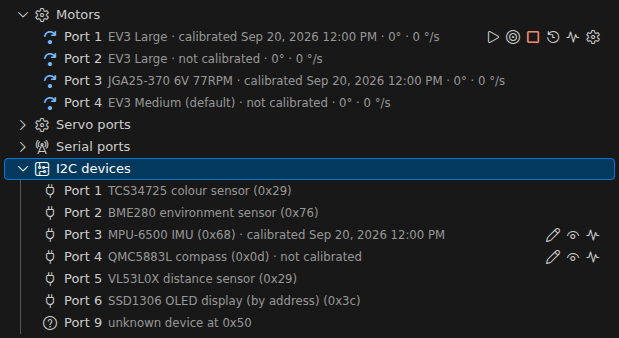
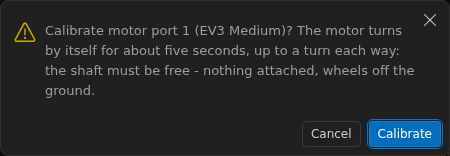
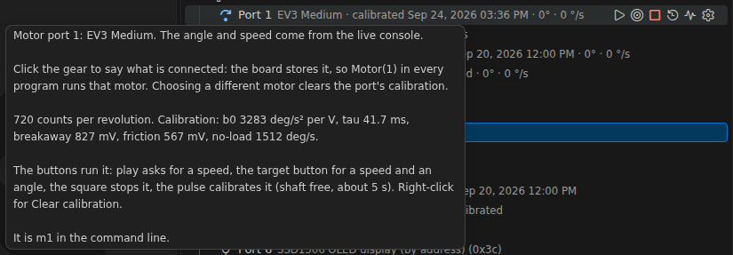
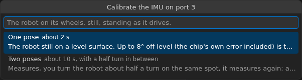
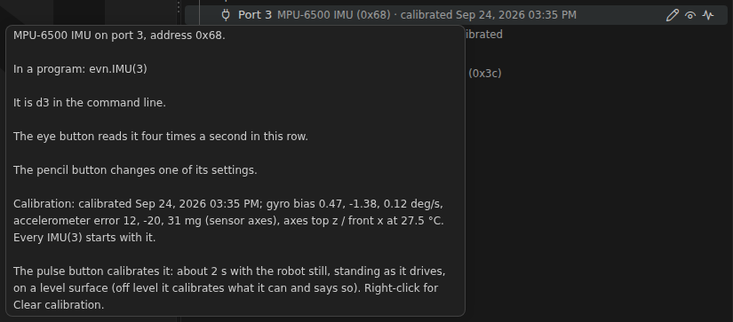
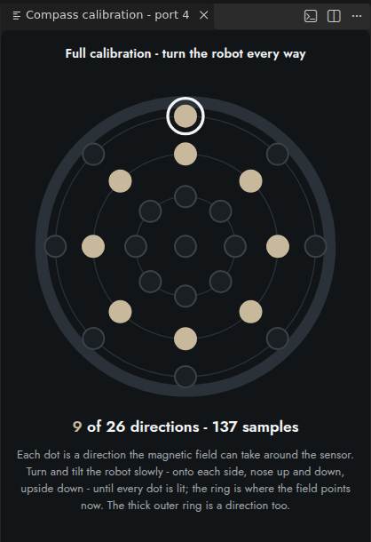
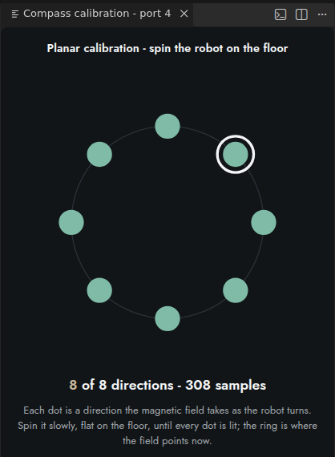

# Calibrating your robot

Three parts of an EVN ALPHA robot are worth calibrating: each **motor**, the **IMU** (gyro and accelerometer) and the **compass**. Each calibration takes a few seconds to a minute, is stored on the board for that port, and is used by every program from then on, from any computer, after every reboot. You calibrate once, and again only when something on the robot changes.

| What | Why | Takes | Stored for | Do it again when |
| :--- | :--- | :--- | :--- | :--- |
| [Motor](#motors) | measures this motor's strength, time constant and friction, so moves are fast and land on target; finds which way its encoder counts | about 11 s, shaft free to turn | motor port 1–4 | you swap the motor, or choose a different motor for the port |
| [IMU](#imu) | removes the gyro's bias and the accelerometer's error, and finds which way the module is mounted, so the heading does not drift from the start and a level robot reads level | about 2 s still (one pose), or about 10 s with a half turn (two poses) | I2C port 1–16 | you move the module to another port, plug in another module, or change how it is mounted |
| [Compass](#compass) | removes the pull of the robot's own iron (motors, battery, screws), so the heading points to magnetic north | about 20 s (planar) to a minute (full) of turning the robot | I2C port 1–16 | you move the motors, the battery or other metal parts, or the compass itself |

You can calibrate from the extension's **Board view** (buttons on each row, no code), from **Python**, or from **blocks**. All three store the same record.

## Before you start

- **Set the board's clock.** A calibration record carries the date it was made. The board has no battery-backed clock: the extension's live console sets it every time it connects (`evn.clock()`), so a calibration run from the Board view, or from a program started from the extension, is dated. A program that runs without the extension (a `main.py` started from the user button) stores its calibration as *date unknown*.
- **Stop the motors.** Storing a calibration is a flash write, which the firmware never does while a motor is driving. If a motor is running at that moment, the calibration is used at once but reaches the flash only once every motor has stopped; until then the Board view says *calibrated (not yet in flash)*.
- **For the Board view:** open the **Board** section (secondary side bar, **Ctrl+Alt+B**) and make sure the line at its top reads **live · connected …** — the calibration buttons appear only while the live console is connected ([Getting started](GETTING_STARTED.md), §3b). They sit on each row as small icons: the **pulse** button calibrates, and the same entries are in the row's right-click menu together with **Clear calibration**.



## Motors

A motor's calibration measures how strongly it accelerates for each volt (`b0`), how quickly it responds (`tau_ms`), the voltage that breaks the shaft free and the voltage its running friction costs, and its no-load speed. It also finds the direction its encoder counts and the encoder's exact phase widths, in each direction of turning (a Hall sensor's edges sit at slightly different angles each way, and a stopped shaft is placed by them), and whether the rotor cogs: it ends with 20 short kicks, and a rotor with magnetic detents (the Pololu 25D) comes to rest in one every time, so the rests line up at the detent period. A custom motor that cogs is then controlled like a library motor with detents (the detents are cancelled while it moves, and the shaft rests in its nearest detent at the end of a move); `evn.calibration(port)["cogging_edges"]` gives the period. The motor controller is built from these numbers, so a calibrated motor moves faster and lands more exactly than one running on its model's defaults. The measured no-load speed becomes the motor's 100 % (`full_speed()`), and, when it is higher than the model's default, its speed limit.

**The shaft must be free to turn.** The motor moves by itself for about eleven seconds, up to about a turn and a half each way, and stops near where it started. Take anything off it that must not move, and lift a robot's wheels off the ground.

### From the Board view

1. **Say which motor is on the port.** Press the **gear** on the motor's row and pick *EV3 Large*, *EV3 Medium*, *NXT*, *JGA25-370 6V 77RPM*, *Pololu 25D 9.7:1 HP 12V*, *CHR-GM16-030PA 9V 1:63*, or *Custom…* for any other DC motor with a quadrature encoder. The choice is stored on the board. A port nobody has configured runs the firmware's default (EV3 Large on ports 1–2, EV3 Medium on 3–4), shown as *EV3 Large (default)*.
2. **Press the pulse button** on the row (or right-click → **Calibrate this motor (shaft free, ~11 s)...**). A dialog asks you to free the shaft; press **Calibrate**.
3. A notification shows **EVN: calibrating motor port N... (about 11 s, shaft free)** while the row reads *calibrating... (shaft free)*.
4. When it is done, a message gives the numbers (`b0`, `tau`, the breakaway voltage, the no-load speed) and says *and stored*.



The Board view calibrates one motor at a time. The row then shows one of:

| Row | Meaning |
| :--- | :--- |
| *calibrated 21 Sep 2026 14:02* | calibrated and stored, with the date |
| *calibrated (date unknown)* | calibrated by a program while the board's clock was not set |
| *calibrated (not yet in flash)* | in use, stored once every motor has stopped |
| *not calibrated* | runs on the motor model's defaults |
| *calibration is for another motor - calibrate again* | the stored record was made for a different motor model and is not used |
| *encoder reversed* | the calibration found this motor's encoder counting against its drive (a non-LEGO motor wired the other way round, such as the JGA25 or the Pololu 25D on the EVN cable) and flipped it; the motor simply works |

The row's tooltip lists the measured numbers, and why the last calibration failed if it did.



### From Python

```python
from evn import Motor
m = Motor(1)
print(m.calibrate())      # (b0, tau_ms, v_break_mv, v_f_mv), after about 11 s
```

Several motors in one go: start each with `wait=False` (the board measures them one after another in the background), then wait until none is busy. Do not call `calibrate()` again to wait: on a port that has already finished, that starts a new run.

```python
import evn
from evn import Motor, wait

motors = [Motor(1), Motor(2), Motor(3), Motor(4)]
for m in motors:
    m.calibrate(wait=False)
while any(evn.calibration(p)["busy"] for p in (1, 2, 3, 4)):
    wait(50)
```

If the shaft cannot turn, or the measurement does not fit, `calibrate()` raises `RuntimeError("calibration failed: …")` and the reason is also kept in `evn.calibration(port)["error"]`. Ctrl-C or the user button stop it: the motor coasts and `calibrate()` raises `KeyboardInterrupt`. The full description is in the [API reference](API_ROBOT.md#calibrating-the-motor-calibrate).

### From blocks

| Block | Does |
| :--- | :--- |
| **calibrate motor** *1* **wait** ☑ | calibrates the motor and waits for it (about 11 s). Unticked, it starts the calibration and goes on: start each motor that way, then a ticked block on the same port waits for that run, so several motors calibrate together |
| **motor** *1* **is calibrated** | `True` when the port has a calibration — use it to calibrate only once: *if not motor 1 is calibrated: calibrate motor 1* |

### When to calibrate a motor again

- **You put a different motor on the port.** Say so with the gear first: choosing a different motor clears the port's calibration, because the old motor's numbers must not run the new one. Then calibrate.
- **You changed a port to a custom, JGA25, Pololu 25D or CHR-GM16 motor.** Calibrate before its first real move: until then the firmware only knows the usual wiring for its encoder direction, and `Motor(port)` warns once that it is not calibrated.
- **Never** plug a LEGO motor into a port whose row says *encoder reversed* without telling the gear: the flip belongs to the port's record, and would make the new motor run away. Changing the motor with the gear (or **Clear calibration**) removes it.
- A program's `Motor(port, model="EV3 Medium")` that names another model than the port's stored one runs that model's defaults for the session and prints a `WARNING`; the stored calibration comes back when the program names the right model again or the board reboots.

## IMU

The IMU calibration measures the gyro's bias (the small turn rate it reads while standing still), the accelerometer's error, and which of the sensor's axes points up. It is written into the chip's own offset registers, so the heading, the tilt, the raw readings and `evn.Pose` all use it. Afterwards:

- **the gyro is right from the first sample**: `ready()` comes as soon as the robot is still, instead of 8–25 s later, and `DriveBase.use_gyro(True)` does not have to wait;
- **the robot reads level** (`tilt()` about 0) standing the way it was calibrated;
- the IMU's `top` axis is set from gravity. Gravity cannot tell forward, so the `front` axis is kept where it can be — check it (the IMU row's pencil button → **axes**, or `imu.axes()`).

**Calibrate with the robot on its wheels, standing as it drives, still, on a surface as level as you have.** Whatever tilt is left (up to 8°) is taken as the sensor's error, so that pose then reads level. A table that is not level adds its slope to the error; the **two-pose** calibration removes it.

| During the calibration | What is calibrated |
| :--- | :--- |
| level within 5° | gyro, accelerometer and the up axis |
| 5°–8° off level | the same, with a warning: a tilted **mount** is levelled out, but a sloped **surface** stays as an error of about its slope — calibrate again on a level surface, or use two poses |
| 8°–30° off level | the gyro and the up axis only; the accelerometer keeps what it had, and a warning says so |
| more than 30° off (the module mounted between axes), or not reading 1 g | the gyro only; set `axes()` yourself |
| moving, or turning | nothing: the calibration fails and the stored one is kept |

**Two poses** take the surface out: the IMU measures, you turn the robot about half a turn (120° to 240°) on the same spot, on its wheels, and it measures again. The slope of the table turns with the robot while the sensor's own error and its mounting stay, so the two can be told apart; only the sensor and the mounting are stored (a slope up to 20° is left out and reported). Do not lift or tip the robot between the poses, keep the turn smooth, and take the second pose within two minutes.

### From the Board view

1. Press the **pulse** button on the IMU's row (or right-click → **Calibrate this IMU (still and level, ~2 s)...**).
2. Pick **One pose** (*about 2 s*) or **Two poses** (*about 10 s, with a half turn in between*).
3. Put the robot on its wheels and keep it still, then press **Calibrate** (one pose) or **Measure the first pose** (two poses). The row reads *calibrating... keep it still*.
4. Two poses only: when asked, turn the robot about half a turn on the same spot, let it rest, and press **Measure the second pose**. Closing that dialog cancels: nothing is changed.
5. A message gives the axes, the gyro bias and how far off level it was (or the slope it left out). A warning message says what it could not calibrate.



The row then shows *calibrated \<date\>*, followed by *(gyro only, accelerometer not)* when the accelerometer part was left out or *(!)* when there is a warning (the tooltip says which). The tooltip lists the gyro bias, the accelerometer error and the axes.



### From Python

```python
from evn import IMU
imu = IMU(3)
print(imu.calibrate())          # about 2 s, still and level: returns imu.calibration()
```

Two poses:

```python
imu.calibrate(pose=1)           # still
# ...turn the robot about half a turn on the same spot, let it rest...
imu.calibrate(pose=2)
```

`IMU(port, calibrate=True)` calibrates when the program starts. `imu.calibrate(wait=False)` starts it and returns at once (`imu.calibration()["busy"]` until it is done); `imu.cancel_calibration()` drops a calibration in progress or a first pose that is waiting. A robot that moved or turned during the measurement raises `RuntimeError("IMU calibration failed: …")`. The full description is in the [API reference](API_SENSORS.md#imu-calibration).

### From blocks

| Block | Does |
| :--- | :--- |
| **set up IMU on port** *1* **calibrate at start** ☐ | ticked: a new calibration is measured when the program starts (still and level, about 2 s); unticked, the stored one is used |
| **calibrate IMU** *1* *(still and level)* / *first pose of two* / *second pose* | the one-pose calibration, or the two poses (turn the robot half a turn between the two blocks) |

### When to calibrate the IMU again

- after moving the module to another I2C port, or plugging another module in: the calibration belongs to the **port**, not to the module;
- after changing how the module is mounted on the robot;
- when the robot no longer reads level on a level floor, or `ready()` takes long again.

Clearing it (**Clear calibration**, or `imu.clear_calibration()`) puts the chip back on its factory trim; the axes stay as they are.

## Compass

A compass on a robot reads the robot's own iron — motors, battery, screws — as well as the Earth's field. Without a calibration the heading can be off by tens of degrees. The calibration collects the field while you turn the robot through many directions and fits a correction for the robot's iron (the **hard iron**, a constant offset, and the **soft iron**, a stretch of the field). It is stored for the port and every later `Compass(port)` starts with it; an `evn.Pose` uses the compass only once it is calibrated.

**Calibrate on the robot as it drives**: motors, battery and metal parts in place, away from other magnets and large steel (a steel table, a radiator). Set the compass's axes (`axes()`, from the module's silkscreen) first: changing them afterwards drops the calibration.

Two kinds:

| | Full | Planar |
| :--- | :--- | :--- |
| How | turn the robot slowly through **every orientation** — onto each side, nose up and down, upside down — as if tracing a ball | **spin** the robot slowly on a flat floor, a couple of full turns |
| Takes | about a minute | about 20 s |
| For | a robot that tilts or climbs | a robot that only drives on the floor; the heading is right only while it stays flat |

### From the Board view, with the map of directions

1. Press the **pulse** button on the compass's row (or right-click → **Calibrate this compass (full or planar)...**).
2. Pick **Full** (*every orientation, about a minute*) or **Planar** (*spin it on the floor, about 20 s*), then **Start**.
3. A panel **Compass calibration - port N** opens beside the editor with a **map of the directions**, and a notification counts them: *12 of 26 directions, 640 samples - keep turning*.
4. Turn the robot. Each dot on the map is a direction the magnetic field can take around the sensor — 26 for a full calibration (the thick outer ring is one of them), 8 on a ring for a planar one. A dot lights up in the EVN tan once the field has pointed that way; the ring marks where it points now. **The dots are directions of the field, not of the robot**: turn the robot until the ring lands on the dark dots.
5. The calibration **finishes by itself**: once 75 % of the directions are lit in a full calibration (20 of 26 — so the map need not be complete) or all 8 in a planar one, the extension tries the fit and stops as soon as it is accepted. If the fit wants more, the panel says *The fit wants more directions: keep turning, and light the dark dots.* When every dot is lit the map turns jade — in a full calibration that is rarely needed: the last few directions (upside down, nose straight down) are the hardest to reach, and about 75 % already gives a good fit.
6. Pressing **Cancel** on the notification, or three minutes without enough directions, asks whether to **Finish with the directions so far** or **Discard** (the previous calibration stays).
7. A message gives the share of directions covered and the fit error. Above 8 % it suggests calibrating again, away from magnets and steel and turning more slowly. On success it suggests setting the heading's zero: point the robot north and use the row's pencil button → **north (set the heading)**.





*The pictures come from the browser IDE's simulated board (developer mode), so the numbers in them are the simulator's.*

The row then shows *calibrated \<date\> (full)* or *(planar)*; the tooltip gives the share of the directions covered, the fit error, the field strength, the chip and the axes.

### From Python

```python
from evn import Compass, wait
c = Compass(6)
c.calibrate()                   # full; c.calibrate(planar=True) for planar
while c.calibrate_progress()[1] < 0.75:
    wait(500)                   # keep turning the robot
print(c.calibrate_stop())       # (residual, coverage, samples); stored for port 6
```

`calibrate_progress()` returns `(samples, coverage)` with the coverage from 0 to 1. `calibrate_stop()` refuses a fit with too few samples or directions (`ValueError("calibration refused: …")`) and keeps collecting, so turn some more and call it again, or end with `calibrate_cancel()`. `calibrate_directions()` gives the map's data (which directions are lit, and the current one). A residual of 0.02 means the fitted field is within 2 % everywhere. The full description is in the [API reference](API_SENSORS.md#compass-calibration).

### From blocks

| Block | Does |
| :--- | :--- |
| **start calibrating compass** *1* **spinning flat** ☑ | starts a planar calibration (ticked) or a full one (unticked, tumble the robot) |
| **compass** *1* **calibration coverage (%)** | how many of the directions have been seen so far, 0–100 |
| **finish calibrating compass** *1* | fits and stores the calibration; wait until the coverage is high enough first, or it raises: about **75 %** for a full calibration, **100 %** for a planar one |
| **cancel calibrating compass** *1* | ends the collection; the calibration the compass had before stays |

### When to calibrate the compass again

- after moving the motors, the battery or other metal parts on the robot, or the compass itself: the iron being corrected is the robot's;
- after changing the compass's `axes()` (the stored calibration is used only with the axes it was made with), or plugging a compass of another chip type into the port;
- when `heading_confidence()` stays low, or `evn.Pose` keeps dropping the compass from its `sources()`.

## Checking and clearing calibrations

The Board view's rows always show the state. In Python, three functions read the stored records without opening the device:

| Call | Returns |
| :--- | :--- |
| `evn.calibration(port)` | motor port 1–4: `calibrated`, `stored`, `stamp` (the date as seconds since 1970, 0 when unknown), the measured numbers, `encoder_reversed`, the detent period (`cogging_edges`, `cogging_measured`, `cogging_confidence`, `cogging_note`), `warning` and `error` |
| `evn.imu_calibration(port)` | I2C port 1–16: `calibrated`, `stored`, `stamp`, the gyro bias and accelerometer error, the axes, `accel_calibrated`, `tilt`, `warning`, `error` |
| `evn.compass_calibration(port)` | I2C port 1–16: `calibrated`, `stored`, `stamp`, `planar`, `coverage`, `residual`, `field`, the axes, the chip, `error` |

```python
import evn
print(evn.calibration(1)["calibrated"], evn.imu_calibration(3)["stamp"])
```

To **clear** a calibration: right-click the row → **Clear calibration** (**Clear this motor port's calibration...**, **Clear this IMU's calibration...**, **Clear this compass's calibration...**), or in Python `evn.clear_calibration(port)` for a motor, `imu.clear_calibration()`, `c.clear_calibration()`. A motor goes back to its model's defaults, an IMU to its factory trim, a compass to the raw field. Like storing, clearing is a flash write that waits for every motor to stop.

Where it is kept: each kind has its own page in the board's flash (motor, IMU and compass records, one entry per port), apart from your files. Flashing a new firmware keeps them, as it keeps your files.

## When something goes wrong

| Message | What to do |
| :--- | :--- |
| *motor port N did not calibrate: …* / `RuntimeError: calibration failed: …` | the message says why — usually the shaft could not turn freely: free it and try again |
| *calibration is for another motor - calibrate again* | the port's motor was changed without the gear: pick the right motor with the gear, then calibrate |
| *the IMU on port N did not calibrate: …* / `RuntimeError: IMU calibration failed: …` | the robot moved or turned while measuring: keep it still (for two poses: turn it by 120°–240°, on its wheels, within two minutes) |
| an IMU warning, or a row ending in *(gyro only, accelerometer not)* | the robot was more than 5° off level (8° for the accelerometer to be left out): calibrate on a level surface, or use two poses |
| *the compass on port N was not calibrated: …* / `ValueError: calibration refused: …` | too few directions: keep turning, lighting the dark dots (full: tip the robot onto its sides and upside down too) |
| a high fit error | calibrate again away from magnets and steel, turning more slowly |
| the calibration buttons are missing | the live console is not connected: see [Getting started](GETTING_STARTED.md), §3b |

The complete calls, with every argument and error, are in the [API reference](API_ROBOT.md#calibration-records-evncalibration).
