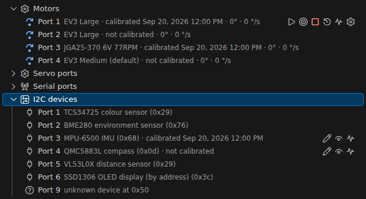
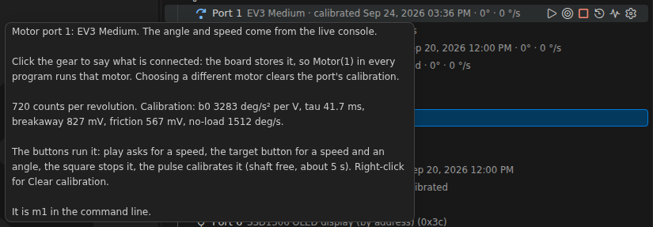
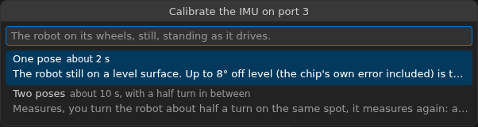
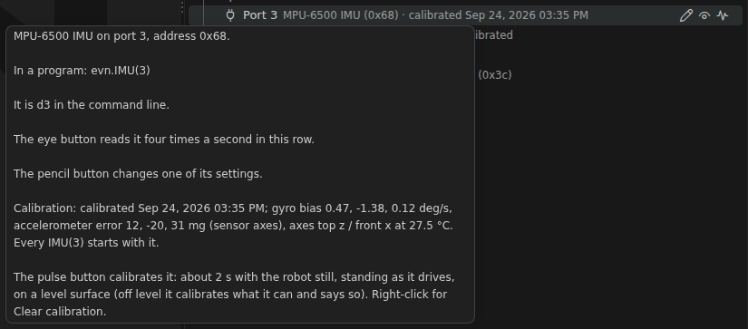
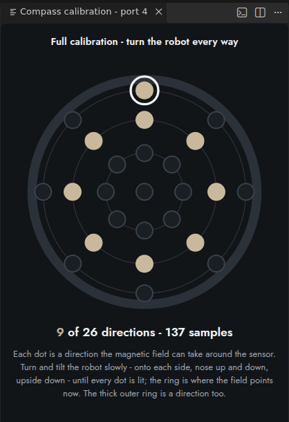
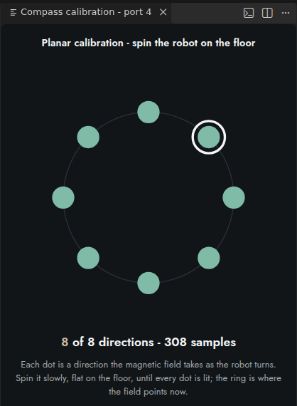
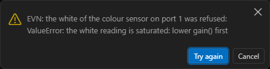
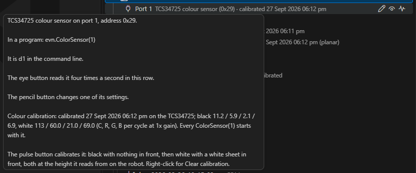

# Calibrating your robot

Four parts of an EVN ALPHA robot are worth calibrating: each **motor**, the **IMU** (gyro and accelerometer), the **compass** and the **colour sensors** (`ColorSensor`, `GestureSensor`); the extended **VL53L1X** distance sensor has its own offset calibration too. Each calibration takes a few seconds to a minute, is stored on the board for that port, and is used by every program from then on, from any computer, after every reboot. You calibrate once, and again only when something on the robot changes.

| What | Why | Takes | Stored for | Do it again when |
| :--- | :--- | :--- | :--- | :--- |
| [Motor](#motors) | measures this motor's strength, time constant and friction, so moves are fast and land on target; finds which way its encoder counts | about 12–13 s per port, shaft free to turn | motor port 1–4 | you swap the motor, or choose a different motor for the port; a mechanism that was cold when you calibrated it |
| [IMU](#imu) | removes the gyro's bias and the accelerometer's error, and finds which way the module is mounted, so the heading does not drift from the start and a level robot reads level | about 2 s still (one pose), or about 10 s with a half turn (two poses) | I2C port 1–16 | you move the module to another port, plug in another module, or change how it is mounted |
| [Compass](#compass) | removes the pull of the robot's own iron (motors, battery, screws), so the heading points to magnetic north | about 20 s (planar) to a minute (full) of turning the robot | I2C port 1–16 | you move the motors, the battery or other metal parts, or the compass itself |
| [Colour sensor](#colour-sensors) | takes the black (nothing in front) and the white (a white sheet), so a white reads white under the module's own light and colours are named reliably | two readings, a few seconds | I2C port 1–16 | you move the sensor to another height above the surface, change the light, or plug another sensor into the port |
| [VL53L1X distance sensor](#vl53l1x-distance-sensor) (an extended peripheral) | corrects the distance it reads (the offset) and, behind a cover window, the light the window reflects (the crosstalk) | about 2 s with a flat card at a measured distance | I2C port 1–16 | you put a window in front of it, or plug another sensor into the port |

You can calibrate from the extension's **Board view** (buttons on each row, no code), from **Python**, or from **blocks**. All three store the same record.

## Before you start

- **Set the board's clock.** A calibration record carries the date it was made. The board has no battery-backed clock: the extension's live console sets it every time it connects (`evn.clock()`), so a calibration run from the Board view, or from a program started from the extension, is dated. A program that runs without the extension (a `main.py` started from the user button) stores its calibration as *date unknown*.
- **Stop the motors.** Storing a calibration is a flash write, which the firmware never does while a motor is driving. If a motor is running at that moment, the calibration is used at once but reaches the flash only once every motor has stopped and the next read of it (the Board view's rescan does one every few seconds); until then the Board view says *calibrated (not yet in flash)*.
- **For the Board view:** open the **Board** section (secondary side bar, **Ctrl+Alt+B**) and make sure the line at its top reads **live · connected …** — the calibration buttons appear only while the live console is connected ([Getting started](GETTING_STARTED.md), §3b). They sit on each row as small icons: the **pulse** button calibrates, and the same entries are in the row's right-click menu together with **Clear calibration**.



## Motors

A motor's calibration measures how strongly it accelerates for each volt (`b0`), how quickly it responds (`tau_ms`), the voltage that breaks the shaft free and the voltage its running friction costs, and its no-load speed. It also finds the direction its encoder counts and the encoder's exact phase widths, in each direction of turning (a Hall sensor's edges sit at slightly different angles each way, and a stopped shaft is placed by them), and whether the rotor cogs: it ends with 20 short kicks, and a rotor with magnetic detents (the Pololu 25D) comes to rest in one every time, so the rests line up at the detent period. A custom motor that cogs is then controlled like a library motor with detents (the detents are cancelled while it moves, and the shaft rests in the detent nearest its target at the end of a move); `evn.calibration(port)["cogging_edges"]` gives the period. The motor controller is built from these numbers, so a calibrated motor moves faster and lands more exactly than one running on its model's defaults. The measured no-load speed becomes the motor's 100 % (`full_speed()`), and, when it is higher than the model's default, its speed limit.

**The shaft must be free to turn.** The motor moves by itself for about twelve seconds, up to about a turn and a half each way, and stops near where it started. Take anything off it that must not move, and lift a robot's wheels off the ground.

**A motor can be calibrated with its mechanism attached** (a gear train, a wheel in the air): the mechanism's friction and inertia then become part of the motor's model, and `load()` reads only what is added on top. Calibrate it **warm**, after it has run for a minute: a cold gear train's friction falls over its first seconds of motion, and a calibration taken then describes a state the motor leaves behind. The calibration measures this itself (its first pulse is run once more at the end) and, when the mechanism changed by more than 3 % meanwhile, the row reads *calibrate again warm*, its tooltip and `evn.calibration(port)["warning"]` say *calibrate again after a minute of running*, and `["drift"]` is the change. The warning and the number are not stored with the record: they last until the board is switched off, so a record taken cold looks clean after a power-up.

### From the Board view

1. **Say which motor is on the port.** Press the **gear** on the motor's row and pick *EV3 Large*, *EV3 Medium*, *NXT*, *JGA25-370 6V 77RPM*, *Pololu 25D 9.7:1 HP 12V*, *CHR-GM16-030PA 9V 1:63*, *CM22-2230 12V 1:49*, or *Custom…* for any other DC motor with a quadrature encoder. The choice is stored on the board. A port nobody has configured runs the firmware's default (EV3 Large on ports 1–2, EV3 Medium on 3–4), shown as *EV3 Large (default)*.
2. **Press the pulse button** on the row (or right-click → **Calibrate this motor (shaft free, ~12 s)...**). A dialog asks you to free the shaft; press **Calibrate**.
3. A notification shows **EVN: calibrating motor port N... (about 12 s, shaft free)** while the row reads *calibrating... (shaft free)*.
4. When it is done, a message gives the numbers (`b0`, `tau`, the breakaway voltage, the no-load speed) and says *and stored*.


A calibration takes about 12–13 s per port; a breakaway that has to be measured again (a reading below the running friction is re-run) adds about 0.8 s each time, at most four times. The Board view waits up to 75 s, above the theoretical bound with every internal timeout hit (about 74 s); every calibration seen on the bench is under 15 s; from Python several ports calibrate one after another (only one drives at a time), so they take about the sum. A calibration page written by this firmware (record version 8) is refused by an older firmware: after a downgrade, choose the motor again and calibrate again.

The Board view calibrates one motor at a time. The row then shows one of:

| Row | Meaning |
| :--- | :--- |
| *calibrated 21 Sep 2026 14:02* | calibrated and stored, with the date |
| *calibrated (date unknown)* | calibrated by a program while the board's clock was not set |
| *calibrated (not yet in flash)* | in use, stored once every motor has stopped |
| *not calibrated* | runs on the motor model's defaults |
| *calibration is for another motor - calibrate again* | the stored record was made for a different motor model and is not used |
| *encoder reversed* | the calibration found this motor's encoder counting against its drive (a non-LEGO motor wired the other way round, such as the JGA25 or the Pololu 25D on the EVN cable) and flipped it; the motor simply works |

The row's tooltip lists the measured numbers, and why the last calibration failed if it did.



### From Python

```python
from evn import Motor
m = Motor(1)
print(m.calibrate())      # (b0, tau_ms, v_break_mv, v_f_mv), after about 12 s
```

Several motors in one go: start each with `wait=False` (the board measures them one after another in the background), then wait until none is busy. A `calibrate()` on each port collects the results as well: it joins a run that is still going and hands over the result of one that has already finished (a command that moves, holds or stops the motor in between - `m.run()`, `m.stop()`, `m.hold()`, or its `DriveBase`, `close()`, a take-over, `evn.stop_all()` - drops that result, and the `calibrate()` then measures again; reads and settings - `m.angle()`, `m.speed()`, `m.reset_angle()`, `m.settings()` - do not).

```python
import evn
from evn import Motor, wait

motors = [Motor(1), Motor(2), Motor(3), Motor(4)]
for m in motors:
    m.calibrate(wait=False)
while any(evn.calibration(p)["busy"] for p in (1, 2, 3, 4)):
    wait(50)
```

If the shaft cannot turn, or the measurement does not fit, `calibrate()` raises `RuntimeError("calibration failed: …")` and the reason is also kept in `evn.calibration(port)["error"]`. Ctrl-C or the user button stop it: the motor coasts and `calibrate()` raises `KeyboardInterrupt`. The full description is in the [API reference](API_ROBOT.md#calibrating-the-motor-calibrate).

### From blocks

| Block | Does |
| :--- | :--- |
| **calibrate motor** *1* **wait** ☑ | calibrates the motor and waits for it (about 12 s). Unticked, it starts the calibration and goes on: start each motor that way, then a ticked block on the same port waits for that run, so several motors calibrate together |
| **motor** *1* **is calibrated** | `True` when the port has a calibration — use it to calibrate only once: *if not motor 1 is calibrated: calibrate motor 1* |

### When to calibrate a motor again

- **You put a different motor on the port.** Say so with the gear first: choosing a different motor clears the port's calibration, because the old motor's numbers must not run the new one. Then calibrate.
- **You changed a port to a custom, JGA25, Pololu 25D, CHR-GM16 or CM22-2230 motor.** Calibrate before its first real move: until then the firmware only knows the usual wiring for its encoder direction, and `Motor(port)` warns once that it is not calibrated. If the encoder does count the other way, the first closed-loop move runs away: the runaway guard coasts the motor within about a quarter of a second and the program stops with `RuntimeError: Motor(n) ran against its own drive … run calibrate() with the shaft free` — which is the fix. (A custom motor is guarded before its calibration only when `evn.configure_motor` was given its `no_load_speed`.)
- **The row says *calibrate again after a minute of running*.** The mechanism on the shaft (a gear train) was still warming up while it was measured: run it for a minute, then calibrate again. (On a mechanism with gear play it can also mean the calibration's first pulse met a touch late in its record - a cable, the frame: free the shaft and calibrate again.) `evn.calibration(port)["drift"]` is how much it changed, and a program's `m.calibrate()` prints the same `WARNING: Motor(n): …` line. Under 3 % there is no warning, and a friction that only rises or only falls while the motor is measured moves the stored numbers by at most about 2.4 % of its speed per volt (K) and 0.13 V of running friction on a JGA25 under a gear train, about as much as two warm calibrations of it differ. A friction that falls and comes back during the calibration is not seen, nor one whose speed-dependent drag eases while its running friction grows (or the other way round).
- **The calibration says *the four pulses disagree on the motor's response time* or *running friction far below this motor model's*.** The result did not look like the motor on the port, so it was **not stored**: the port keeps the calibration it had (or its model's defaults), and `calibrate()` raises `RuntimeError("calibration failed: …")` with that text - as soon as its pulses are done, before the slow ramps. The first means the calibration's pulses took very different times to reach their speed (the slowest over three times the fastest), which one motor does not do: something touched the shaft or the wheel while it turned (a cable, the table, a wheel rubbing on the frame, a loose hub), or the mechanism on the shaft has a lot of play and a heavy load behind it. (A first pulse that alone disagrees - gear play it had to take up, or a touch only it met early on - is not a refusal: the calibration repeats that pulse at its end, and when the rest agree with the repeat, the first pulse takes the repeat's response time and its speed is read from the second half of its own record, after the play. The drift check still runs; a touch that pulse met late, in that second half, is not mended and shows as the *calibrate again* note below.) The second is said on a port set to a CHR-GM16 or an EV3 Medium, whose running friction the calibration always measures: it came out far below the usual (under 0.3 of the model's figure, and never under 0.15 V) while everything else looked like that motor, so something rubbed or caught, the port is set to another motor than the one on it, or a load on the shaft grows with its speed (a fan, a propeller, a very stiff grease) - such a load is refused even when the rest of the result would be about right, so calibrate the motor without it (the controller then handles the load as it runs). Behind gear play, when the first pulse was mended as above, this test is not applied and such a load is stored (its b0 about right). It is said where the motor was chosen with the gear or `evn.configure_motor`, or named in `Motor(port, model=...)` as another model than the port's default; a port nobody set is not held to it. Free the shaft, check the motor chosen with the gear, and calibrate again; if it keeps saying so with the shaft free, calibrate without the mechanism. Until then the row reads *not calibrated* (as after any calibration that failed) although the port still runs, and has in flash, the calibration it had; after the next power-up the row shows it again. (This is what a CHR-GM16 whose wheel caught now and then used to store without a word, and then hunt on.)
- A result outside the range the port's motor is known for (`stored b0 is not plausible for this motor model`, usually another kind of motor on the port - an EV3 Large on a port set to EV3 Medium, say) is stored and used, and `calibrate()` says so at once, as `Motor(n)` does at every boot; the Board view shows it beside its "calibrated" message. When the drift check warns as well, one note names both.
- **Never** plug a LEGO motor (or any other motor) into a port whose row says *encoder reversed* without telling the gear: the flip belongs to the port's record, and would make the new motor run away at full speed — and the runaway guard does **not** reliably catch this one, because it judges the speed in the terms of the motor the port is set up for (its counts per turn, its calibration), and an EV3 motor on a Pololu or JGA25 port reads far below that motor's top speed. Stop the program to coast it. Changing the motor with the gear (or **Clear calibration**) removes the flip.
- A program's `Motor(port, model="EV3 Medium")` that names another model than the port's stored one runs that model's defaults for the session and prints a `WARNING`; the stored calibration comes back when the program names the right model again or the board reboots.

## IMU

The IMU calibration measures the gyro's bias (the small turn rate it reads while standing still), the accelerometer's error, and which of the sensor's axes points up. It is written into the chip's own offset registers, so the heading, the tilt, the raw readings and `evn.Pose` all use it. Afterwards:

- **the gyro is right from the first sample**: `ready()` comes as soon as the robot is still, instead of 8–25 s later, and `DriveBase.use_gyro(True)` does not have to wait. The bias drifts a little with temperature, so until the IMU's own gyro calibration lands (8–25 s still) the heading can still creep a fraction of a degree: `imu.heading_confidence()` reads 0.5 until then and 1 after, for a program that waits for it;
- **the robot reads level** (`tilt()` about 0) standing the way it was calibrated;
- the IMU's `top` axis is set from gravity. Gravity cannot tell forward, so the `front` axis is kept where it can be — check it (the IMU row's pencil button → **axes**, or `imu.axes()`).

**Calibrate with the robot on its wheels, standing as it drives, still, on a surface as level as you have.** Whatever tilt is left (up to 8°) is taken as the sensor's error, so that pose then reads level. A table that is not level adds its slope to the error; the **two-pose** calibration removes it.

| During the calibration | What is calibrated |
| :--- | :--- |
| level within 5° | gyro, accelerometer and the up axis |
| 5°–8° off level | the same, with a warning: a tilted **mount** is levelled out, but a sloped **surface** stays as an error of about its slope — calibrate again on a level surface, or use two poses |
| 8°–30° off level | the gyro and the up axis only; the accelerometer keeps what it had, and a warning says so |
| more than 30° off (the module mounted between axes), or not reading 1 g | the gyro only; set `axes()` yourself |
| moving, or turning | nothing: the calibration fails and the stored one is kept |

**Two poses** take the surface out: the IMU measures, you turn the robot about half a turn (120° to 240°) on the same spot, on its wheels, and it measures again. The slope of the table turns with the robot while the sensor's own error and its mounting stay, so the two can be told apart; only the sensor and the mounting are stored (a slope up to 20° is left out and reported). Do not lift or tip the robot between the poses, keep the turn smooth, and take the second pose within two minutes.

### From the Board view

1. Press the **pulse** button on the IMU's row (or right-click → **Calibrate this IMU (still and level, ~2 s)...**).
2. Pick **One pose** (*about 2 s*) or **Two poses** (*about 10 s, with a half turn in between*).
3. Put the robot on its wheels and keep it still, then press **Calibrate** (one pose) or **Measure the first pose** (two poses). The row reads *calibrating... keep it still*.
4. Two poses only: when asked, turn the robot about half a turn on the same spot, let it rest, and press **Measure the second pose**. Closing that dialog cancels: nothing is changed.
5. A message gives the axes, the gyro bias and how far off level it was (or the slope it left out). A warning message says what it could not calibrate.



The row then shows *calibrated \<date\>*, followed by *(gyro only, accelerometer not)* when the accelerometer part was left out or *(!)* when there is a warning (the tooltip says which). The tooltip lists the gyro bias, the accelerometer error and the axes.



### From Python

```python
from evn import IMU
imu = IMU(3)
print(imu.calibrate())          # about 2 s, still and level: returns imu.calibration()
```

Two poses:

```python
imu.calibrate(pose=1)           # still
# ...turn the robot about half a turn on the same spot, let it rest...
imu.calibrate(pose=2)
```

`IMU(port, calibrate=True)` calibrates when the program starts. `imu.calibrate(wait=False)` starts it and returns at once (`imu.calibration()["busy"]` until it is done); `imu.cancel_calibration()` drops a calibration in progress or a first pose that is waiting. A robot that moved or turned during the measurement raises `RuntimeError("IMU calibration failed: …")`. The full description is in the [API reference](API_SENSORS.md#imu-calibration).

### From blocks

| Block | Does |
| :--- | :--- |
| **set up IMU on port** *1* **calibrate at start** ☐ | ticked: a new calibration is measured when the program starts (still and level, about 2 s); unticked, the stored one is used |
| **calibrate IMU** *1* *(still and level)* / *first pose of two* / *second pose* | the one-pose calibration, or the two poses (turn the robot half a turn between the two blocks) |

### When to calibrate the IMU again

- after moving the module to another I2C port, or plugging another module in: the calibration belongs to the **port**, not to the module;
- after changing how the module is mounted on the robot;
- when the robot no longer reads level on a level floor, or `ready()` takes long again.

Clearing it (**Clear calibration**, or `imu.clear_calibration()`) puts the chip back on its factory trim; the axes stay as they are.

## Compass

A compass on a robot reads the robot's own iron — motors, battery, screws — as well as the Earth's field. Without a calibration the heading can be off by tens of degrees. The calibration collects the field while you turn the robot through many directions and fits a correction for the robot's iron (the **hard iron**, a constant offset, and the **soft iron**, a stretch of the field). It is stored for the port and every later `Compass(port)` starts with it; an `evn.Pose` uses the compass only once it is calibrated.

**Calibrate on the robot as it drives**: motors, battery and metal parts in place, away from other magnets and large steel (a steel table, a radiator). Set the compass's axes (`axes()`, from the module's silkscreen) first: changing them afterwards drops the calibration.

Two kinds:

| | Full | Planar |
| :--- | :--- | :--- |
| How | turn the robot slowly through **every orientation** — onto each side, nose up and down, upside down — as if tracing a ball | **spin** the robot slowly on a flat floor, a couple of full turns |
| Takes | about a minute | about 20 s |
| For | a robot that tilts or climbs | a robot that only drives on the floor; the heading is right only while it stays flat |

A drive base can do the planar spin itself: start the calibration, run one wheel forward and the other backward at a low speed (about 60 °/s at the wheels turns a base with 62 mm wheels and a 17 cm track at about 22 °/s) for 20 s, then the other way for 20 s, stop the motors and finish. On the bench base that lit all 8 directions in 18 s with a fit error under 1 %; the motors' own magnets are part of what the calibration corrects, so calibrating while they run is the realistic case.

### From the Board view, with the map of directions

1. Press the **pulse** button on the compass's row (or right-click → **Calibrate this compass (full or planar)...**).
2. Pick **Full** (*every orientation, about a minute*) or **Planar** (*spin it on the floor, about 20 s*), then **Start**.
3. A panel **Compass calibration - port N** opens beside the editor with a **map of the directions**, and a notification counts them: *12 of 26 directions, 640 samples - keep turning*.
4. Turn the robot. Each dot on the map is a direction the magnetic field can take around the sensor — 26 for a full calibration (the thick outer ring is one of them), 8 on a ring for a planar one. A dot lights up in the EVN tan once the field has pointed that way; the ring marks where it points now. **The dots are directions of the field, not of the robot**: turn the robot until the ring lands on the dark dots.
5. The calibration **finishes by itself**: once 75 % of the directions are lit in a full calibration (20 of 26 — so the map need not be complete) or all 8 in a planar one, the extension tries the fit and stops as soon as it is accepted. If the fit wants more, the panel says *The fit wants more directions: keep turning, and light the dark dots.* When every dot is lit the map turns jade — in a full calibration that is rarely needed: the last few directions (upside down, nose straight down) are the hardest to reach, and about 75 % already gives a good fit.
6. Pressing **Cancel** on the notification, or three minutes without enough directions, asks whether to **Finish with the directions so far** or **Discard** (the previous calibration stays).
7. A message gives the share of directions covered and the fit error. Above 8 % it suggests calibrating again, away from magnets and steel and turning more slowly. On success it suggests setting the heading's zero: point the robot north and use the row's pencil button → **north (set the heading)**.





*The pictures come from the browser IDE's simulated board (developer mode), so the numbers in them are the simulator's.*

The row then shows *calibrated \<date\> (full)* or *(planar)*; the tooltip gives the share of the directions covered, the fit error, the field strength, the chip and the axes.

### From Python

```python
from evn import Compass, wait
c = Compass(6)
c.calibrate()                   # full; c.calibrate(planar=True) for planar
while c.calibrate_progress()[1] < 0.75:
    wait(500)                   # keep turning the robot (a planar one: 1.0, all 8 directions)
print(c.calibrate_stop())       # (residual, coverage, samples); stored for port 6
```

A drive base spinning itself, planar:

```python
from evn import Compass, Motor, wait, stop_all
c = Compass(3)
right, left = Motor(2), Motor(3)      # the left motor mounted mirrored: the same sign on both pivots the base
c.calibrate(planar=True)
for speed in (60, -60):               # one way, then back
    right.run(speed); left.run(speed)
    wait(20000)
    stop_all()
    wait(800)
print(c.calibrate_stop())             # the flash write happens with the motors stopped
```

`calibrate_progress()` returns `(samples, coverage)` with the coverage from 0 to 1. `calibrate_stop()` refuses a fit with too few samples or directions (`ValueError("calibration refused: …")`) and keeps collecting, so turn some more and call it again, or end with `calibrate_cancel()`. `calibrate_directions()` gives the map's data (which directions are lit, and the current one). A residual of 0.02 means the fitted field is within 2 % everywhere. The full description is in the [API reference](API_SENSORS.md#compass-calibration).

### From blocks

| Block | Does |
| :--- | :--- |
| **start calibrating compass** *1* **spinning flat** ☑ | starts a planar calibration (ticked) or a full one (unticked, tumble the robot) |
| **compass** *1* **calibration coverage (%)** | how many of the directions have been seen so far, 0–100 |
| **finish calibrating compass** *1* | fits and stores the calibration; wait until the coverage is high enough first, or it raises: about **75 %** for a full calibration, **100 %** for a planar one |
| **cancel calibrating compass** *1* | ends the collection; the calibration the compass had before stays |

### When to calibrate the compass again

- after moving the motors, the battery or other metal parts on the robot, or the compass itself: the iron being corrected is the robot's;
- after changing the compass's `axes()` (the stored calibration is used only with the axes it was made with), or plugging a compass of another chip type into the port;
- when `heading_confidence()` stays low, or `evn.Pose` keeps dropping the compass from its `sources()`.

## Colour sensors

The colour sensor (`ColorSensor`, TCS34725), the gesture sensor's colour (`GestureSensor`, APDS-9960) and the Extended `TCS3430` XYZ colour sensor name a colour by its hue, saturation and brightness. The light the sensor sees by is not white (the module's LED is warm), so an uncalibrated white sheet reads as a pale yellow or orange, and nothing in front can read as a dark blue. A two-point calibration fixes both: the **black** (nothing in front, or a black target) is subtracted from every reading, and the **white** (a white sheet) is scaled to 100 %, so the white reads `s` 0, `v` 100 and every colour is judged against the sensor's own white. `color()` and `color_match()` then use it.

Hold the sensor where the colours will be read (the same height above the surface as on the robot): the calibration is only right at that distance and light.

### From the Board view

1. Press the **pulse** button on the colour sensor's (or the gesture sensor's, or the TCS3430's) row, or right-click → **Calibrate this colour sensor (black, then white)...**. The row reads *calibrating... black, then white*.
2. **Step 1 of 2, the black.** The dialog says what to set up: for the colour sensor and the TCS3430, nothing in front of it (or a black target) at the height it reads from (about 1 cm for the TCS3430, lit by its own LED); for the gesture sensor, the sensor **covered completely** (a hand or a black card on it). Press **Take the black**.
3. **Step 2 of 2, the white.** Hold a white sheet in front: close to the colour sensor or the TCS3430, at that same height; a few cm in front of the gesture sensor, in the room light, without shading the module. Press **Take the white**.
4. A message gives the record the board stored: the chip, the black and the white (four numbers each: clear, red, green, blue, in counts per cycle at 1× gain; the TCS3430's three: X, Y, Z), and says *and stored*, or *not yet in flash* when a motor was driving. Its **Clear calibration** button undoes it.


Each reading is stored the moment it is taken. When the board refuses one, a dialog shows the sensor's own reason word for word — *the white reading is saturated: lower gain() first*, *the white target is too dark or not brighter than the black reference: hold a white sheet in front*, *the black reading is too bright: nothing (or a black target) in front* — with **Try again**: fix what it says (for a saturated white, lower the gain with the row's pencil button first) and press it. A black as bright as the stored white is not refused: the black is taken and the old white cleared, and step 2 says so. Closing a dialog stops the calibration: before the black nothing is changed; after it the new black is kept and the white is as it was — unless the port's record was made by the other sensor (a gesture sensor's record on a colour sensor's port, or the reverse): then the black starts a fresh record of this sensor, with no white. For the gesture sensor the Board view turns its gesture engine off (and its colour engine on, if it was off) for the two readings, and puts them back afterwards.



The row then shows *calibrated \<date\>*, with *(black only)* or *(white only)* when only one end is stored, or *calibration is for the gesture sensor - calibrate again* (on a gesture sensor's row: *for the colour sensor*) when the port's record was made on the other chip (see *One colour calibration per port* below). The tooltip lists the black and the white. **Clear calibration** on such a row clears nothing: the record belongs to the other sensor, and only that sensor, plugged into the port, can clear it (its row, or its `clear_calibration()` from Python); calibrating this sensor replaces it.



*The pictures come from the browser IDE's simulated board (developer mode), so the numbers in them are the simulator's. The refused white was made by setting the simulated colour sensor's gain to 60, which its white always refuses; on a board it depends on the sheet and the light.*

### From Python

```python
from evn import ColorSensor, wait
cs = ColorSensor(5)
cs.calibrate_black()        # nothing in front of the sensor
print("hold a white sheet in front"); wait(5000)
cs.calibrate_white()        # the white sheet
print(cs.stored_calibration())   # {'calibrated': True, 'stored': True, 'chip': 'TCS34725', ...}
```

Both are stored at once for the port, and every later `ColorSensor(5)` starts with them. A refused reading raises `ValueError` and says why: a white that is too dark or not brighter than the black, a white that saturates (lower `gain()`), a black that is too bright. `black_reference()` / `white_reference()` give the two readings back, `ColorSensor.ranges()` shows the same calibration as raw counts and can change it by hand for the running program only (a `ranges()` change is never written to the board: the next `ColorSensor(5)` starts with the stored calibration again, and a later `calibrate_black()` / `calibrate_white()` stores whatever is in force), and `black_reference(None)` / `white_reference(None)` forget one of them (stored). A gain or integration-time change keeps the calibration (take the white again for an exact white after a large gain change).

**One colour calibration per port.** Calibrating a `GestureSensor` on a port replaces a `ColorSensor`'s record there, and the reverse; the same for a `TCS3430` and a `HiTechnicColorSensor`. A record of another chip is not installed, but `stored_calibration()['chip']` (and `evn.color_calibration(port)['chip']`) shows whose it is.

The Extended `TCS3430` works the same way (`TCS3430(port).calibrate_black()`, then `calibrate_white()`; `stored_calibration()` shows `'chip': 'TCS3430'` with the black and white as X, Y, Z per cycle at 1× gain, the white net of the black), with the module's own LED at about 1 cm ([its section](API_EXTENDED.md#tcs3430--xyz-colour-and-ambient-light-sensor)).

The Extended `HiTechnicColorSensor` works the same way (2026-09-28): `HiTechnicColorSensor(port).calibrate_black()`, then `calibrate_white()`, at the distance the colours will be read (its own LED lights the target), or the Board view's **pulse** button on its row. `stored_calibration()` shows `'chip': 'HiTechnic Color V2'` (or `'HiTechnic Color V1'`) with the black and the white as the sensor's own R, G, B counts (0..255); a V2's record is not used by a V1 on the port and the reverse ([its section](API_EXTENDED.md#hitechniccolorsensor--hitechnic-nxt-color-sensor-v1--v2)).

### The gesture sensor is different

The gesture sensor's only LED is **infrared** (for proximity and gestures): its colour channels see the **room light**, so "nothing in front" is its *brightest* reading, not its black. Calibrate it this way, with the gesture engine off (gesture mode freezes the colour reading, and a calibration then refuses the stale reading with `ValueError("colour reading is stale: engines(gesture=False) first, or move the card")` - in gesture mode, and after it until the chip has finished a new colour cycle; the Board view turns the engine off and on by itself). At the sensor's defaults (one 2.78 ms cycle, 4× gain) a dim room may leave the white sheet under the 5 % the white needs, and `calibrate_white()` then says "too dark": raise `integration_time()` (or `gain()`) first and calibrate at that setting. A long integration (up to 712 ms) or a `wait_time()` does not make a live reading "stale": only one more than two colour cycles old is refused. This procedure has not yet been run on a module (none on the bench); the first one should check it.

```python
from evn import GestureSensor, wait
g = GestureSensor(7)
g.engines(gesture=False)    # the colour keeps updating with a hand or a card close
print("cover the sensor completely (a hand or a black card on it)"); wait(5000)
g.calibrate_black()
print("hold a white sheet a few cm in front, in the room light, without shading the module"); wait(5000)
g.calibrate_white()
```

This procedure is not yet benched (no APDS-9960 on the bench rig).

### From blocks

| Block | Does |
| :--- | :--- |
| **calibrate colour sensor** *1* *black (nothing in front)* / *white (a white sheet)* | takes the black or the white of the colour sensor, stored for the port |
| **calibrate gesture sensor** *1* **colour** *black (covered)* / *white (a white sheet)* | the same for the gesture sensor: turn its gesture engine off first, black with the sensor covered |
| **calibrate TCS3430** *1* *black (nothing in front)* / *white (a white sheet)* | the same for the TCS3430, stored for the port |

### When to calibrate a colour sensor again

- after changing how high the sensor sits above the surface, or the light around it;
- after plugging another colour sensor (or a gesture sensor, or a TCS3430) into the port: the board keeps one colour calibration per port.

## VL53L1X distance sensor

The VL53L1X (an [extended peripheral](API_EXTENDED.md#vl53l1x--time-of-flight-distance-sensor-up-to-4-m)) comes calibrated from the factory, and a port that was never calibrated keeps the sensor's own values. ST's two calibrations correct what the factory could not know: the **offset** (a sensor that reads a few millimetres long or short) and, for a sensor behind a cover window, the **crosstalk** (light the window reflects back, which makes near targets read short). There is no Board view button: calibrate from Python or blocks; the sensor's row shows the port's calibration (the offset, the crosstalk, the date) and its tooltip the target and the spread of the readings it came from.

Hold a flat card, grey or white (ST's reference is grey, 17 % reflectance), square to the sensor at a distance you have measured from its glass with a ruler, nothing else in view, for about 2 seconds:

```python
from evn import VL53L1X
tof = VL53L1X(1)
print(tof.calibrate_offset(140), "mm")      # the card exactly 140 mm away; ST suggests 100 mm
# behind a cover window only, and after the offset: the card where the window starts to make it read short
# print(tof.calibrate_crosstalk(300), "cps")
print(tof.stored_calibration())             # the target, the spread of the 50 readings, the sensor's own values
```

The block is **calibrate VL53L1X** *1* *offset* / *crosstalk (cover window)* **with a flat target at** *140* **mm**. A calibration takes 50 valid readings; it is refused (`ValueError`) when fewer than 50 of 100 were valid (no card, or the card not where you said) or the offset would pass ±1023 mm. `offset(mm)` and `crosstalk(cps)` set the values by hand, and `offset(None)` / `crosstalk(None)` put the sensor's own back.

### When to calibrate the VL53L1X again

- after putting a window in front of it (the crosstalk, then the offset again);
- after plugging another VL53L1X into the port: nothing identifies the sensor, so the new one gets the port's calibration. Clear it, then unplug and replug the sensor to get its own values back;
- after a hard reset of the board (the RESET button, the watchdog, a flash, `evn.reset()`) stopped the port's first calibration, or came before the port's first calibration or `offset()` / `crosstalk()` setting reached the flash (`pending`): the sensor may still hold what the calibration or the setting wrote (its zeros, or the new values). If `stored_calibration()["part_offset"]` is `None` now, the port's record was lost: unplug and replug the sensor **first**, then calibrate (or set `offset()` / `crosstalk()`) - done the other way round, those are kept as the sensor's own values. If it is a number, `clear_calibration()` puts the sensor's own values back.

## Checking and clearing calibrations

The Board view's rows always show the state. In Python, five functions read the stored records without opening the device:

| Call | Returns |
| :--- | :--- |
| `evn.calibration(port)` | motor port 1–4: `calibrated`, `stored`, `stamp` (the date as seconds since 1970, 0 when unknown), the measured numbers, `encoder_reversed`, the detent period (`cogging_edges`, `cogging_measured`, `cogging_confidence`, `cogging_note`), `warning` and `error` |
| `evn.imu_calibration(port)` | I2C port 1–16: `calibrated`, `stored`, `pending`, `stamp`, the gyro bias and accelerometer error, the axes, `accel_calibrated`, `tilt`, `warning`, `error` |
| `evn.compass_calibration(port)` | I2C port 1–16: `calibrated`, `stored`, `pending`, `stamp`, `planar`, `coverage`, `residual`, `field`, the axes, the chip, `error` |
| `evn.color_calibration(port)` | I2C port 1–16: `calibrated`, `chip` (`'TCS34725'`, `'APDS9960'`, `'TCS3430'`, `'HiTechnic Color V2'` or `'HiTechnic Color V1'`), `stored`, `pending`, `stamp`, `black`, `white`, `error` |
| `evn.vl53l1x_calibration(port)` | I2C port 1–16: `calibrated`, `stored`, `pending`, `stamp`, `offset`, `offset_target`, `offset_sd`, `crosstalk`, `crosstalk_target`, `crosstalk_sd`, `part_offset`, `part_crosstalk` |

In the I2C records, `pending` is about that port alone: its own change (a calibration or a clear) is waiting for the flash because a motor was driving when it was made (or its flash write failed). The next read of that kind of calibration (`stored_calibration()` - an IMU's `calibration()` -, the `evn.…_calibration()` call above, or the Board view's rescan every few seconds while a sensor of that kind is plugged in) or the next change to any I2C calibration writes it once the motors have stopped; stopping the motors alone writes nothing, and a hard reset of the board before then loses it. Another port's waiting write does not count. `stored` is true when the port has a record and nothing of it waits.

```python
import evn
print(evn.calibration(1)["calibrated"], evn.imu_calibration(3)["stamp"])
```

To **clear** a calibration: right-click the row → **Clear calibration** (**Clear this motor port's calibration...**, **Clear this IMU's calibration...**, **Clear this compass's calibration...**, **Clear this colour sensor's calibration...**), or in Python `evn.clear_calibration(port)` for a motor, `imu.clear_calibration()`, `c.clear_calibration()`, `cs.clear_calibration()` for a colour or gesture sensor, `tof.clear_calibration()` for a VL53L1X (the sensor's own offset and crosstalk back). A motor goes back to its model's defaults, an IMU to its factory trim, a compass to the raw field, a colour sensor to its uncalibrated reading. Like storing, clearing is a flash write that waits for every motor to stop. An IMU's, a compass's or a colour sensor's `clear_calibration()` returns `False` only while its own old record is still in flash, the clear waiting for the flash as a `pending` change does (above); when nothing of that calibration is in flash (nothing stored, a record that never got there, or, for a colour sensor, only the other sensor's record, which is left alone) it returns `True`, even while another port's write waits, and a port with nothing stored writes nothing. Each row's *not yet in flash* is about that row's own record too. While a motor drives and another kind's calibration (say the colour sensor's) is still waiting for the flash, clearing a stored record is refused with `RuntimeError` and nothing changes - a calibration or collection in progress goes on: stop the motors and clear again. A flash write that fails (`OSError`) still clears the calibration in force; the board keeps the clear and retries it at every read of the calibration, so the Board view says *uncalibrated, but the flash write failed* (a power-off before the retry succeeds brings the old calibration back), or that the retry wrote it.

Where it is kept: each kind has its own page in the board's flash (motor, IMU, compass, colour and VL53L1X records, one entry per port), apart from your files. Flashing a new firmware keeps them, as it keeps your files.

## When something goes wrong

| Message | What to do |
| :--- | :--- |
| *motor port N did not calibrate: …* / `RuntimeError: calibration failed: …` | the message says why — usually the shaft could not turn freely: free it and try again |
| *calibration is for another motor - calibrate again* | the port's motor was changed without the gear: pick the right motor with the gear, then calibrate |
| *the IMU on port N did not calibrate: …* / `RuntimeError: IMU calibration failed: …` | the robot moved or turned while measuring: keep it still (for two poses: turn it by 120°–240°, on its wheels, within two minutes) |
| an IMU warning, or a row ending in *(gyro only, accelerometer not)* | the robot was more than 5° off level (8° for the accelerometer to be left out): calibrate on a level surface, or use two poses |
| *the compass on port N was not calibrated: …* / `ValueError: calibration refused: …` | too few directions: keep turning, lighting the dark dots (full: tip the robot onto its sides and upside down too) |
| a high fit error | calibrate again away from magnets and steel, turning more slowly |
| *the black / white of the colour sensor on port N was refused: ValueError: …* | the sensor's reason, word for word: a saturated white needs a lower `gain()` (the row's pencil button), a dark white a white sheet closer (or, on the gesture sensor, a longer `integration_time()`), a bright black nothing in front (the gesture sensor covered); then **Try again** |
| *calibrated for now, but not stored: a motor is driving and another calibration waits for the flash* / `RuntimeError: a motor is driving and another calibration waits for the flash` | stop every motor, then calibrate or clear again (the waiting calibration is written first) |
| the calibration buttons are missing | the live console is not connected: see [Getting started](GETTING_STARTED.md), §3b |

The complete calls, with every argument and error, are in the [API reference](API_ROBOT.md#calibration-records-evncalibration).
