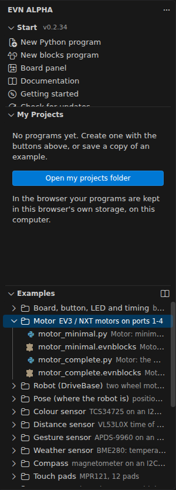
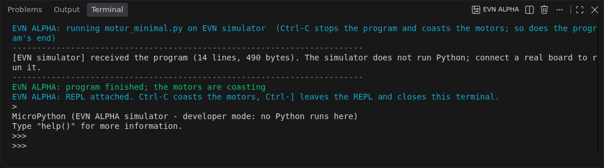
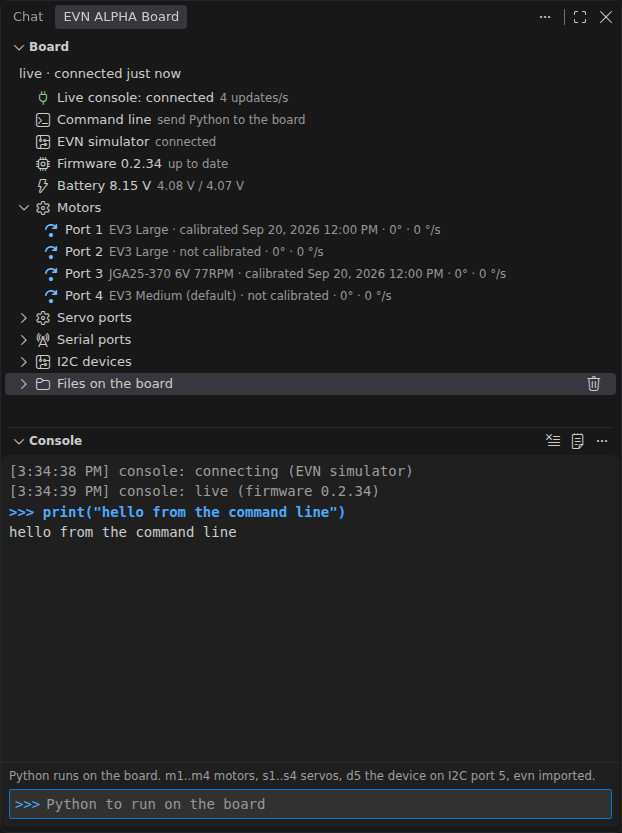

# EVN ALPHA MicroPython: getting started

This is an early-access build for user testing. It covers the **motor layer** (four EV3/NXT motor ports, the `evn.Motor` API), the battery, button and LED, a file system on the board, the servo and serial ports, raw `evn.I2C`, and the fifteen **EVN Standard Peripherals** — colour, distance, gesture, environment, touch, compass and IMU sensors, the ADC, the OLED, the 8x8 matrix and the seven-segment display, the RGB LED module, the Bluetooth module and the Geekservo servo profiles (270°, 360° and continuous rotation). All of them are now bench-validated on EVN modules. Beside them, five **EVN Extended Peripherals**, supported the same way but not stocked by EVN: the HiTechnic NXT colour sensor and compass, the DFRobot HuskyLens camera, the ST VL53L1X distance sensor and the ams-OSRAM TCS3430 XYZ colour sensor.

**The quickest way through all of this is the guided walkthrough:** **EVN: Getting started walkthrough** in the command palette, or the link under *Start* in the **EVN ALPHA** sidebar. Six steps — install mpremote, choose the board port, flash the firmware, run an example, write your own program, learn more — and they tick themselves off as you go: the first three as soon as mpremote is found and the board appears, the rest when you run the matching command. It opens by itself the first time the extension starts with no board connected. This document covers the same ground in writing, with more detail.

## 1. What you need

- VS Code 1.106 or newer, this extension installed (`.vsix` file: *Extensions* view, `...` menu, *Install from VSIX...*).
- Python 3.8+ on your PC. The extension talks to the board through `mpremote`, a small Python tool. Run **EVN: Install mpremote** from the command palette once (it runs `pip install mpremote`), or install it yourself.
- Recommended: the Microsoft *Python* and *Pylance* extensions, for autocomplete and inline docs.
- An EVN ALPHA board, a USB cable, a battery pack (the motors run from the pack, not from USB).

## 2. Put the firmware on the board

Run **EVN: Flash MicroPython firmware**. The extension carries the firmware (`firmware/EVN_ALPHA_MicroPython.uf2`; `firmware/BUILD.txt` says which build, and the flash command checks the file's md5 against that record before it touches the board - a stale or half-synchronised file is refused with both hashes named, never flashed).

- If the board already runs the MicroPython firmware, the extension reboots it into the bootloader by itself.
- Otherwise: unplug USB, **hold the BOOTSEL button**, plug USB back in, release the button. A drive named `RPI-RP2` appears and the extension copies the firmware onto it.

The board reboots and shows up as a COM port. The status bar reads `EVN: COM7` (the number varies). The LED blinks once a second while no program is talking to the board, five times a second while one is.

Files on the board (`main.py` and anything else you copied) survive a firmware flash.

The **Board** section tells you which firmware the board is actually running, next to the build this extension brings, together with the battery and the files on the board. It lives in the **secondary side bar** (*View → Appearance → Secondary Side Bar*, or **Ctrl+Alt+B**), with the **Console** view under it (§3b), so both can stay open beside your program; drag them somewhere else if you prefer. Most of the time it fills itself in: whenever no program is running and the REPL is closed, the extension keeps a **live console** open to the board (§3b), and the rows follow the board as it changes. **Read the board** in the section's header re-reads the firmware, the files and the I2C scan when you ask for it.

When the board's firmware is older than the bundled one, the firmware row becomes a warning with a **Flash** button next to it, and the extension offers the flash once. The battery row shows the pack — it is always two cells — with the pack voltage and both cell voltages: it turns into a warning under 7.2 V and an error under 6.6 V, worth a look when motors behave oddly. A read is refused while a program is running, because the program holds the port: stop it, or close the *EVN ALPHA* terminal, first. If `mpremote` is not installed yet, the section offers an **Install mpremote** button.

If the board is in UF2 (BOOTSEL) mode it has no COM port at all: the status bar reads `EVN: BOOTSEL mode — click to flash` and the port row says *Board in UF2 (BOOTSEL) mode* with a **Flash** button. Flashing from there needs neither a COM port nor Python.

Give the board a name once with **EVN: Name this board** (or the tag button on the port row, or in the port picker): the status bar then reads `EVN: Kenneth's robot (COM7)`. The extension remembers boards by their USB serial number, so yours is found again whatever COM number Windows gives it next time.

## 3. Your first program

Open the **EVN ALPHA** tab in the activity bar (the ℕ glyph). It has three sections: *Start* (the extension's version beside its title, worth quoting in a bug report; five rows: **New Python program**, **New blocks program**, **Board panel**, **Documentation**, **Getting started**, and below them the update row of §6a), *My projects* and *Examples*. Two more, *Board* and *Console*, are in the secondary side bar on the other side of the window (§2, §3b).



1. Plug a motor into **port 1** and keep the wheel off the ground.
2. Under *Examples*, open the **Motor** folder and click `motor_minimal` to open it, then press **Ctrl+F5** (*EVN: Run current file on the board*), or use the **Run example on the board** button next to its name.
3. The program's output appears in the *EVN ALPHA* terminal. When it ends - finished, or stopped by an error - every motor coasts (the terminal says `program finished; the motors are coasting`, as a Pybricks program ends stopped), and the terminal stays attached to the board's REPL with the program's variables: type `m.angle()` and press Enter, for example. **Ctrl+]** leaves the REPL and coasts every motor (a `m.run(300)` typed there does not keep driving, and a line you had half typed is cleared, never run); so does every other way the terminal ends: closing its tab, pressing Run (or any other board command) again, closing or reloading the VS Code window. If the board cannot be reached when you leave, the terminal says so in red and **Enter** tries the coast again.
   **In the browser IDE, closing or reloading the browser tab is the exception:** the browser ends the page at once, with no time to write anything to the board, so a running program - or a motor started at the REPL - **keeps driving**. Press **Stop** (the red button in the status bar, or Ctrl+Shift+F5) before you close the tab; if you forgot, press the **user button** on the board or switch it off. A firmware fix (coast when the USB host goes away) is being discussed.

   

Every example says what hardware it needs next to its name and in its tooltip (`Needs: one motor on port 1, wheels off the ground`), so you can tell before you run it whether you have the parts on the board.

While a program runs, the status bar reads `Running motor_minimal.py` — click it to bring the terminal back up — and a red **Stop** button sits next to it (the same as **Ctrl+Shift+F5**). Afterwards it reads `motor_minimal.py finished`, or `motor_minimal.py: error`, or `stopped`; while the REPL is open only the board's port and the **REPL** button are shown, since they already say where the prompt is. If the program raises, the traceback in the terminal is clickable: `File "<stdin>", line 12` opens your program at line 12.

To write your own, press **New Python program** under *Start* (or in the *My projects* header): it asks for a name and creates the file in your projects folder, `EVN Projects` in your Documents folder (the setting `evn.projectsFolder` puts it elsewhere). Everything in that folder is listed under *My projects*, Python programs in its **Python** folder and blocks programs in its **Blocks** folder (as *Examples* is), with **Run on the board** and **Upload as main.py** next to each file, and Rename, Duplicate, Delete and **Show in the file explorer** in the right-click menu.

An example can be edited, but it is never overwritten: a save asks for a name and becomes a new program of yours under *My projects* (the tab switches to it). **Save a copy to my projects** in its right-click menu does the same without editing first. Running an example saves nothing.

Autocomplete for `evn` works inside the projects folder once it is the workspace: **Open my projects folder as the workspace** in the *My projects* `...` menu (the folder already carries the stubs and the settings for it).

Hover over an `evn` name (`Motor`, `run_angle`, `imu.heading`, `robot.straight`) to see its signature and documentation. Pylance shows it inside the projects folder; in the browser IDE, with Jedi, or in an example opened from *Examples*, the extension shows the same text itself (setting `evn.python.hover`: `auto`, `always` or `off`).

### If `evn` is not found

`evn` exists only on the board; the editor reads its description from `typings/evn.pyi`. A red "Import "evn" could not be resolved" (or "…from source") means that description did not reach your file. Run **EVN: Check Python setup** with the file open: it says what applies and offers the fix. The usual causes:

- **The file is not in your projects folder, or you opened a parent folder.** Only a `typings/` at the top of the opened folder counts. Use **Open my projects folder as the workspace**, or **EVN: Enable evn autocomplete in every Python file**.
- **BasedPyright is installed** (it ignores Pylance's settings and shows the stub as an error). The projects folder is set up for it; elsewhere, the check command's *Fix* adds its settings. Keep one Python language server, not two.
- **Your folder has a `pyrightconfig.json` or a `pyproject.toml` with `[tool.pyright]`.** Then Pylance ignores its settings there. In `pyrightconfig.json` add `"stubPath": "typings"` and `"reportMissingModuleSource": "none"`; in `pyproject.toml` add `stubPath = "typings"` and `reportMissingModuleSource = "none"` under `[tool.pyright]` (TOML, no JSON quotes around the keys).
- **Pylint or mypy report it.** The projects folder carries `.pylintrc` and `.mypy.ini` for them; *Set up this folder* adds them elsewhere, unless that tool may already read a configuration of yours - in the folder (a `pyproject.toml` that mentions `tool.mypy`, a `setup.cfg` with a `[pylint...]` section ...), a parent folder of the repository, or your home folder (`~/.pylintrc`, `~/.config/mypy/config`, `$PYLINTRC` ...): a file of ours would then switch yours off, so the check command names the one line to add to yours instead (and tells you when a file of ours already hides yours). Whether your file already covers `evn` is not guessed (only the tool knows how it reads its file): if the tool reports `evn`, add that line. Ruff and Flake8 never report it.

**Stopping things:** **Ctrl+C** in the terminal, or **Ctrl+Shift+F5** (*EVN: Stop all motors*), interrupts the program and coasts every motor. Both write the interrupt straight to the board's port, so the stop does not depend on a second tool being able to open it; if the port cannot be reached at all, the terminal says so in red and the editor shows a message naming the port instead of reporting a stop that did not happen — then use the board's **user button**, which coasts every motor without a PC. Closing the program terminal while a program is running stops it too, and it stops the board *that terminal* was using, even with a second VS Code window on another board. Connecting a tool to the board also coasts the motors.

## 3a. Blocks instead of Python

Open `motor_minimal` (the blocks file) in the **Motor** folder under *Examples*, or press **New blocks program** for an empty one. The block editor shows Scratch-style blocks on the left and the MicroPython they generate on the right. Build a program by dragging blocks from the toolbox, then press **Run on board** in the editor's toolbar (or **Ctrl+F5**); **Stop motors** interrupts it. **Upload as main.py** puts it on the board as the program the user button starts, **Export Python** turns it into a `.py` file you can keep editing as text. A blocks example saves the same way a Python one does: under a new name, into your projects folder. Every block and the Python it produces: **EVN: Open blocks reference**.

**Every object has its own examples folder.** *Examples* has one folder per part of the API — the board, the motor, the robot, the pose, the data log, and every standard peripheral (colour sensor, compass, IMU, display, …) — each with a `…_minimal` program (the few lines you need) and a `…_complete` one (every call of that object), in Python and, where the object has blocks, as blocks too. On disk they are `examples/01_board/` to `examples/22_data_log/`, and the *Extended Peripherals* group holds one folder per device (`examples/extended_peripherals/01_hitechnic_color/` to `05_tcs3430/`); for example `examples/05_colour_sensor/colour_sensor_minimal.py`.

## 3b. The live console, the command line and the Console view



Whenever no program is running and the REPL is closed, the extension keeps a **live console** open to the board, and the *Board* section comes alive. The line above the rows then reads **live · connected 3 minutes ago** (or **live over Bluetooth · connected 3 minutes ago** when the board is on its wireless link, §5a); with the console off it reads "read 12 seconds ago" instead, because what you see is then one read, not a live link.

Every row is also a way to drive that port. The buttons only appear while the live console is connected (and, on servo and serial ports, once you have said with the gear what is plugged in):

- **Motors** shows the angle and the speed of ports 1 to 4, four times a second. Turn a shaft by hand and watch the number move — a quick way to check wiring and direction. Press the **gear** and say which motor is plugged in: *EV3 Large*, *EV3 Medium*, *NXT*, *JGA25-370 6V 77RPM* (a 6 V gearmotor the board then caps at 6 V), *Pololu 25D 9.7:1 HP 12V* (a fast 12 V gearmotor, about 3500 deg/s on the battery; never hold it stalled), *CHR-GM16-030PA 9V 1:63* (a 16 mm 9 V gearmotor, 1:63, the board caps it at 9 V, above the battery, so the cap never binds; another ratio of it is a **Custom…** motor with 7 × 4 × the ratio counts), or **Custom…** for any other DC motor with a quadrature encoder — it asks for a name, the encoder counts per output revolution (one channel's pulses × 4 × the gear ratio; a LEGO motor is 720), the rated voltage and the no-load speed. The choice is **stored on the board**, so `Motor(port)` in every program, from any computer, runs that motor; the row reads it back from the board (*EV3 Medium*, *custom (N20 6 V)*, or *EV3 Large (default)* for a port nobody has configured). Then press the **pulse button** (or right-click, *Calibrate this motor*; the whole procedure is in [Calibrating your robot](CALIBRATION.md#motors)): the shaft must be free to turn, it moves about a turn and a half each way for about eleven seconds, and the row afterwards reads *calibrated 21 Sep 2026 14:02* (or *not calibrated*, *calibrating...*, *calibration is for another motor — calibrate again*). The calibration measures this motor's strength, time constant and friction, stores them on the board for that port, and also finds which way its encoder counts — a non-LEGO motor wired the other way round shows *encoder reversed* and simply works (the flip belongs to that port's calibration: when you swap the motor, say so with the gear — that clears it — rather than plugging a different motor into a *reversed* port). Choosing a different motor for a port clears that port's calibration (a right-click *Clear calibration* does it by hand); a custom, JGA25, Pololu 25D or CHR-GM16 motor is not fully trusted until it is calibrated, and `Motor(port)` says so once. With a motor set, four more buttons appear while the console is live: **Run this motor at a speed...** (it asks for deg/s, negative runs backwards), **Run this motor to an angle...** (a speed, then a target angle), **Run this motor for a time...** (a speed, then how many milliseconds to run) and **Stop this motor**. The row keeps counting while the motor turns, because neither move blocks the telemetry.
- **Servo ports**: press the gear on a port and say what is on it — *Geekservo 270°*, *Geekservo 360°*, *Geekservo continuous*, *generic 180°*, *Custom servo...*, *RGB LED strip*, or *nothing*. The console then builds the object for you, so servo port 3 is `s3` (an LED strip is `l3`). For any other servo pick *Custom servo...*: give it a name, its range in degrees (0 for a servo that turns continuously), its shortest and longest pulse in microseconds (the servo's sheet says them, often 500 and 2500) and its direction; the row then shows the name and the tooltip the `Servo(...)` line to use in a program. **Drive this servo port...** then asks for an angle (a positional servo), a duty in percent (a continuous one) or a colour (an LED strip), and **Stop this servo port** ends it.
- **Serial ports** are Serial 1 and Serial 2. The gear says what is on the header: *EVN Bluetooth module*, *UART (raw serial)* or *nothing*, and the console creates `bt1` / `bt2` or `u1` / `u2` for it. A UART is asked for its baud rate straight after (9600, 19200, 38400, 57600, 115200, which is what most things use, 230400, 460800, 921600, or *Other...* for anything from 300 to 3000000), and the row then reads `UART 9600 · 0 bytes waiting`. Change it later with the same gear: the board reopens the port at the new baud and keeps whatever was already queued. A Bluetooth row says what state the module is in, whether the board's REPL is on it, how many bytes are waiting and which COM port is this board's wireless link; its three buttons pair it in Windows, put the REPL on the module and pick its COM port for the board: that is §5a, the way to work without the USB cable.
- **I2C devices** lists the sensors and displays it found on ports 1 to 16, each identified by its own ID register, and re-checks about every 5 s. Plug a colour sensor in and it appears with its name and port. On a device it recognises, **Set a property of this device...** offers what that device can be set to (the colour sensor's gain 1, 4, 16 or 60, its integration time, and so on) and then asks for the value, and **Read this device live...** asks what the row should show — `hsv`, `rgb`, `lux`, `distance`, `heading`, whatever that sensor has — and the row shows it four times a second from then on, with a small chart of it in the *Console* view. The eye-closed button stops it. A live reading is remembered for that board and comes back by itself when the console reconnects. An **IMU** or **compass** row also has a **pulse** button that calibrates it — the IMU still and level in about 2 s (*One pose*, or *Two poses* with a half turn in between), the compass while you turn the robot (*Full* or *Planar*, with a live map of the directions) — and the row then reads *calibrated \<date\>*; right-click for **Clear calibration**. [Calibrating your robot](CALIBRATION.md) walks through all three calibrations.
- the **battery** row, the **firmware** row and **Files on the board**, kept up to date without you pressing anything. *Files on the board* starts with a **Storage** row (`Storage · 10.6 MB free of 11.0 MB (96 %)`), which turns into a warning, with one message offering **Download all data logs**, when less than a tenth of the space or less than 256 kB is free: a data log the board cannot save when your program ends is lost. Next is the **data** folder, where `evn.DataLog` saves its files (`data · 3 data logs, 412 kB`, newest first). Click a log, or its cloud button, to download it into the **Data** folder of your projects folder; a `.csv` opens in the data viewer at once, and if a file of that name is already there you choose **Replace** or **Keep both**. Every other file on the board has the same cloud button, and every file a delete button. The **data** row downloads all the logs with one button, and its right-click menu deletes them all (you confirm once). If the pack falls below `evn.battery.warnVolts` while the console is connected — 7.0 V by default, and the pack is two cells, so that is 3.5 V each — a warning appears in the status bar as well, with both cell voltages in its tooltip. Set it to 0 if you would rather not be told.

**Command line** is the row to try things with: click it (or **EVN: Send a command to the board**), type one line of Python and press Enter. `m1` to `m4` are the four motors, `s1` to `s4` the servos you configured (`l1` to `l4` for an LED strip), `bt1` / `bt2` and `u1` / `u2` the serial ports, `d5` the device on I2C port 5, and `evn` is already imported, so `m1.run_angle(200, 90)` turns port 1 by 90°, and `m1.angle()` prints where it is. The answer, and anything the board prints, appear in the **EVN Console** panel (**EVN: Show the console output**). The last 20 commands are offered again when you open the row.

**The Console view** under the Board tree is the same thing with a prompt and a transcript, for when one line at a time through a box gets tiring. Type Python, press **Enter**, and it runs on the board in the same namespace — a variable you set on one line is still there on the next. **Shift+Enter** adds a line instead of sending, so a small block (a `for` loop over three lines, say) goes over at once; **Up** and **Down** walk the lines you sent before, **Ctrl+L** clears the transcript, **Esc** empties the prompt. While the console is not live the prompt is greyed out and says why ("the board is running its own program (main.py)", "connecting to the board..."). It shows the same lines as the **EVN Console** panel, including what a program the board started by itself is printing.

**The charts.** Whenever a device is being read live (**Read this device live...** on an I2C row), a small strip chart of it appears between the transcript and the prompt: about the last minute of readings, one line for each number the reading gives (up to four), the scale at the right edge, and the latest value in the header next to the port and what is being read — `port 5 · lux · 123.4`. It is a quick way to see whether a sensor is steady, drifting or noisy while you move something in front of it. The chart appears with the reading and goes when you stop it; if the sensor starts raising instead of answering, the curve stands still and the header turns red. Readings that are not a single number or a short list of them (`hsv`, which comes back as a dict) have no chart, only the row. Nothing extra is asked of the board: the charts are drawn from the same telemetry the *Board* rows already use.

This is not the board's REPL. The REPL is still the **REPL** button and the terminal it opens (**Open REPL** is in the Console view's `...` menu too); the Console view is a prompt on top of the live link, which is why it can keep the port while the tree goes on updating.

Two things to know:

- **A program the board started by itself is never interrupted.** If `main.py` is running (started from the user button), the console row says so and only watches: its output still reaches the **EVN Console** panel. Press the stop button on that row (*Stop the board's program and connect*) when you do want to take the board over.
- **The link gets out of the way.** When you run a program, open the REPL, upload a file, reset or flash the board, the console lets go of the port and comes back a second after it is free. If you would rather it never held the port at all, turn `evn.console.enabled` off.

## 3c. Recording data (the data logger)

The graph button at the top of the *Board* view (or **EVN: Open data logger**) opens the data logger beside
your program. It needs the live console (§3b): the board idle, not running a program. The board itself
records: the firmware samples each source at the rate it makes new readings, in the board's memory, at the
lowest priority (it never delays the motors), and the logger fetches what it recorded.

- **On the left**, everything the board can measure right now: the four motor ports (angle, speed, load,
  stalled), every identified I2C device with its readings (the IMU's heading, tilt, acceleration ..., the
  colour sensor's hsv, rgb, lux ..., the distance sensor's distance ...), the battery and the user button.
  Tick what to record and choose each source's **rate**: **max** records every new reading - a motor at
  the motion engine's own 1 kHz tick, an IMU at its 200 Hz, a compass at 75 Hz, the battery at 25 Hz - and
  never the same reading twice; 1000 Hz down to 1 Hz otherwise (a rate above the source's own gives the
  source's). Over Bluetooth every reading is held to 50 Hz.
  Right-clicking a motor, the battery or a device on the *Board* view and choosing **Add to data logger**
  ticks that source's usual readings for you.
- **Record** starts a new file, **Stop** ends it. The status bar shows `0:12 logging` while it runs, even
  with the logger's tab closed. A light set - up to 100 values a second, the note under the list says -
  goes into the file as it is measured. A heavier one (a motor at **max** is 1000 values a second) is kept
  **in the board's memory** while it records: the USB cable must not carry a stream of samples while
  motors drive, it is not built for that. The chart shows a preview meanwhile. The note says how long the
  memory lasts at full rate (about 10 s for one reading at max, longer at lower rates); when a reading's
  share is full, the board keeps every second sample and **halves its rate**, so the recording never stops
  by itself - a long run comes back evenly thinned, and the file says where (`# rate halved: ...`). A run of
  identical readings is kept as two rows, its first and its last, so a motor at rest or a button nobody
  presses costs two rows however long you record: the file and the chart show the value flat between the
  two, and every reading in between was taken and was the same to the last bit. The file's last line says
  how many samples the board took (`# samples taken: ...`), which is more than the rows. After
  **Stop** the logger waits until every motor has stopped, then fetches the samples and writes them. A
  recording also ends by itself when the console lets go of the board (you press **Run**, open the REPL, or
  unplug); what was streamed stays in the file, what the board still held is lost.
- **Capture point** is for an experiment by hand: set it up, type a note (`10 cm`), capture. One reading of
  every ticked reading is added to the day's points file, one row per value with your note.

Files go to the **Data** folder of your projects folder and show under **Data logs** in *My projects*:
`2026-09-25 14-03-11 arm test.csv` (the name box sets the last part), and `arm test points 2026-09-25.csv`
for points. They are plain CSV, one row per value:

    # EVN ALPHA data log
    # started: 2026-09-25T14:03:11.123+08:00
    # board: EVN ALPHA E46320165B5F2A36, firmware 0.2.39, MicroPython v1.26.1
    time_s,device,port,quantity,value,unit,note
    0.000000,Motor,1,angle,12,deg,
    0.001000,Motor,1,angle,13,deg,
    0.004210,MPU-6500 IMU,3,acceleration.x,12.5,mm/s²,

`time_s` is the board's own clock, in seconds with microsecond resolution, since Record, so a gap or a jitter in the data is the
board's, not the cable's. Excel opens the file as it is (filter the `quantity` column); in Python,
`pandas.read_csv(f, comment='#')`.

**Logging from your own program.** A program records the same way with `evn.DataLog` (Pybricks' `DataLog`,
with EVN's `add()` for motors and sensors): it keeps the samples in the board's memory while it runs and
writes a CSV file on the board once the motors have stopped - never while one drives, which would stall its
control loop.

```python
from evn import Motor, IMU, DataLog, wait

motor = Motor(1)
imu = IMU(1)
log = DataLog(name='run1')           # the file: /data/run1_<date>_<time>.csv
log.add(motor, 'angle')              # every new reading (up to 1000 a second)
log.add(imu, 'heading', 50)          # 50 a second
log.start()
motor.run(300)
wait(5000)
motor.stop()                         # save() is refused while a motor drives (a stop just issued is fine)
log.stop()
print(log.save())
```

A log not yet saved (recording or stopped) is saved by itself (`autosave=True`) when `main.py` ends, the editor's Run finishes, the board soft-reboots or a `with` block ends, once the motors coast. To get the file,
open the **data** folder under *Files on the board* in the *Board* view (§3b) and click the log, or its cloud
button: it is copied into the **Data** folder of your projects folder and opens in the viewer below
(`mpremote cp :/data/run1_....csv .` does the same from a terminal). The board keeps the same rule as the
logger: a run of identical samples is two rows, its first and its last; `log.log()` rows are always kept. `log.log(x, y)` adds rows
of your own values (the columns are `DataLog('x', 'y', ...)`); the whole class is in the API reference
(*DataLog*), and `examples/22_data_log/` has a minimal and a complete program, in Python and in blocks (the
*Data log* category).

**Looking at a log.** Click it under *Data logs* (or **Open log...** in the logger, or right-click any
`.csv` and **Open in data viewer**). Each unit gets its own lane with its own scale, on one time axis; hover
for the values at that moment, **drag** across the lanes to zoom into a span, the **wheel** zooms around the
pointer, **double-click** shows everything, and the strip underneath shows the whole log with the span in
view (drag it to pan). Click a name in the legend to hide or show that line. The table under the chart is
the statistics of the span in view: rows, rate, min, max, mean, standard deviation, change, slope and
the last value - zoom into the part you care about and read it off. The mean, standard deviation and slope
weight each row by the time it holds (until the next row), so a flat run of identical readings counts for its
whole span, and the rate comes from the shortest gap between rows, which such a run does not stretch.

## 4. Ports and units

Motor ports are the numbers printed on the board, **1 to 4**: `Motor(1)`. (`Port.A` to `Port.D` exist as the same numbers.)

Angles are degrees, speeds deg/s, accelerations deg/s², times ms, duty %, torque mNm, voltage mV. Positive is clockwise looking at the shaft; `Direction.COUNTERCLOCKWISE` flips a motor.

```python
from evn import Motor, Port, Stop, Direction, wait, StopWatch

m = Motor(1)
m.run_angle(500, 360)                     # 500 deg/s, one turn, then hold
m.run_target(500, 0, then=Stop.COAST)     # back to 0, then release
m.run(300); wait(1000); m.stop()          # 1 s at 300 deg/s
print(m.angle(), m.speed(), m.load())
```

Speeds can also be given in **percent** of the motor's full speed instead of deg/s: `Motor(1, speed_unit=SpeedUnit.PERCENT)`. 100 % is the motor's no-load speed at the present battery voltage (a model estimate until `m.calibrate()` measures it on your motor, about 11 s with the shaft free to turn: see [Calibrating your robot](CALIBRATION.md)). See `examples/02_motor/motor_complete.py`.

### Sensors, displays and servos

A standard peripheral is plug-and-play: put it on an I2C port (any of 1 to 16, only SDA and SCL are used), name the port, read.

```python
from evn import ColorSensor, Display, Color

cs = ColorSensor(5)                       # OSError if nothing answers on port 5
d = Display(11)
if cs.color() == Color.RED:
    d.write(0, "red!")
```

The RGB LED module and the servos sit on the servo ports 1 to 4, the Bluetooth module on Serial 1 or 2. Each has its own folder of examples, `examples/05_colour_sensor/` to `examples/18_bluetooth/`, with a minimal and a complete program. The full list of calls is in **EVN: Open API reference**.

**Extended peripherals.** Kit you may already own works too: a HiTechnic NXT Color Sensor (V1 or V2) or Compass Sensor through an NXT cable adapter (`HiTechnicColorSensor(port)`, `HiTechnicCompass(port)`; the board runs that port at 100 kHz by itself) a DFRobot HuskyLens camera with its Protocol Type set to I2C (`HuskyLens(port)`), an ST VL53L1X distance sensor that reaches 4 m (`VL53L1X(port)`) and an ams-OSRAM TCS3430 XYZ colour sensor (`TCS3430(port)`). The *Board* view names them, the block editor has an *Extended* category, and the *Extended Peripherals* group under *Examples* (`examples/extended_peripherals/`) has a folder for each. The calls are in the API reference, section *EVN Extended Peripherals*.

```python
from evn import HuskyLens

cam = HuskyLens(11)
cam.algorithm(HuskyLens.OBJECT_TRACKING)
print(cam.blocks())                       # [(x, y, width, height, id), ...]
```

**Looking a call up while you type:** put the cursor on a word in a Python file — `Motor`, `run_angle`, `battery`, `StopWatch` — and press **Ctrl+F1** (or use *Open online documentation for the symbol under the cursor* in the right-click menu). The online documentation opens at that section of the API reference. The site it opens is the `evn.docsUrl` setting, so a staging copy can be used instead.

## 5. A program that starts from the user button

**EVN: Upload current file as main.py** copies the open file to the board as `main.py`. After every power-on (and after a reset) the board waits, LED blinking fast, and **a press of the user button starts the program**; when it ends, the next press runs it again, so a robot needs no PC. Choose *Upload and run now* to reset the board and start it immediately this once. Press the button once the LED blinks fast (a press during the first second of the boot is not counted). While the extension's live console is attached it talks to the board within a second of every boot, which ends the wait and gives it the REPL — so with VS Code connected use *Upload and run now* (or pause the console); the button starts `main.py` when nothing is talking to the port. A `boot.py` containing `import evn; evn.autostart(True)` restores the old behaviour (start at power-on without a press) for a board that must run unattended.

Escapes, in case the program misbehaves:

- Hold the **user button for 2 s** while it runs: the board reboots (motors coast) and waits for the button again.
- Hold the **user button while powering on**: `main.py` is skipped once (useful with `autostart`).
- **EVN: Stop all motors** interrupts it from VS Code (the extension's own connections never start `main.py`).
- The *Board* section's console row says when the board is running its own program, and its stop button (**Stop the board's program and connect**) ends it and hands the board back to you. Nothing else the extension does interrupts it.
- **EVN: Remove main.py from the board** deletes it.
- After a watchdog reboot (a program that froze the board), `main.py` is skipped automatically.

## 5a. Working without the USB cable (REPL over Bluetooth)

With an EVN Bluetooth module on Serial 1 or 2, the board's prompt can come to the PC over the air, and everything above (Run, the REPL, Upload as main.py) works the same way.

**The easy way is the *Serial ports* section of the *Board* tree** (§3b), with the board still on USB and the live console connected:

1. Press the gear on **Serial 1** or **Serial 2** and choose **EVN Bluetooth module**. The row then shows the module's state and whether the REPL is on it.
2. **Pair the Bluetooth module in Windows** (the link button, also in the palette) opens the Windows Bluetooth settings. Add the device shown as `HC-05` or `EVN Bluetooth` — the PIN is `1234`. Windows then lists an outgoing *Standard Serial over Bluetooth link (COMxx)* port for it.
3. **Put the REPL on this Bluetooth module** (the broadcast button) does the switch on the board. It offers **Make it permanent**, which writes the two lines into `boot.py` on the board for you, so the REPL is on the module every time it is switched on. Only one module carries the REPL at a time.
4. **Use the Bluetooth COM port for the board** (the plug button) lists the *Standard Serial over Bluetooth link (COMxx)* ports; pick the module's. That COM port is now this board's **wireless link** (the serial row says `link COM11 (98:D3:41:F7:18:02)` — the module's own Bluetooth address next to the port), and you never have to pick it again: the link is kept by that address, so it still finds the board if Windows gives the port another COM number later. The list leaves out Windows' *incoming* Bluetooth ports, the ones it makes per adapter, because they can never reach a module.

Then simply **unplug the USB cable**. The extension notices within about 4 s and comes back over Bluetooth in about 6 s: the status bar reads `EVN: Kenneth's robot (Bluetooth)`, the console row *Live console: connected over Bluetooth* with the COM port, and the line above the tree *live over Bluetooth · connected 3 minutes ago*. The same telemetry, the same buttons, and the REPL, Run and Stop all motors all go over the air; Ctrl+C is still the emergency stop.

**Put the cable back in and everything moves back to USB by itself**: USB is preferred at every look, and it is faster. Nothing to switch, and nothing to set up again: the motor models, the servo profiles, the serial headers, the live reads and the last speeds and angles you typed are kept for *that board*, by its USB serial number, and the wireless link is what tells the extension which board is on the far end of a Bluetooth COM port (a Bluetooth port has no USB descriptor to ask). If the link drops, out of range or the board switched off, the console row says *the Bluetooth link dropped* and keeps trying by itself; Windows keeps the COM port listed either way, so nobody else notices. A board that has never been on USB has no serial to key anything to: plug it in once, then pick the link.

**To try all this without pulling the cable**, press the arrow-swap button on the Bluetooth serial row: **Switch the board to Bluetooth now**. The live console moves onto the wireless link with the cable still in, so you can see the wireless side working at your desk: the console row reads *Live console: connected over Bluetooth (USB ignored)* and the serial row ends `· on the wireless link by choice`. The same button, now **Switch the board back to USB**, ends it. So does restarting VS Code: the choice is never saved on purpose, because the rule the extension otherwise follows is USB whenever it is there.

**Over the air the telemetry is deliberately slower**: 2 updates a second instead of the 4 USB gets. The module's link is shared with whatever your own program sends through it, and four updates a second of motor angles, battery and live device reads leave little room. `evn.console.bluetoothRate` takes 1, 2 or 4 if you would rather have it another way, and the console row always says which rate is in force (`2 updates/s · COM11`); a change applies the next time the console connects.

**By hand**, if you would rather do it yourself or you are not on Windows:

1. Pair the module once in Windows *Bluetooth & devices* (it shows as `HC-05` or `EVN Bluetooth`, PIN `1234`). Windows then lists a *Standard Serial over Bluetooth link (COMxx)* port for it — the outgoing one (Bluetooth settings → *More Bluetooth settings* → *COM Ports* shows which).
2. On the board, once per power-up, switch the REPL onto the module. Over USB, in the REPL: `import evn; bt = evn.Bluetooth(2); bt.repl(True)` (the module's serial port number). To make it permanent, put those lines in a `boot.py` on the board — from the USB REPL: `open('boot.py','w').write("import evn\nbt = evn.Bluetooth(2)\nbt.repl(True)\n")` (or `mpremote cp boot.py :` from a terminal; *Make it permanent* in the Board view writes the same). The name matters: `bt` is how a program later reaches the module (`bt.repl(False)`, `bt.write(...)`). A `boot.py` that wrote the anonymous `evn.Bluetooth(2).repl(True)` still works: a later plain `Bluetooth(2)` adopts the module the REPL is on.
3. In VS Code click the port in the status bar and choose the Bluetooth COM port (marked with a broadcast icon). If the board has been on USB before, the extension keeps that port as its wireless link and keeps `evn.port` on the board's serial number, so USB is used again as soon as the cable is in. Unplug the cable; the REPL button, Run and Stop all motors now go over Bluetooth. Ctrl+C is still the emergency stop.

Notes: the first connection to the module takes a second or two (Windows opens the Bluetooth link when the port is opened); a program that uses the same module for its own traffic should turn the REPL off first (`bt.repl(False)`, with `bt` from `boot.py` — or, if `boot.py` did not bind a name, `bt = evn.Bluetooth(2)`, which adopts the module the REPL is on), because bytes the REPL consumes never reach `read()`; while the module carries the REPL a plain `Bluetooth(2)` adopts it as it is, and `Bluetooth(2, name=...)`, a different `baud`, `mode`, `addr` or `stay_in_command` raise `ValueError` — the module cannot be re-programmed under the REPL (`repl(False)`, program, `repl(True)`); the USB prompt keeps working alongside. Over Bluetooth a board that answers nothing is ambiguous (it may be running its own `main.py`, or its REPL may not be on this module), and the console row says both rather than guessing; it never interrupts a running program to find out.

## 6. Other commands (command palette, type `EVN:`)

| Command | What it does |
| :--- | :--- |
| Select board port | choose which board to use when several are connected (it is remembered by its USB serial number, so it is found again on any COM number) |
| Name this board | give this board a name; the status bar then shows it, as `EVN: Kenneth's robot (COM7)` |
| Open REPL | interactive prompt on the board (Ctrl+] to leave, which coasts the motors); also the `REPL` button in the status bar and the terminal icon next to Run |
| List files on the board | `ls` of the board's file system, in the *EVN ALPHA* output panel |
| Reset the board | reboot (motors coast; `main.py` then waits for the user button) |
| Collect board diagnostics | firmware version, battery, motion-engine counters, files: paste it into a bug report |
| Read the board (firmware, battery, files) | re-read the firmware, the files and the I2C scan into the *Board* section; also its refresh button |
| Send a command to the board | one line of Python on the board through the live console (§3b); the *Command line* row |
| Show the console output | the *EVN Console* panel: what the command line answered, and what a program the board started by itself is printing |
| Clear the console view | empty the *Console* view's transcript (Ctrl+L in the view does the same) |
| Open data logger / Open a data log / Stop the data logger recording | record what the board measures to a CSV, open a recording in the data viewer, end a recording (§3c); **Open data logger** is also the graph button on the *Board* view |
| Open in data viewer | a `.csv` in the data viewer's chart (right-click it in the Explorer, or **Reopen Editor With...**) (§3c) |
| Connect the live console / Pause the live console (free the port) | take the port for the live console, or let go of it (for another tool, say) |
| Pair the Bluetooth module in Windows | open the Windows Bluetooth settings to add the module (`HC-05` or `EVN Bluetooth`, PIN `1234`); §5a |
| Switch the board to Bluetooth now (test the wireless link) / Switch the board back to USB | move the live console onto the wireless link with the cable still in, and back again; also the arrow-swap button on a Bluetooth serial row (§5a) |
| Getting started walkthrough | the six guided steps |
| Enable evn autocomplete in every Python file | point Pylance's global stub path at the `typings` folder of your projects folder, so `evn` autocompletes anywhere, not only inside that folder. The extension offers this once by itself when you open a `.py` file that imports `evn` outside a folder that has the stubs (*Turn it on*, *Not now* — it asks again in a week — or *Never*) |
| Check Python setup | for the Python file that is open: which language servers and linters run, whether the `evn` stubs reach it, and what shadows them (a config file, a workspace setting); offers *Set up this folder*, *Turn on everywhere* or *Fix*, never replacing a value of yours |
| Open online documentation for the symbol under the cursor | **Ctrl+F1** in a Python file: the online API reference, at the section for the word under the cursor (§4) |
| Check for extension and firmware updates | ask the documentation site whether a newer extension or firmware has been published |
| Update the extension / Update the extension and reload the window | install the published extension; the second also reloads the window so it runs (§6a) |
| Open API reference / getting started guide / blocks reference / calibration guide | these documents, inside VS Code |
| Open online documentation (evn.coresg.tech) | the same documents on the web site |
| Run current file on the board / Stop all motors | **Ctrl+F5** / **Ctrl+Shift+F5** (§3) |
| Upload current file as main.py / Remove main.py from the board | the program the user button starts (§5) |
| Flash MicroPython firmware / Install mpremote | §2 and §1 |

The buttons on the *Board* rows — run a motor, drive a servo port, set or read a device, put the REPL on the Bluetooth module, download or delete a file or the data logs — are not in the palette: each belongs to its row and needs the live console (§3b), except the file downloads and deletes, which also work with the console off while nothing else holds the port.

## 6a. Updates

The last row of the *Start* view in the EVN ALPHA side bar says where the extension stands:

- **Up to date** — the extension is the latest published (the time is when it last looked). Click it to look again.
- **Update to 0.2.x** — a newer extension is published. Its buttons: **Update** downloads and installs it; **Update and Reload** does the same and reloads the window, so the new version (and the firmware it brings) is running straight away. After a plain *Update* the row reads **Reload to start 0.2.x** until you reload.
- **Could not check for updates** — the site did not answer; click to try again.

In the browser IDE the page itself is the published version, so the update is a reload.

**EVN: Check for extension and firmware updates** does the same look-up by hand. With `evn.updates.check` on (the default) it happens quietly when a window opens (from the last answer when that is under a day old) and once a day after, and a toast appears only when there is something newer (once per version, with the same *Update* / *Update and Reload* buttons; *Remind me later* is a week). Nothing is ever downloaded or installed without you pressing a button. While the public site is not yet serving its `latest.json`, the check will simply report that it could not check — that is expected in this early-access build, not a fault.

## 7. Reporting problems

Please send:

1. The output of **EVN: Collect board diagnostics** (it opens as a document).
2. The program you ran, and what the motors did versus what you expected.
3. If VS Code showed an error, the *EVN ALPHA* output panel (*View, Output*, pick *EVN ALPHA*).

Known limitations of this build:

- One board at a time per VS Code window; the *EVN ALPHA* terminal holds the port, and every other command closes that terminal first.
- `run_until_stalled` needs a real obstruction; an unloaded shaft never stalls. **`duty_limit` is the force it
  pushes with before the stall is reported** — without one the motor pushes with the whole pack.
- A file write on the board is **refused while a motor is driving**: it raises `OSError: [Errno 16] EBUSY` (a write would stall the 1 kHz motion engine for 45–400 ms). Motors that hold, brake or coast do not block it. Collect your readings in a list while the robot moves and write the file after `stop()` / `hold()` or a `wait=True` move; or catch the `OSError` and write later. Reading files and `import` are never refused.
- A peripheral that is unplugged raises `OSError` from the next reading and recovers by itself when it is plugged back into the **same** port; a replug into a different port is not followed.
- `Compass.calibrate_stop()` refuses a calibration until the sensor has been through enough directions, and keeps collecting: turn it more and stop again, or `calibrate_cancel()`.
